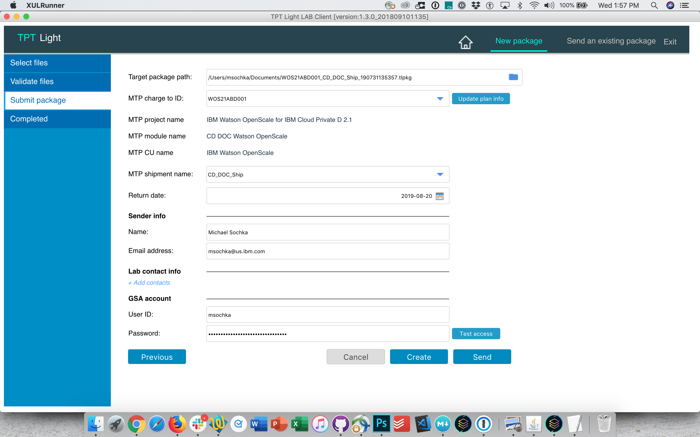
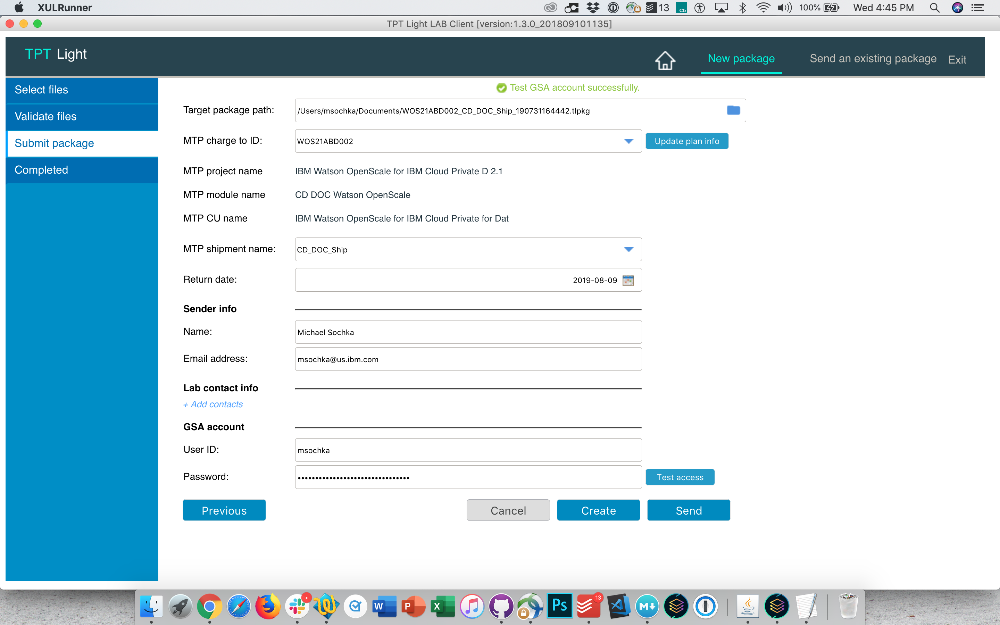

# ai-openscale - IBM Watson OpenScale

This repository is for the IBM Watson OpenScale for IBM Cloud STAGING build.

The following document explains everything that a content designer would need to know to work with this product and specifically with the Markdown files in this repository.

## Content Design team

- Hai-Nhu Tran (director)
- Wendy Switzer (manager)
- Mike Sochka (lead writer/content designer)
- Inge Halilovic (content strategist)

### Back up writers

- Kevin MacDonald (former lead writer)
- Jessica DiCarlo (former writer) In Pittsburgh office

## Recurring meetings

### Whole team meetings:

Monday: Watson OpenScale Sprint Planning, weekly at 10am Eastern, chair: Rishi Patel https://ibm.webex.com/meet/riship

Thursday: Weekly Dev Playbacks, weekly at 10:00am Eastern, chair: Rishi Patel https://ibm.webex.com/meet/riship

### Squad meetings / [4] Four-in-a-box

As of 2019-09-09

| Squad | Time (EST) | Lead |
|:---:|:---:|:---:|
| Model Risk Management (MRM) | Tuesdays at 9:00AM | Carmen Ruppach |
| Platform | Tuesday at 1:00PM | Alex Jones |
| Metrics | Wednesdays at 10:00AM | Barbara Kowalczyk |
| Explainability & Bias | Wednesdays at 11:00AM | Carmen Ruppach |
| AIOS Dev/Design | Wednesdays at 9:00PM | Kimberly Iungerman |
| Drift | Thursdays at 11:00AM | Anshu Jain |

Yes. That's Wednesdays at 9:00 post meridian for the AIOS Dev/Design checkpoint.

## GHE issue tracker (with doc issues label)

One of the brilliant aspects of the way that Watson OpenScale is set up from an operations point of view is the consistent use of a single GitHub repository to track all work for all squads, including documentation. The following link is for issues that are tagged [`Documentation`](https://github.ibm.com/aiopenscale/tracker/issues?q=is%3Aopen+is%3Aissue+label%3ADocumentation).

## OpenScale main documentation repos

- [Staging builds for IBM Watson OpenScale for IBM Cloud (the current repo)](https://github.ibm.com/Bluemix-Docs/ai-openscale)
- [Production builds for IBM Watson OpenScale for IBM Cloud](https://github.com/IBM-Bluemix-Docs/ai-openscale)
- [Staging builds for IBM Watson OpenScale for IBM Cloud Pak for Data](https://github.ibm.com/Bluemix-Docs/ai-openscale-icp)
- [Production builds for IBM Watson OpenScale for IBM Cloud Pak for Data](https://github.com/IBM-Bluemix-Docs/ai-openscale-icp)

## OpenScale API documentation repo

https://github.ibm.com/cloud-api-docs/ai-openscale
FYI: Creating and publishing API docs for IBM Cloud

## Internal blog of OpenScale information

[IBM Connections Community for OpenScale](https://w3-connections.ibm.com/wikis/home?lang=en#!/wiki/Wf58c4c538dbf_45b4_b7a7_5003d0ceb79b/page/IBM%20Watson%20OpenScale)

## OpenScale "regular" documentation doc sites

- [IBM Cloud OpenScale doc](https://cloud.ibm.com/docs/ai-openscale?topic=ai-openscale-getting-started)
- [IBM Cloud OpenScale ICP4D doc](https://cloud.ibm.com/docs/ai-openscale-icp?topic=ai-openscale-icp-gs-get-started#gettingstarted)

## Other documentation and tools (not written by Content Design)

- [API doc](https://cloud.ibm.com/apidocs/ai-openscale)
- [OpenScale CLI package](https://github.com/IBM-Watson/aiopenscale-modelops-cli)
- [OpenScale Python SDK](http://ai-openscale-python-client.mybluemix.net/)
- [GitHub tutorials, which use Jupyter Notebooks](https://github.com/pmservice/ai-openscale-tutorials)

## OpenScale test environments

- [Cloud](https://aiopenscale.test.cloud.ibm.com/aiopenscale/onboarding)
- [ICP](https://9.30.109.153:31843/aiopenscale/onboarding)

  (Note: To log onto this system, you must request a username and password. Zhi Li is usually able to provide one for you to do testing.)

## Usabilla doc issue owners file

The following file maps owners of doc repos to Usabilla, which is used to get feedback from users. For more information, see Docs app user feedback tool.

[Usabilla assignments](https://github.ibm.com/Bluemix/UsabillaGithub/blob/master/json/docUrlToAssigneeMap.json)

## Release manager

Rishi Patel

## Aha! link for OM roadmap

[Aha! board](https://bigblue.aha.io/products/WSPHERE/feature_cards)

## Development managers/architects/leads

**Note**: This isn't a complete list, but I tried to represent at least one contact from each squad or location (Poland, India, US/California, US/New York, US/Massachusetts).

- Kamila Baron-Palucka (on maternity leave)
- Barbara Kowalczyk (manager)
- Manish Bhide (STSM, India Lab)
- Yong Li (manager, ICP, fastpath script/Python module, and other things)
- Ken Matsuoka (GUI)
- Ramesh Somisetty (explainability, maybe other things as well)
- Charlie Wiecha (manager from Yorktown who reports to Gaurav Rao, Director of Engineering for OpenScale)
- Lukasz Cmielowski
- Dave Royer (fastpath)
- Rohit Gargate (fastpath, ICP)
- Eric Martens (Digital Technical Engagement)
- Trent Gray-Donald, Gaurav Rao, and Gaurav’s team will move to Dinesh Nirmal's team. For more information, see [Dinesh's blog](https://apps.na.collabserv.com/blogs/77488779-12e6-4302-a944-7ca6bad90db4/entry/ANNOUNCEMENT_New_Analytics_Development_Organizational_Alignment).

## Offering managers

Taken from [Beth Smith's blog](https://w3-connections.ibm.com/blogs/76f4974e-15fb-41d1-8fa5-5ad4abc1ae4d/entry/Team_announcements_Joining_Analytics_and_AI)

AI lifecycle tools & runtime: We are combining Watson Studio, Watson Machine Learning, and OpenScale as a comprehensive set of tools and runtimes for AI, running on Kubernetes. This team will work closely with IBM Research to deliver AI automation throughout the lifecycle.
The offering management team for AI OpenScale will move to Shadi Copty and includes the following OMs:

- Anshu Jain (all-around, very good with UX and documentation)
- Alex Jones
- Rebecca Kim (metrics)
- Rohan Vaidyanathan w/ his team (marketing/go to market)

## Design

- Thomas Hollifield (manager/lead)
- Kim Iungerman (project manager, chairs the Design 4 in a Box meeting)
- Kev Bittner
- Cory Marko

## Slack channels

- `#openscale` (general)
- `#openscale-api` (api channel)
- `#openscale-dev` (main dev channel)
- `#openscale-doc` (main documentation channel)
- `#openscale-support` (main support channel, monitored by the dev team)
- `#openscale-tool` (questions about the fastpath/python module/Yong's dev team)
- `#openscale-ux` (questions for the design/ux team, Thomas Hollifield's team)

## Translations

Translation kits are sent once a month on the last Monday of each month. Translation process, which includes contacts and a link to the spreadsheet where we enter translation shipments: https://test.cloud.ibm.com/docs/developing/writing?topic=writing-tp#tp

OpenScale, by request, has a lot of screencaps that are difficult to maintain for English, let alone in translations. I explained the situation to Rishi and feel the best option would be to provide English screencaps and if the translators wanted to reproduce them with translated interfaces, they were certainly welcome to do that but that the documentation team doesn't have the resources to provide translatable SVGs.

We discussed the feasibility of development providing translated screen captures and updates to them as a way to help manage the frequent GUI updates that OpenScale has had.

### Project codes for translation kits

The following screen shots show you how to fill out the TCT Light screens for the translation kits:

#### IBM Watson OpenScale for IBM Cloud

- MTP charge to ID: WOS21ABD001

  

#### IBM Watson OpenScale for IBM Cloud Pak for Data

- MTP charge to ID: WOS21ABD002

  

## Accessibility testing

The documentation has been tested. [IBM Watson OpenScale Documentation Accessibility Checklist](https://acs.w3ibm.mybluemix.net/auth/checklist?checklistId=4b1cfcec-5ee8-4fdf-8a0f-04f80e4a6643&deliverableId=34dd21a8-e5d8-473f-902e-c0980ccb8418)

Link to Cloud doc about ACS compliance records, https://test.cloud.ibm.com/docs/developing/writing?topic=writing-accessibility-requirements-for-information-developers#step-7-submitting-your-checklists-and-compliance-records-in-acs

I assume accessibility requirements are the same regardless of where documentation is published, but FWIW, here's a link to the IBM Cloud doc app info, which might be specific to how to test for repos in the Cloud doc app, https://test.cloud.ibm.com/docs/developing/writing?topic=writing-accessibility-requirements-for-information-developers#downloading-content-for-testing

Note:
In the section, What does this mean for service providers?, it says:
>The compliance for your service in IBM Cloud (UI or doc) will be recorded in ACS in such a way that your compliance is dependent on IBM Cloud's compliance. Use the statements from the corporate team in this section.
>However, the IBM Cloud compliance is not affected if your service becomes non-compliant.
Last year, the doc app itself wasn't compliant, so technically a service's documentation couldn't be completely compliant either. Now, as far as I know the doc app is compliant.

## Content quality efforts

Documentation in the IBM Cloud doc app is subject to certain processes set by the doc app team (Jenifer Schlotfeldt's team), one of which is automated testing for the content quality dashboard (aka, CQD) and quarterly "doc week" reporting.
Info about CQD: https://test.cloud.ibm.com/docs/developing/writing/content-strategy?topic=writing-cqd#cqd-tc-md
There's a Slack channel for #doc-week-2019 https://ibm-cloudplatform.slack.com/archives/C89B4RALE/p1550524701002600

## Amplitude 

The Amplitude dashboard is available [here](https://analytics.amplitude.com/ibm/dashboard/vcz3hrj). You can view usage charts for the OpenScale content.

### Request for instrumentation for getting started tutorial

One of the OMs, Rebecca Kim, has an issue created for getting stats about the getting started tutorial
For background and links to other references, see the Aha issue: https://bigblue.aha.io/features/WSPHERE-155

## Conrefs used in Watson OpenScale content

The following conrefs (variables) are used extensively throughout the documentation. It is good to be familiar with them. Some have both `short` and `full` forms. Some even have the `notm` form, which strips any copyright or trademark symbols out of the string so that they can be used in headings. Use of the escape characters for the copyright and trademark symbols in a heading causes problems and must be avoided.

- `{{site.data.keyword.aios_full}}` = IBM® Watson OpenScale
- `{{site.data.keyword.aios_full_notm}}` = IBM Watson OpenScale
- `{{site.data.keyword.aios_short}}` = Watson OpenScale
- `{{site.data.keyword.Bluemix}}` = IBM Cloud™
- `{{site.data.keyword.cloud_notm}}` = IBM Cloud
- `{{site.data.keyword.cos_full}}` = IBM® Cloud Object Storage
- `{{site.data.keyword.dashdblong}}` = IBM® Db2® Warehouse on Cloud
- `{{site.data.keyword.DSX}}` = Watson Studio
- `{{site.data.keyword.iamshort}}` = Cloud Identity and Access Management
- `{{site.data.keyword.ibmid}}` = IBMid
- `{{site.data.keyword.ibmwatson_notm}}` = IBM Watson
- `{{site.data.keyword.icp4dfull_notm}}` = IBM Cloud Pak for Data
- `{{site.data.keyword.icpfull}}` = IBM® Cloud Private
- `{{site.data.keyword.pm_full}}` = IBM Watson™ Machine Learning
- `{{site.data.keyword.pm_short}}` = Machine Learning
- `{{site.data.keyword.wos4d_full}}` = IBM® Watson OpenScale for IBM® Cloud Pak for Data
- `{{site.data.keyword.wos4d_notm}}` = IBM Watson OpenScale for IBM Cloud Pak for Data

If you ever need to check on the value of one of these conref variables, or if you need to look up another one to use, see [IBM Cloud conref equivalent file to cloudoeconrefs.dita](https://github.ibm.com/cloud-doc-build/markdown/blob/master/cloudoeconrefs.yml)

## File naming conventions and structure

## Tutorial topic progression