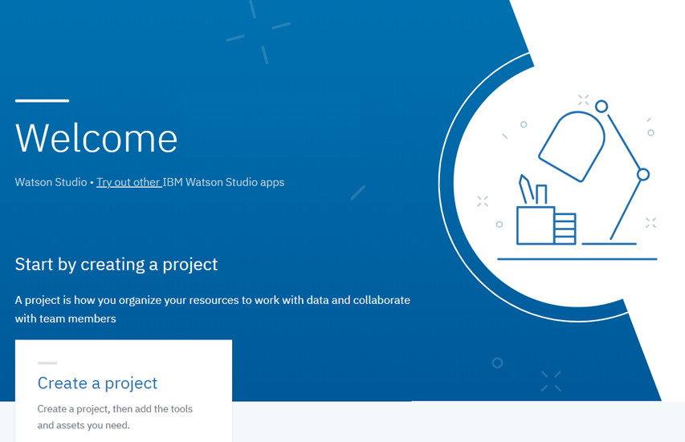
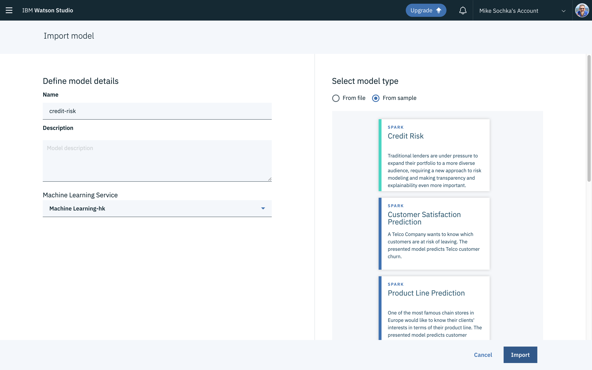
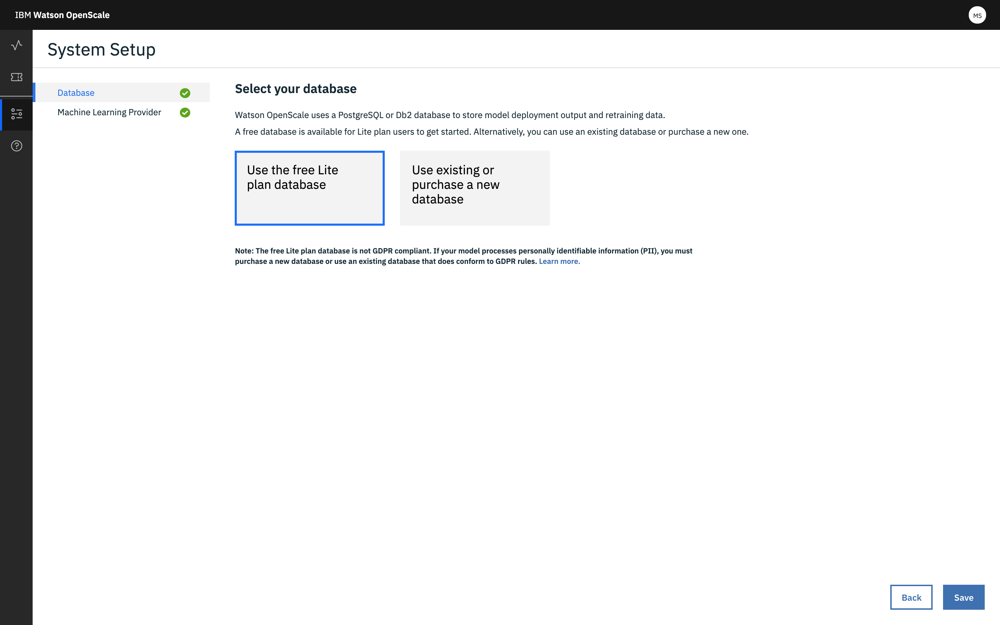

---

copyright:
  years: 2018, 2019
lastupdated: "2019-09-09"

keywords: ai, getting started, tutorial, understanding, fast start

subcollection: ai-openscale

---

{:shortdesc: .shortdesc}
{:external: target="_blank" .external}
{:tip: .tip}
{:important: .important}
{:note: .note}
{:pre: .pre}
{:codeblock: .codeblock}
{:download: .download}
{:screen: .screen}
{:javascript: .ph data-hd-programlang='javascript'}
{:java: .ph data-hd-programlang='java'}
{:python: .ph data-hd-programlang='python'}
{:swift: .ph data-hd-programlang='swift'}
{:faq: data-hd-content-type='faq'}

# The interactive setup tutorial
{: #gs-obj}

In this tutorial, you learn how to provision the required {{site.data.keyword.Bluemix_notm}} services, set up a project and deploy a sample model in Watson Studio, and configure monitors in {{site.data.keyword.aios_short}}.
{: shortdesc}

1. [Provision {{site.data.keyword.Bluemix_notm}} machine learning and storage services](/docs/services/ai-openscale?topic=ai-openscale-gs-obj#gs-prps).
2. [Set up a Watson Studio project, and create, train and deploy a machine learning model](/docs/services/ai-openscale?topic=ai-openscale-gs-obj#gs-setup).
3. [Configure and explore trust, transparency and explainability for your model](/docs/services/ai-openscale?topic=ai-openscale-gs-obj#gs-confaios).

## Provision prerequisite {{site.data.keyword.Bluemix_notm}} services
{: #gs-prps}

In addition to {{site.data.keyword.aios_short}}, to complete this tutorial, you need the following accounts and services.

**Important**: For best performance, it's recommended that the prerequisite services are created in the same region as {{site.data.keyword.aios_short}}. To view available locations for {{site.data.keyword.aios_short}}, see [Service availability](/docs/resources?topic=resources-services_region){: external}.

1.  Log in to your [{{site.data.keyword.Bluemix_notm}} account](https://{DomainName}){: external} with your {{site.data.keyword.ibmid}}.
1.  For each of the following services that you don't already have associated with your account, create an instance by clicking the link, giving the service a name, selecting the **Lite** (free) plan, and clicking the **Create** button:

    - [{{site.data.keyword.DSX}}](https://{DomainName}/catalog/services/watson-studio){: external}

      

    - [{{site.data.keyword.pm_full}}](https://{DomainName}/catalog/services/machine-learning){: external}

      

    - [{{site.data.keyword.cos_full_notm}}](https://{DomainName}/catalog/services/cloud-object-storage){: external}

      

## Set up a Watson Studio project
{: #gs-setup}

1.  Log in to your [Watson Studio account](https://dataplatform.ibm.com/){: external} and begin by creating a new project. Click **Create a project**.

    

1. Click the **Create an empty project** tile.

  

1. Give your project a name and description, make sure that the {{site.data.keyword.cos_full_notm}} service that you created is selected in the **Storage** dropdown, and click **Create**.

### Associate your {{site.data.keyword.Bluemix_notm}} Services with your Watson project
{: #gs-assoc}

1.  Open your {{site.data.keyword.DSX}} project and select the **Settings** tab. In the **Associated Services** section, click **Add service** and then click **Watson**.

    

1.  Click the **Add** link on the **Machine Learning** tile.
2.  On the **Existing** tab, from the **Existing Service Instance** drop-down, click the service you created previously.
3.  Click **Select**.

### Add the **Credit Risk** model
{: #gs-addmod}

1.  In {{site.data.keyword.DSX}}, from your project, click the **Add to project** button, and click the **Watson Machine Learning model** tile.

    

1.  On the **Import Model** page, in the **Select model type** section, click the **From sample** radio button.
2.  Click the **Credit Risk** model tile, and then click **Import**.

    

### Deploy the **Credit Risk** model
{: #gs-depmod}

1.  From the the **Credit Risk** model page, click the **Deployments** tab, and then, click **Add Deployment**.
1.  Type `credit-risk-deploy` as the name for your deployment, and select the **Web service** deployment type.
1.  Click **Save**.

## Configure {{site.data.keyword.aios_short}}
{: #gs-confaios}

Now that the machine learning model has been deployed, you can configure {{site.data.keyword.aios_short}} to ensure trust and transparency with your models.

### Provision {{site.data.keyword.aios_short}}
{: #gs-provaios}

1.  [Provision a new {{site.data.keyword.aios_short}} service instance](https://{DomainName}/catalog/services/watson-openscale){: external}

    

2.  Give your service a name, select the **Lite plan**, and click **Create**.

1.  Select the **Manage** tab of your {{site.data.keyword.aios_short}} instance, and click the **Launch application** button. The **Welcome to {{site.data.keyword.aios_short}}** demo page opens.
2. For this tutorial, click **No Thanks**.

### Select a database
{: #gs-db-choice}

Next, you need to choose a database. You have two options: the free database, or an existing or new database.

2. For this tutorial, select the **Use the free Lite plan database** tile.

   The free database has some important limitations. It is a hosted database that does not give you separate access to it. It gives {{site.data.keyword.aios_short}} acccess to your database and data. It is not GDPR-compliant. See more complete details about each of these options in the [Specifying a database](/docs/services/ai-openscale?topic=ai-openscale-connect-db) topic. The existing database can be a PostgreSQL database or a Db2 database.
    {: tip}

   

1.  Review the summary data and click **Save**. Confirm and, when prompted, click the **Continue with Configuration** button.

### Connect {{site.data.keyword.aios_short}} to your machine learning model
{: #gs-ctmod}

1.  Click the **Watson Machine Learning** tile, and then click **Save**.

1.  For this tutorial, select your {{site.data.keyword.pm_full}} instance from the menu and click **Next**.

    You also have the option to select a different {{site.data.keyword.pm_short}} location. See [Specifying an {{site.data.keyword.pm_full}} service instance](/docs/services/ai-openscale?topic=ai-openscale-wml-connect) for additional information.
    {: note}

    

You are now able to select the deployed models that will be monitored by {{site.data.keyword.aios_short}}.

### Provide a set of sample data to your model
{: #gs-samp}

Before you can configure your monitors, you must generate at least one scoring request against your model in order to generate payload logging that the monitors can consume. In this section, you will provide sample data to Watson Studio in the form of a JSON file to generate a scoring request.

1.  Download the [credit_payload_data.json](https://raw.githubusercontent.com/watson-developer-cloud/doc-tutorial-downloads/master/ai-openscale/credit_payload_data.json){: external} file.

1.  From the **Deployments** tab of your Watson Studio project, click the **credit-risk-deploy** link, click the **Test** tab, and select the JSON input icon.

    

1.  Now, open the `credit_payload_data.json` file you downloaded, and copy the contents to the JSON field in the **Test** tab. Click the **Predict** button to send and score training payloads to your model.

    

## Next steps
{: #gs-next-steps-config}

Continue with this tutorial by completing the following steps:

1. [Prepare monitors for deployment](/docs/services/ai-openscale?topic=ai-openscale-mo-config#mo-select-deploy).

   To prepare monitors, you must select one of the deployed models and add it to the dashboard. From the **Insights** tab, click a deployment tile, or click the **Add to dashboard** button to select a deployed model and click **Configure**.

2. [Set up payload logging](/docs/services/ai-openscale?topic=ai-openscale-mo-config#mo-work-data).

   In the **Payload logging** section, you must specify the type of input.

3. [Set up model details](/docs/services/ai-openscale?topic=ai-openscale-mo-config#mo-work-model-dets).

   In the **Model details** section, you must record the model details. For this tutorial select **Manually configure monitors**.

4. [Configure quality monitoring](/docs/services/ai-openscale?topic=ai-openscale-acc-monitor).

   In the **Quality** section, you set the quality alert threshold and sample sizes.

5. [Configure Fairness monitoring](/docs/services/ai-openscale?topic=ai-openscale-mf-monitor).

   In the **Fairness** section, choose which features to monitor for fairness. For each feature you select, {{site.data.keyword.aios_short}} will monitor the deployed model's propensity for a favorable outcome for one group over the other. Although, features are monitored individually, debiasing corrects issues for all features together.

6. [Configure the drift detection monitor](/docs/services/ai-openscale?topic=ai-openscale-behavior-drift-config).

   In the **Drift** section, you set up a drift detection model.
   
5. [Provide a set of sample feedback data to your model](/docs/services/ai-openscale?topic=ai-openscale-fmt-upld-fdbk-data#fmt-upld-fdbk-data-upld-csv).

   To enable monitoring for quality, you must provide your model with feedback data. Quality data will not appear in the dashboard until that is done. You can generate the requests all at once by adding sample feedback data to the model for scoring. For this task, you'll download a CSV file that contains sample feedback data.

6. [Get insights](/docs/services/ai-openscale?topic=ai-openscale-io-ov).

   After you configure accuracy monitoring, the accuracy check runs after one hour. In a production system, this makes sense so that your dashboard can accumulate feedback data. For the purposes of this tutorial, you'll probably want to trigger the accuracy check manually after you add your feedback data, so that you can see results in the **Insights** dashboard.

   To check the result immediately, from the **Insights** page, select a deployment, click one of the **Quality** metrics, and then click **Check quality now**.