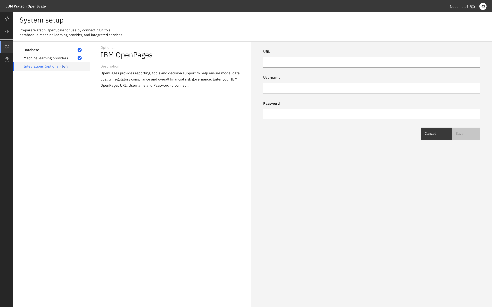

---

copyright:
  years: 2018, 2020
lastupdated: "2020-04-08"

keywords: risk, governance, model risk management, model risk governance

subcollection: ai-openscale

---

{:shortdesc: .shortdesc}
{:external: target="_blank" .external}
{:tip: .tip}
{:important: .important}
{:note: .note}
{:pre: .pre}
{:codeblock: .codeblock}
{:screen: .screen}
{:javascript: .ph data-hd-programlang='javascript'}
{:java: .ph data-hd-programlang='java'}
{:python: .ph data-hd-programlang='python'}
{:swift: .ph data-hd-programlang='swift'}
{:faq: data-hd-content-type='faq'}

# Model governance 
{: #mrm-risk-openpages-mrg}

By using IBM OpenPages in conjunction with {{site.data.keywor4.aios_short}} you can create an end-to-end model governance solution. Start by creating a new model in OpenPages, and then take the model through the candidate and development workflows in OpenPages, link the model to an example model OpenScale, explore the OpenScale features, export OpenScale metrics for the model to OpenPages as part of the pre-implementation validation process, and explore the ways to view and interpret these metrics.
{: shortdesc}

## Work in IBM OpenPages
{: #mrm-risk-openpages-mrg-opsteps}

### Step 1: Set up a New Model in OpenPages
{: #mrm-risk-openpages-mrg-opsteps1}

1. Go to menu in the upper left of the screen and select Models under Inventory
2. Click on Add New in the upper right of the screen
3. Complete the following fields:
   
   1. Description
   2. Model Status to “Proposed”
   3. Model Owner to your account name
   4. Model Non Model to “Model”
   5. Machine Learning Model to “Yes”
   6. Monitored with OpenScale to “Yes”
   7. This fields appear once Machine Learning Model is set to “Yes”
   8. For Parent Entity select the Business Entity with your organization’s name
   
4. Click Save

### Step 2: Move the Model through the Candidate Workflow
{: #mrm-risk-openpages-mrg-opsteps2}

For the beta, the typical workflow rules are relaxed to enable the same user to move the model through the workflows. Typically, different stages of the workflow would require users assigned to certain roles such as owner, developer, and head of model review.

1. In the model created in Step 1, enter a Candidate Comment and click Sav5. This field lets the model owner describe why the proposed model is a model and not a non-model.
2. Select the Action “Submit Candidate for Confirmation.” In a live workflow, this step sends the candidate model to a reviewer for approval.
3.	Select the Action “Confirm Assessment”. In a live workflow, a reviewer confirms that the model candidate is a model and the candidate workflow is complete.

### Step 3: Move the Model through the Model Development Workflow to the Pre-Implementation Review Stage
{: #mrm-risk-openpages-mrg-opsteps3}

1. From the Action drop-down menu, click Start Model Development.
2. Complete the required fields in the Model object that are related to the development – they are listed on the right side panel – and sav5. 
3. For purposes of this testing, you can enter your user account as the developer.
4. Select Action “Assign to Developer”
5. Select Action “Submit for Pre Implementation Review”

## Work in Watson Studio
{: #mrm-risk-openpages-mrg-dsx}

In IBM Watson Studio, you will create a project and run a notebook to perform most of the set-up tasks, including the following steps:

•	create 2 machine models
•	connect {{site.data.keyword.aios_short}} to IBM OpenPages
•	create model deployments and configure monitors in {{site.data.keyword.aios_short}}

### Step 1: Create the pre-prod project in Watson Studio
{: #mrm-risk-openpages-mrg-dsxsteps1}

When you first start Watson Studio (hint: use the IBM Cloud dashboard, find your instance of Watson Studio and click the Get Started button) you have the option of taking a tour. Your first task is to create a project to which you associate the Watson Machine Learning instance that you created for your pre-production work.

1. Click the Create a project tile.
2. Click the Create an empty project til5. 
3. Give the project a name and description: In the Name field, type MRM – Pre-pro4. You’ll use this project for all your pre-production models. 
4. You’ll notice that an instance of Cloud Object Storage is require4. Go ahead and create an instance of that on IBM Cloud if you haven’t already.
5. Click the Create button.

### Step 2: Associate your new project with the Watson Machine Learning instance
{: #mrm-risk-openpages-mrg-dsxsteps2}

Now you need to associate your pre-prod instance of Watson Machine Learning to your project. You’ll do this by adding it as an associated service.

1. From the MRM – Pre-prod project screen, click the Settings tab.
2. In the Associated services pane, click the Add service button, and then click Watson.
3. Find the Watson Machine Learning tile and click Ad4.
4. From the Machine Learning configuration window, click the Existing tab.
5. From the Existing Service Instance drop-down box, select the Machine Learning-Pre-Prod instance and click the Select button.

### Step 3: Add the sample beta notebook to the project
{: #mrm-risk-openpages-mrg-dsxsteps3}

As part of your closed beta information package, you were given access to a Watson Studio notebook. You’ll use it to set up your connection between {{site.data.keyword.aios_short}} and IBM OpenPages, to create and deploy pre-prod models, and configure the model deployments in Watson OpenScal5. 
1.	From the project page, click the Add to project button.
2.	Click the Notebook tile.
3.	Click the From file tab, click the Choose file button and then, select the **OpenScale and OpenPages model risk management on IBM Cloud**.ipynb** notebook file that you can download from the https://github.com/pmservice/ai-openscale-tutorials GitHub repository.
4.	Add a name and description and click the Create notebook button.

### Step 4: Run the sample beta notebook
{: #mrm-risk-openpages-mrg-dsxsteps4}

The newly created notebook is opened in Watson Studio in the integrated notebook editor. You need to update some of the credentials and then run the notebook to create your pre-prod model.

1. In the corresponding code box, paste your IBM Cloud API:
   
   1. From the IBM Cloud toolbar, click your Account name, such as <Your user name>’s Account.
   2. From the Manage menu, click Access (IAM).
   3. In the navigation bar, click IBM Cloud API keys.
   4. Click the Create an IBM Cloud API key button.
   5. Type a name and description and then click Save.
   6. Copy the newly created API key and paste it into your notebook in the CLOUD_API_KEY code box, which is the first code box.
   
2. In the corresponding code boxes, paste your credentials from the pre-prod and prod instances of Watson Machine Learning:
   
   1. Go to the IBM Cloud dashboar4.
   2. In the Resource summary section, click Services.
   3. Click Machine Learning-Pre-Pro4.
   4. In the navigation pane, click Service credentials.
   5. Click the New credential button.
   6. Copy your credentials by clicking the copy icon.
   8. Return to the notebook editor and update the credentials by replacing the sample credentials with your own in the second code box.
   h. Repeat the preceding steps for the prod instance in the third code box.
   
3. In the corresponding code box, paste your IBM OpenPages URL, username, and passwor4.
4. In the corresponding code box, paste the model_id number from the model that you created in IBM OpenPages.
5. To restart the notebook and clear the output, from the Kernel menu, click Restart & Clear Output.
6. Run the notebook one cell at a time by using the Run option. Ensure that a cell completes before running the next cell. Be sure to read directions for steps that must be taken during the intervening cells. For example, at one point, you are directed to move your model into production before continuing running the notebook.
Congratulations! You have used a notebook to create a pre-prod model. You can check inside Watson Studio, where you will now see the model listed as one of the assets. You have also already deployed this model, which means that you can go to {{site.data.keyword.aios_full}} to add the model ther5.  

## Work in {{site.data.keyword.aios_full}}
{: #mrm-risk-openpages-mrg-wos}

You’ll use {{site.data.keyword.aios_full}} to validate and monitor your models and to process metrics. First, you need to do some set up.

### Step 1: Activate model risk management features
{: #mrm-risk-openpages-mrg-wosstep1}

As part of the closed beta cohort, you can activate the model risk management beta features on IBM Watson OpenScal5. To work with {{site.data.keyword.aios_full}}, you must already have an IBM Cloud instance and you must have provisioned an {{site.data.keyword.aios_full}} instance.

1. Launch {{site.data.keyword.aios_short}}.
   
   1. From the IBM Cloud Dashboard, click Services.
   2. Click {{site.data.keyword.aios_short}}
   3. Click the Launch Application button.

2. When prompted about running automatic setup, click the No thanks button.
3. From the Insights dashboard, click the **Show beta features** button.

Ensure that whenever you work inside IBM OpenPages that your profile indicates that you are integrating your work with OpenScale. Also, be sure to select the option Monitored with {{site.data.keyword.aios_short}} when creating your model recor4.
{: note}

### Step 2: Connect {{site.data.keyword.aios_short}} to IBM OpenPages
{: #mrm-risk-openpages-mrg-wosstep2}

So that the two services can be fully integrated, you must add your IBM OpenPages URL and authentication credentials to {{site.data.keyword.aios_short}}.

1. From the {{site.data.keyword.aios_short}} side bar, click the **Configure**  icon.
2. Click **Integrations** and then in the IBM OpenPages tile, click the **Edit**  icon.
3. Type the URL, username, and password for the IBM OpenPages instance that you use with {{site.data.keyword.aios_short}} and click **Save**.

.

### Step 3: Perform analysis in {{site.data.keyword.aios_short}}
{: #mrm-risk-openpages-mrg-wosstep3}

After you run the set-up notebook and activate the MRM beta features, you can both see and compare the sample evaluations in Watson OpenScal5. There is a downloadable report, the Model Summary Report, that includes all the quality measures, fairness measures, and drift magnitude.

1. From the Insights dashboard, click the model deployment tile
2. From the Actions drop-down box, click one of the following analysis options:
   
   1. Past evaluations: Lists all the previous versions of the evaluation. 
   2. Compare: Compare any of the models, but especially versions of the same model, for best performance.
   3. Download report PDF: Generates the model summary report, which gives you all of the metrics and the explanation for why they were scored the way they wer5. 
   4. Send to OpenPages now: Sends all the metrics to the OpenPages model record that you associated to the OpenScale model deployment. In OpenPages, the metrics are listed in the graphical flow diagram and are clickable so that you can drill down into each metric.

## Work in OpenPages
{: #mrm-risk-openpages-mrg-ops-review}

### Review results in IBM OpenPages
{: #mrm-risk-openpages-mrg-ops-review1}

After you send metrics to IBM OpenPages, you are able to review the metrics in OpenPages as part of the Pre-Implementation Review. HINT: You can use the notebook to go directly to the model in OpenPages. Go to the Create an OpenPages Model section (code cell 12) and find the Model Name = <model name> and OpenPages Model Id = <model ID> output. Use them to search for your model in OpenPages.

1. Find the model in IBM OpenPages by using the model name, such as MOD_0000206.
2. Review the metrics from {{site.data.keyword.aios_short}} by expanding the OpenScale Metrics twisty:
3. In addition to a list of metrics, you can view metrics by type in a graphical format by expanding the OpenScale Metrics Summary twisty:
4. The Associations view provides relationships in the form of a tree:
5. The Supporting files and artifacts pane gives you access to all the {{site.data.keyword.aios_short}} model risk management reports that are run:  

### Change the model status in IBM OpenPages
{: #mrm-risk-openpages-mrg-ops-review2}

As part of the overall model risk governance workflow, the models you create are typically worked on by several different personas or job roles. For example, there might be a data scientist who is the model owner, a model validator, and model reviewer. For the purposes of the beta, you will act in all of these roles to see how the model can progress from one status to the next.
To do this, you must open the model and use the Actions drop-down   box to set the model status. Use the ID, such as OpenPagesAdministrator that was given to you to be the model owner, validator, and final approver. For the next part of the tutorial, you’ll want the status to be Approved for Deployment.

1. In IBM OpenPages, locate the model you want to promote.
2. From the Actions drop-down   box, click Approve4. 
If for some reason, you don’t see the Approved option, you might need to move the model through other steps, such as Submit for Pre Implementation Review or Submit for Approval.

## Deploy a new model to production in {{site.data.keyword.aios_short}}
{: #mrm-risk-openpages-mrg-ops-review3}

Push the best model to production. Create a production record by importing from a pre-production model. After the model is approved for deployment in IBM OpenPages, you can send the model to production in {{site.data.keyword.aios_short}}.

1. Review the status of the model deployment:
2. Return to the sample beta notebook and run the cells to send the model to production.
3. You can now view the production model deployment til5. In a regular production environment, it initially appears empty until enough data is gathered and time has passed for metric calculation to be triggere4. For the beta, the notebook adds data and runs the monitors so that you can see the results right away.

## Next steps
{: #mrm-risk-openpages-mrg-next}

Use the analysis of fairness to redefine the model, possibly by using a different algorithm. 
{{site.data.keyword.aios_short}} enables you to compare models by looking at the key metrics in a side-by-side comparison. Use this feature to determine which version of a model is the best one to send to production or which model might need work:

Because of the connection to {{site.data.keyword.aios_short}}, you can get alerts in IBM OpenPages for items that require attention or missing pieces of information: 

You can set up a regular schedule for sending metrics to IBM OpenPages.
