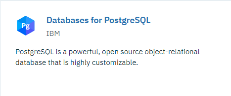
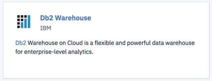
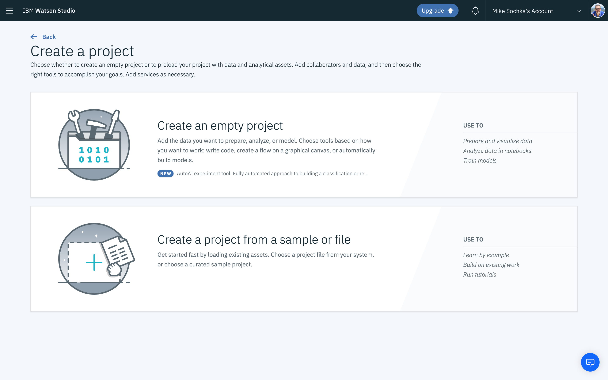
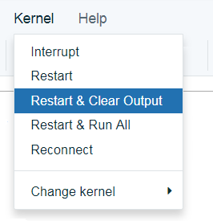
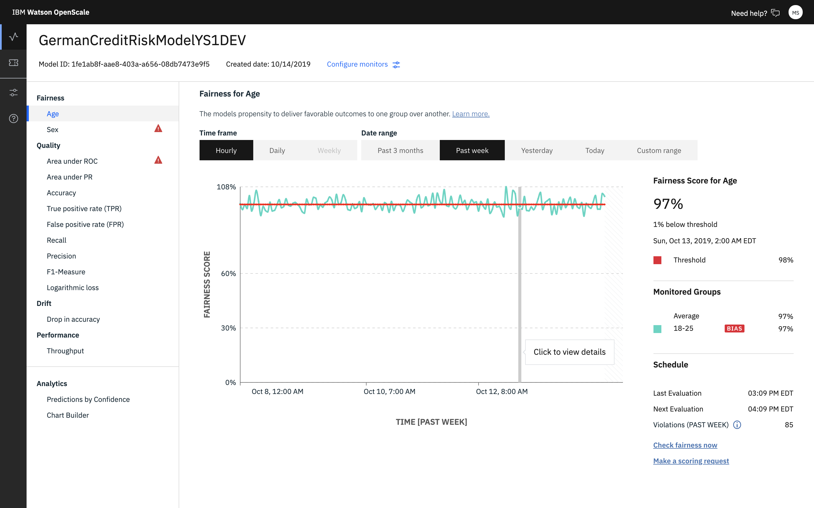
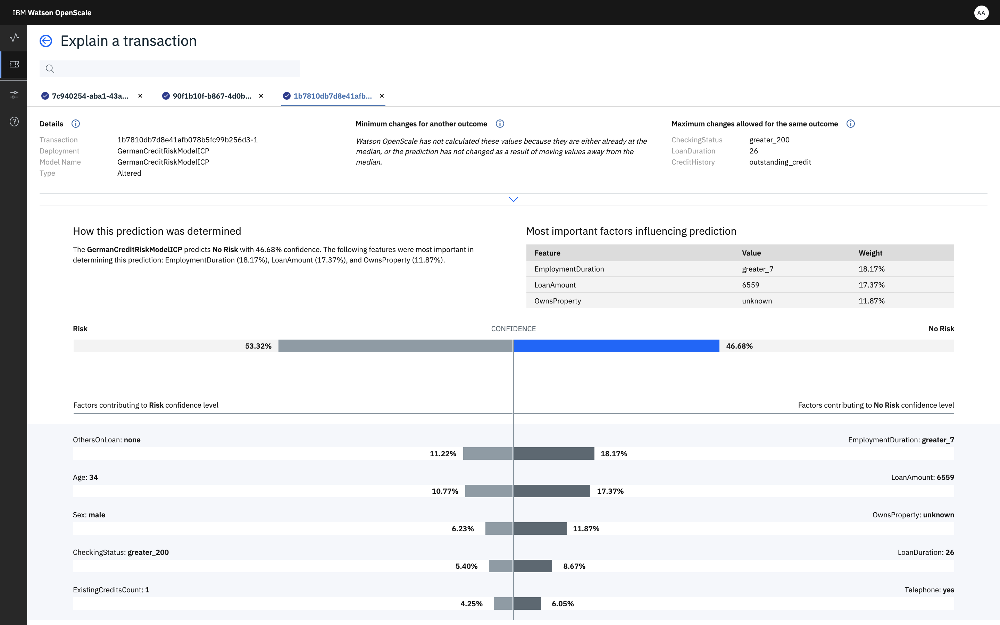

---

copyright:
  years: 2018, 2020
lastupdated: "2020-01-28"

keywords: tutorial, Jupyter notebooks, Watson Studio projects, projects, models, deploy, 

subcollection: ai-openscale

---

{:shortdesc: .shortdesc}
{:external: target="_blank" .external}
{:tip: .tip}
{:important: .important}
{:note: .note}
{:pre: .pre}
{:codeblock: .codeblock}

{:screen: .screen}
{:javascript: .ph data-hd-programlang='javascript'}
{:java: .ph data-hd-programlang='java'}
{:python: .ph data-hd-programlang='python'}
{:swift: .ph data-hd-programlang='swift'}
{:faq: data-hd-content-type='faq'}

# Python SDK Tutorial (Advanced)
{: #crt-ov}

In this tutorial, you learn to do the following tasks:

- Run a Python notebook to create, train, and deploy a machine learning model.
- Create a data mart, configure performance, accuracy, and fairness monitors, and create data to monitor.
- View results in the {{site.data.keyword.aios_short}} Insights tab.

## Python client
{: #in-pyc}

The [{{site.data.keyword.aios_short}} Python client](http://ai-openscale-python-client.mybluemix.net/){: external} is a Python library that you use to work directly with the {{site.data.keyword.aios_short}} service on {{site.data.keyword.cloud_notm}}. You can use the Python client, instead of the {{site.data.keyword.aios_short}} client UI, to directly configure a logging database, bind your machine learning engine, and select and monitor deployments. For examples that use the Python client in this way, see the [{{site.data.keyword.aios_short}} sample notebooks](https://github.com/pmservice/ai-openscale-tutorials/tree/master/notebooks){: external}.

## Scenario
{: #crt-scenario}

Traditional lenders are under pressure to expand their digital portfolio of financial services to a larger and more diverse audience, which requires a new approach to credit risk modeling. Their data science teams currently rely on standard modeling techniques - like decision trees and logistic regression - which work well for moderate data sets, and make recommendations that can be easily explained. This approach satisfies regulatory requirements that credit lending decisions must be transparent and explainable.

To provide credit access to a wider and riskier population, applicant credit histories must expand. They go beyond traditional credit, such as mortgages and car loans, to alternate credit sources, such as utility and mobile phone plan payment histories, education, and job titles. These new data sources offer promise, but also introduce risk by increasing the likelihood of unexpected correlations, which introduce bias based on an applicant’s age, gender, or other personal traits.

The data science techniques that are most suited to these diverse data sets, such as gradient boosted trees and neural networks, can generate highly accurate risk models, but at a cost. Such "black box" models generate opaque predictions that must somehow become transparent. You must ensure regulatory approval, such as Article 22 of the General Data Protection Regulation (GDPR) or the federal Fair Credit Reporting Act (FCRA) that is managed by the Consumer Financial Protection Bureau.

The credit risk model that is provided in this tutorial uses a training data set that contains 20 attributes about each loan applicant. Two of those attributes - age and sex - can be tested for bias. For this tutorial, the focus is on bias against sex and age. For more information about training data, see [Why does {{site.data.keyword.aios_short}} need access to my training data?](/docs/services/ai-openscale?topic=ai-openscale-trainingdata#trainingdata)

{{site.data.keyword.aios_short}} monitors the deployed model's propensity for a favorable outcome ("No Risk") for one group (the Reference Group) over another (the Monitored Group). In this tutorial, the Monitored Group for sex is `female`, while the Monitored Group for age is `18 to 25`.

## Prerequisites
{: #crt-prereqs}

This tutorial uses a Jupyter Notebook that must be run in a Watson Studio project, that uses a "Python 3.5 with Spark" runtime environment. It requires service credentials for the following {{site.data.keyword.cloud_notm}} services:

- Cloud Object Storage (to store your {{site.data.keyword.DSX}} project)
- {{site.data.keyword.aios_short}}
- {{site.data.keyword.pm_full}}
- (Optional) Databases for PostgreSQL or Db2 Warehouse

The Jupyter Notebook does the following tasks: 

- Trains, creates, and deploys a German Credit Risk model
- Configures {{site.data.keyword.aios_short}} to monitor that deployment
- Provides seven days' worth of historical records and measurements for viewing in the {{site.data.keyword.aios_short}} Insights dashboard. 

You can also configure the model for continuous learning with Watson Studio and Spark.

## Introduction
{: #crt-intro}

In this tutorial, you perform the following tasks:

- [Provision {{site.data.keyword.cloud_notm}} machine learning and storage services](/docs/services/ai-openscale?topic=ai-openscale-crt-ov#crt-services).
- [Set up a Watson Studio project, and run a Python Notebook to create, train, and deploy a machine learning model](/docs/services/ai-openscale?topic=ai-openscale-crt-ov#crt-set-wstudio).
- [Provision {{site.data.keyword.aios_short}}](/docs/services/ai-openscale?topic=ai-openscale-crt-ov#crt-wos-adv).
- [Run a Python Notebook to create a data mart, configure performance, accuracy, and fairness monitors, and create data to monitor](/docs/services/ai-openscale?topic=ai-openscale-crt-ov#crt-edit-notebook).
- [View results in the {{site.data.keyword.aios_short}} Insights tab](/docs/services/ai-openscale?topic=ai-openscale-crt-ov#crt-view-results).

## Provision {{site.data.keyword.cloud_notm}} Services
{: #crt-services}

Log in to your [{{site.data.keyword.cloud_notm}} account](https://{DomainName}){: external} with your {{site.data.keyword.ibmid}}. When provisioning services, particularly if you use Db2 Warehouse, verify that your selected organization and space are the same for all services.

### Create a {{site.data.keyword.DSX}} account
{: #crt-wstudio}

- [Create a {{site.data.keyword.DSX}} instance](https://{DomainName}/catalog/services/watson-studio){: external} if you do not already have one associated with your account:

  

- Give your service a name, choose the Lite (free) plan, and click the **Create** button.

### Provision an {{site.data.keyword.cos_full_notm}} service
{: #crt-cos}

- [Provision an {{site.data.keyword.cos_short}} service](https://{DomainName}/catalog/services/cloud-object-storage){: external} if you do not already one associated with your account:

  

- Give your service a name, choose the Lite (free) plan, and click the **Create** button.

### Provision an {{site.data.keyword.pm_full}} service
{: #crt-wml}

- [Provision a {{site.data.keyword.pm_short}} instance](https://{DomainName}/catalog/services/machine-learning){: external} if you do not already have one associated with your account:

  

- Give your service a name, choose the Lite (free) plan, and click the **Create** button.

### Provision an {{site.data.keyword.aios_full}} service
{: #crt-wos-adv}

If you haven't already, ensure that you provision {{site.data.keyword.aios_full}}. 

- [Provision a {{site.data.keyword.aios_short}} instance](https://{DomainName}/catalog/services/watson-openscale){: external} if you do not already have one associated with your account:

  

1. Click **Catalog** > **AI** > **{{site.data.keyword.aios_short}}**.
2. Give your service a name, choose a plan, and click the **Create** button.
3. To start {{site.data.keyword.aios_short}}, click the **Get Started** button.

### (Optional) Provision a Databases for PostgreSQL or Db2 Warehouse service
{: #crt-db2}

If you have a paid {{site.data.keyword.cloud_notm}} account, you can provision a `Databases for PostgreSQL` or `Db2 Warehouse` service to take full advantage of integration with {{site.data.keyword.DSX}} and continuous learning services. If you choose not to provision a paid service, you can use the free internal PostgreSQL storage with {{site.data.keyword.aios_short}}, but you are not able to configure continuous learning for your model.

- [Provision a Databases for PostgreSQL service](https://{DomainName}/catalog/services/databases-for-postgresql){: external} or [a Db2 Warehouse service](https://{DomainName}/catalog/services/db2-warehouse){: external} if you do not already have one associated with your account:

  

  

- Give your service a name, choose the Standard plan (Databases for PostgreSQL) or Entry plan (Db2 Warehouse), and click the **Create** button.

## Set up a {{site.data.keyword.DSX}} project
{: #crt-set-wstudio}

1. Log in to your [{{site.data.keyword.DSX}} account](https://dataplatform.ibm.com/){: external}. Click the {{site.data.keyword.avatar}} and verify that the account you are using is the same account you used to create your {{site.data.keyword.cloud_notm}} services:

  

1. In {{site.data.keyword.DSX}}, begin by creating a new project. Click the **Create a project** tile.

  

1. Click the **Create an empty project** tile.

  

1. Give your project a name and description, make sure that the {{site.data.keyword.cos_full_notm}} service that you created is selected in the **Storage** dropdown, and click **Create**.

## Create and deploy a {{site.data.keyword.pm_short}} model
{: #crt-make-model}

### Add the `Working with Watson Machine Learning` notebook to your {{site.data.keyword.DSX}} project
{: #crt-add-notebook}

- Access the following file. If you have a GitHub account, you can sign in to clone and download the file. Otherwise, you can view the raw version, by clicking the **Raw** button and copy the text of the file into a new file with the extension `.ipynb`.

    - [Working with Watson Machine Learning (Watson OpenScale and Watson ML Engine.ipynb)](https://github.com/pmservice/ai-openscale-tutorials/blob/master/notebooks/Watson%20OpenScale%20and%20Watson%20ML%20Engine.ipynb){: external}

- From the **Assets** tab in your {{site.data.keyword.DSX}} project, click the **Add to project** button and select **Notebook** from the dropdown:

  

- Select **From file**:

  

- Then, click the **Choose file** button, and select the "german_credit_lab.ipynb" notebook file that you downloaded:

  

- In the **Select runtime** section, choose the latest Python with Spark option.

  {{site.data.keyword.DSX}} does not offer a free environment with Python and Apache Spark. The only free runtime environment is for a Python-only environment.
  {: note}

- Click **Create Notebook**.

### Edit and run the `Working with Watson Machine Learning` notebook
{: #crt-edit-notebook}

The `Working with Watson Machine Learning` notebook contains detailed instructions for each step in the Python code you run. As you work through the notebook, take some time to understand what each command is doing.
{: tip}

- From the **Assets** tab in your Watson Studio project, click the **Edit** icon next to the `Working with Watson Machine Learning` notebook to edit it.

- In the "Provision services and configure credentials" section, make the following changes:

    - Follow the instructions in the notebook to create, copy, and paste an {{site.data.keyword.cloud_notm}} API key.

    - Replace the {{site.data.keyword.pm_full}} service credentials with the ones you created previously.

    - Replace the DB credentials with the ones you created for Databases for PostgreSQL.

    - If you previously configured {{site.data.keyword.aios_short}} to use a free internal PostgreSQL database as your data mart, you can switch to a new data mart that uses your Databases for PostgreSQL service. To delete your old PostgreSQL configuration and create a new one, set the KEEP_MY_INTERNAL_POSTGRES variable to `False`.

        The notebook removes your existing internal PostgreSQL data mart and create a new data mart with the supplied DB credentials. **No data migration occurs**.
        {: important}

- After you provision your services and entered your credentials, your notebook is ready to run. Click the **Kernel** menu item, and select **Restart & Clear Output** from the menu:

  

- Now, run each step of the notebook in sequence. Notice what is happening at each step, as described. Complete all the steps, up through and including the steps in the "Additional data to help debugging" section.

The net result is that you have created, trained, and deployed the **Spark German Risk Deployment** model to your {{site.data.keyword.aios_short}} service instance. {{site.data.keyword.aios_short}} is configured to check the model for bias against sex (in this case, Female) or age (in this case, 18-25 years old).

## Viewing results
{: #crt-view-results}

### View insights for your deployment
{: #crt-view-insights}

Using the [Watson OpenScale dashboard](https://aiopenscale.cloud.ibm.com/aiopenscale/){: external}, click the **Insights**  tab:

The Insights page provides an overview of metrics for your deployed models and KPI applications. You can easily see alerts for Fairness or Accuracy metrics that exceed the threshold set through the notebook. The data and settings that are used in this tutorial create Accuracy and Fairness metrics similar to the ones shown here.

  

### View monitoring data for your deployment
{: #crt-view-mon-data}

1. To view monitoring details, from the **Insights** page, click the tile that corresponds to the deployment. The monitoring data for that deployment appears. 
2. Slide the marker across the chart to select data for a specific one-hour window. 
3. Click the **View details** link.

  

Now, you can review the charts for the data you monitored. For this example, you can see that for the "Sex" feature, the group `female` received the favorable outcome "No Risk" less (68%) than the group `male` (78%).

  

### View explainability for a model transaction
{: #crt-view-explain}

For each deployment, you can see explainability data for specific transactions.

If you already know which transaction you want to view, there's a quick way to look it up with the transaction ID. After you click the deployment tile, from the navigator, click the **Explain a transaction**  icon, type the transaction ID, and press **Enter**.
{: tip}

If you use the internal lite version of PostgreSQL, you might not be able to retrieve your database credentials. This might prevent you from seeing transactions.
{: note}

1. From the charts for the latest biased data, click the **View transactions** button.

  

  A list of transactions where the deployment has acted in a biased manner appears. 
  
2. Select one of the transactions and, from the **ACTION** column, click the **Explain** link.

  

You will now see an explanation of how the model arrived at its conclusion, including how confident the model was, the factors that contributed to the confidence level, and the attributes fed to the model.

  
  
## Next steps
{: #crt-next-steps}

- Learn more about [viewing and interpreting the data](/docs/services/ai-openscale?topic=ai-openscale-it-ov) and [monitoring explainability](/docs/services/ai-openscale?topic=ai-openscale-ie-ov).
