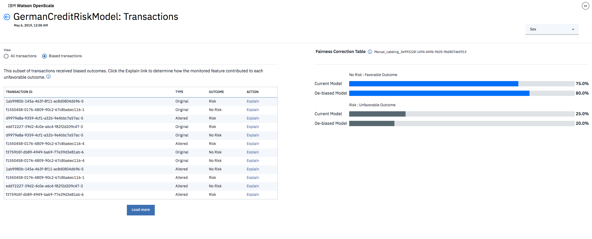

---

copyright:
  years: 2018, 2019
lastupdated: "2019-06-28"

keywords: metrics, monitoring, custom metrics, thresholds

subcollection: ai-openscale

---

{:shortdesc: .shortdesc}
{:external: target="_blank" .external}
{:tip: .tip}
{:important: .important}
{:note: .note}
{:pre: .pre}
{:codeblock: .codeblock}
{:download: .download}
{:screen: .screen}
{:javascript: .ph data-hd-programlang='javascript'}
{:java: .ph data-hd-programlang='java'}
{:python: .ph data-hd-programlang='python'}
{:swift: .ph data-hd-programlang='swift'}
{:faq: data-hd-content-type='faq'}

# Fairness metrics overview
{: #anlz_metrics_fairness}

Use {{site.data.keyword.aios_full}} fairness monitoring to determine whether outcomes that are produced by your model are fair or not for monitored group. When fairness monitoring is enabled, it generates a set of metrics every hour by default. You can generate these metrics on demand by clicking the **Check quality now** button or by using the Python client.
{: shortdesc}

{{site.data.keyword.aios_short}} automatically identifies whether any known protected attributes are present in a model. When {{site.data.keyword.aios_short}} detects these attributes, it automatically recommends configuring bias monitors for each attribute present, to ensure that bias against these potentially sensitive attributes is tracked in production. 

Currently, {{site.data.keyword.aios_short}} detects and recommends monitors for the following protected attributes: 

- sex
- ethnicity
- marital status
- age
- zip code

In addition to detecting protected attributes, {{site.data.keyword.aios_short}} recommends which values within each attribute should be set as the monitored and the reference values. So, for example, {{site.data.keyword.aios_short}} recommends that within the "Sex" attribute, the bias monitor be configured such that "Woman" and "Non-Binary" are the monitored values, and "Male" is the reference value. If you want to change any of the recommendations, you can edit them via the bias configuration panel. 

Recommended bias monitors help to speed up configuration and ensure that you are checking your AI models for fairness against sensitive attributes. As regulators begin to turn a sharper eye on algorithmic bias, it is becoming more critical that organizations have a clear understanding of how their models are performing, and whether they are producing unfair outcomes for certain groups. 

Fairness metrics are calculated based on the following information:

- scoring payload data.

For proper monitoring purpose, every scoring request should be logged in {{site.data.keyword.aios_short}} as well. Payload data logging is automated for {{site.data.keyword.pm_full}} engines.

For other machine learning engines, the payload data can be provided either by using the Python client or the REST API.

For machine learning engines other than {{site.data.keyword.pm_full}}, fairness monitoring creates additional scoring requests on the monitored deployment.
{: note}

You can review all metrics value over time on the {{site.data.keyword.aios_short}} dashboard:


You can review related details, such as favourable and unfavourable outcomes:


You can view detailed transactions:



You can view the recommended debiased scoring endpoint:


### Supported fairness metrics
{: #anlz_metrics_supfairmets}

The following fairness metrics are supported by {{site.data.keyword.aios_short}}:

- [Fairness for a group](https://test.cloud.ibm.com/docs/services/ai-openscale?topic=ai-openscale-quality_group)

The following protected attributes are supported by {{site.data.keyword.aios_short}}: 

- [sex](/docs/services/ai-openscale?topic=ai-openscale-quality_group#quality_group-sex)
- [ethnicity](/docs/services/ai-openscale?topic=ai-openscale-quality_group#quality_group-ethnicity)
- [marital status](/docs/services/ai-openscale?topic=ai-openscale-quality_group#quality_group-marital)
- [age](/docs/services/ai-openscale?topic=ai-openscale-quality_group#quality_group-age)
- [zip code](/docs/services/ai-openscale?topic=ai-openscale-quality_group#quality_group-zip)


### Supported fairness details
{: #anlz_metrics_supfairdets}

The following details for fairness metrics are supported by {{site.data.keyword.aios_short}}:

- The favorable percentages for each of groups
- Fairness averages for all the fairness groups

```
                          (% of favorable outcome in monitored group
Disparate Impact Ratio =  ____________________________________________
                          (% of favorable outcome in reference group)
```

- Distribution of the data for each of the monitored groups
- Distribution of payload data
