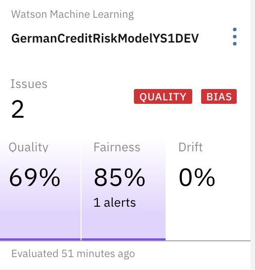
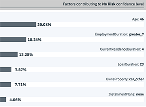

---

title: Trust and transparency for your machine learning models with {{site.data.keyword.aios_short}}
description: Monitor your machine learning deployments for bias, accuracy, and explainability
duration: 120
intro: In this tutorial, you will provision {{site.data.keyword.Bluemix}} machine learning and data services, create and deploy machine learning models in {{site.data.keyword.DSX}}, and configure the new IBM {{site.data.keyword.aios_full}} product to monitor your models for trust and transparency.
takeaways:
- See how {{site.data.keyword.aios_short}} provides trust and transparency for AI models
- Understand how {{site.data.keyword.Bluemix}} services and {{site.data.keyword.DSX}} technologies can provide a seamless, AI-driven customer experience

copyright:
  years: 2018, 2020
lastupdated: "2020-04-18"

keywords: ai, getting started, tutorial, understanding, video

subcollection: ai-openscale

---

{:shortdesc: .shortdesc}
{:external: target="_blank" .external}
{:hide-dashboard: .hide-dashboard}
{:tip: .tip}
{:important: .important}
{:note: .note}
{:pre: .pre}
{:codeblock: .codeblock}
{:screen: .screen}
{:note: .note}
{:note: .note}
{:note: .note}
{:note: .note}

# Getting started tutorial
{: #getting-started}

{{site.data.keyword.aios_full}} tracks and measures outcomes from your AI models, and helps ensure they remain fair, explainable, and compliant wherever your models were built or are running. {{site.data.keyword.aios_short}} also detects and helps correct the drift in accuracy when an AI model is in production
{: shortdesc}

Enterprises use {{site.data.keyword.aios_full}} to automate and operationalize AI lifecycle in business applications. This approach ensures that AI models are free from bias, can be easily explained and understood by business users, and are auditable in business transactions. {{site.data.keyword.aios_short}} supports AI models built and run in the tools and model serve frameworks of your choice.

## Overview
{: #gs-view-demo}

Get a quick overview of {{site.data.keyword.aios_short}} by watching the following video.

  

     <iframe class="embed-responsive-item" id="WOS-bias-vid" title="{{site.data.keyword.aios_short}} Drift-Bias-Explainability Videos" type="text/html" src="https://cdnapisec.kaltura.com/p/1773841/sp/177384100/embedIframeJs/uiconf_id/39954662/partner_id/1773841?iframeembed=true&playerId=kplayer&entry_id=1_22otz5jl&flashvars[streamerType]=auto" width="560" height="395" allowfullscreen webkitallowfullscreen mozAllowFullScreen allow="autoplay *; fullscreen *; encrypted-media *" frameborder="0"></iframe>
  

&nbsp;

## Getting started with {{site.data.keyword.aios_short}}  (automated setup)
{: #gettingstarted}

Traditional lenders are under pressure to expand their digital portfolio of financial services to a larger and more diverse audience, which requires a new approach to credit risk modeling. Their data science teams currently rely on standard modeling techniques - like decision trees and logistic regression - which work well for moderate data sets, and make recommendations that can be easily explained. This approach satisfies regulatory requirements that credit lending decisions must be transparent and explainable.

To provide credit access to a wider and riskier population, applicant credit histories must expand beyond traditional credit, like mortgages and car loans, to alternate credit sources like utility and mobile phone plan payment histories, plus education and job titles. These new data sources offer promise, but also introduce risk by increasing the likelihood of unexpected correlations that introduce bias based on an applicant’s age, gender, or other personal traits.

The data science techniques that are most suited to these diverse data sets, such as gradient boosted trees and neural networks, can generate highly accurate risk models, but at a cost. Such "black box" models generate opaque predictions that must somehow become transparent. You must ensure regulatory approval, such as Article 22 of the General Data Protection Regulation (GDPR) or the federal Fair Credit Reporting Act (FCRA) that is managed by the Consumer Financial Protection Bureau.

The credit risk model that is provided in this tutorial uses a training data set that contains 20 attributes about each loan applicant. Two of those attributes - age and sex - can be tested for bias. For this tutorial, the focus is on bias against sex and age. For more information about training data, see [Why does {{site.data.keyword.aios_short}} need access to my training data?](/docs/ai-openscale?topic=ai-openscale-trainingdata#trainingdata)

{{site.data.keyword.aios_short}} monitors the deployed model's propensity for a favorable outcome ("No Risk") for one group (the Reference Group) over another (the Monitored Group). In this tutorial, the Monitored Group for sex is `female`, while the Monitored Group for age is `19 to 25`.

## Setup options
{: #gs-module}

There are several setup options, depending on your preference and level of expertise.

- [The following automated setup](/docs/ai-openscale?topic=ai-openscale-wos-fast-start#wos-fast-start) guides you through the process by performing tasks for you in the background.

   Use of a tour means that you can watch and click through to the next part of the tour.
   
- [The interactive setup](/docs/ai-openscale?topic=ai-openscale-gs-obj#gs-obj) lets you take control with an easy-to-follow script.

   Use the interface to perform common tasks with a sample model and injected data.
   
- [The advanced tutorial](/docs/ai-openscale?topic=ai-openscale-crt-ov) enables more technical users to install a Python module that automates the provisioning and configuration of prerequisite services. This advanced tutorial is for data scientists or users who are comfortable with coding, Python and Notebooks. It's an example of how the {{site.data.keyword.aios_short}} client can be used to perform functionality programatically. The notebook that is used in this tutorial results in the same place as following the [automated setup](/docs/ai-openscale?topic=ai-openscale-wos-fast-start#wos-fast-start).

   This module requires that Python 3 is installed, which includes the pip package management system. For instructions, see, [Installing a Python module to set up {{site.data.keyword.aios_short}}](/docs/ai-openscale?topic=ai-openscale-as-module).

For additional tutorial links, see [Additional resources](/docs/ai-openscale?topic=ai-openscale-arsc-ov).

## Automated setup
{: #wos-fast-start}

To quickly see how {{site.data.keyword.aios_short}} monitors a model, run the demo scenario option that is provided when you first log into the {{site.data.keyword.aios_short}} UI.  See [Working with the UI demo](#wos-work-demo).
{: shortdesc}

## Before you begin
{: #wos-prereqs}

Before you begin the tour, you must have the following resources set up:

- [{{site.data.keyword.ibmid}}](/docs/account?topic=account-signup){: external}
- [{{site.data.keyword.aios_full}}](/docs/ai-openscale?topic=ai-openscale-getting-started#crt-wos-faststart)

The automated setup tour is designed to work with the least possible user interaction. It automatically makes the following decisions for you:

- If you have multiple {{site.data.keyword.pm_full}} instances set up, the install process runs an API call to list the instances and chooses whichever {{site.data.keyword.pm_short}} instance appears first in the resulting list. 
- To create a new lite version {{site.data.keyword.pm_full}}, {{site.data.keyword.aios_short}} installer uses the default resource group for your {{site.data.keyword.Bluemix}} account.

### Provision a {{site.data.keyword.aios_short}} service
{: #crt-wos-faststart}

If you haven't already, ensure that you provision {{site.data.keyword.aios_full}}. 

- [Provision a {{site.data.keyword.aios_short}} instance](https://{DomainName}/catalog/services/watson-openscale){: external} if you do not already have one associated with your account:

  

1. Click **Catalog** > **AI** > **{{site.data.keyword.aios_short}}**.
2. Give your service a name, choose a plan, and click the **Create** button.
3. To start {{site.data.keyword.aios_short}}, click the **Launch Application** button.

## Auto setup
{: #wos-work-demo}

1.  Sign into your {{site.data.keyword.aios_short}} instance on {{site.data.keyword.Bluemix}}.
1.  To automatically set up your {{site.data.keyword.aios_short}} instance by using sample data, click **Auto setup**.

   As the {{site.data.keyword.aios_short}} services are being provisioned, you can review the demo scenario. When provisioning is complete, click the **Start tour** button to tour the {{site.data.keyword.aios_short}} dashboard, and proceed with [Viewing results in the {{site.data.keyword.aios_short}} model monitor](#wos-open).

## View insights in the {{site.data.keyword.aios_short}} model monitor
{: #wos-open}

To view insights into the fairness and accuracy of the model, details of data that is monitored, and explainability for an individual transaction, open the {{site.data.keyword.aios_short}} dashboard. Each deployment is shown as a tile. The tour configured a deployment called `GermanCreditRiskModel`, as shown in the following screen capture:

   

### View insights
{: #wos-insights}

At a glance, the Insights page shows any issues with fairness and accuracy, as determined by the thresholds that are configured.

   

### View monitoring data
{: #wos-monitoring}

1.  From the Insights page, click the `GermanCreditRiskModelICP` tile to view details about the monitored data.
1.  Click and drag the marker across the chart to view a day and time period that shows data and then click the **View details** link. Alternatively, you can click different time periods in the chart to change the data that you see. 

For information about interpreting the time series chart, see [Getting insights](/docs/ai-openscale?topic=ai-openscale-it-ov).

### View explainability
{: #wos-explain}

To understand the factors that contribute when bias is present for a given time period, from the visualization screen shown in the previous section, click the **Biased transactions** radio button.

   

Transaction IDs for the past hour are listed for those transactions that have bias. For the model used in this module, bias exists for requests that are available.

   

For information about finding and explaining transactions, see [Monitoring explainability](/docs/ai-openscale?topic=ai-openscale-ie-ov).

   

## Finishing the tour
{: #wos-done-demo}

After you finish the tour and the application setup, you can perform one of the following tasks: 

- To add your own model to the dashboard, from the **Model monitors** tab, click the **Add to dashboard** button.
- To continue exploring the tutorial model, from the **Model monitors** tab, click the **German Credit Risk** tile.

## Next steps
{: #gs-next}

- Learn more about [viewing and interpreting the data](/docs/ai-openscale?topic=ai-openscale-it-ov) and [monitoring explainability](/docs/ai-openscale?topic=ai-openscale-ie-ov).

- To learn more about {{site.data.keyword.aios_short}} in action, see [How AI picks the highlights from Wimbledon fairly and fast](https://www.ibmbigdatahub.com/blog/ai-picks-highlights-wimbledon-fairly-fast){: external}