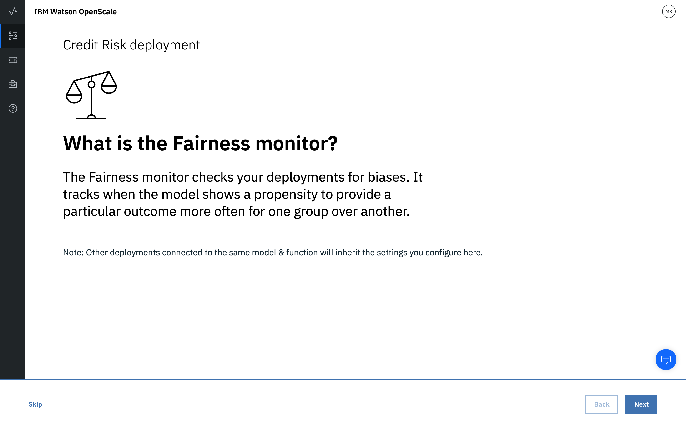
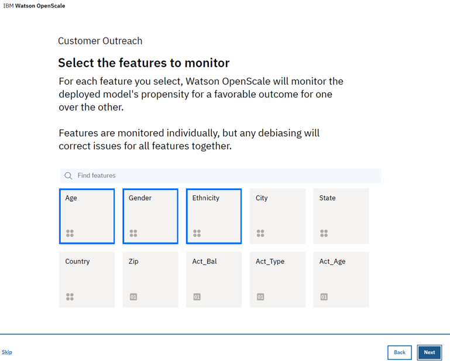
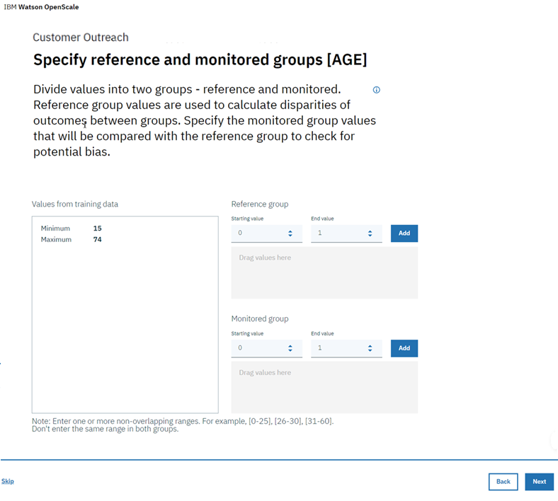
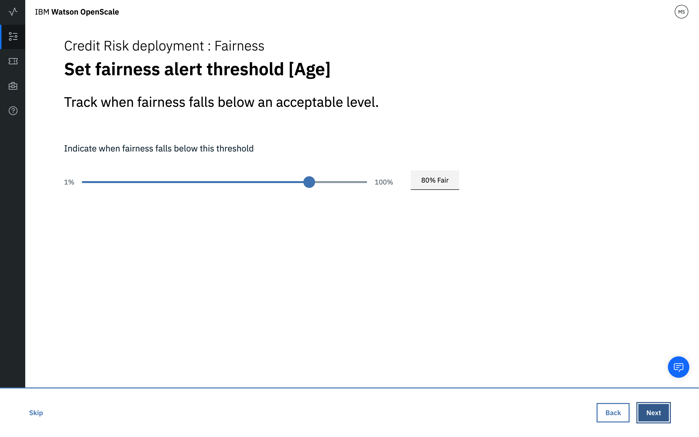
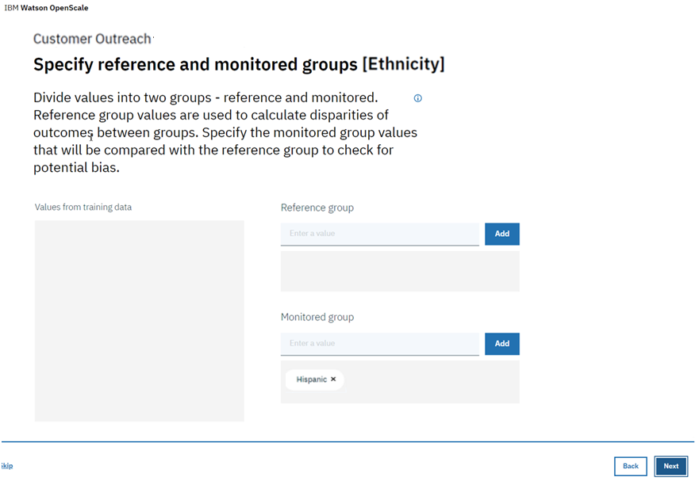
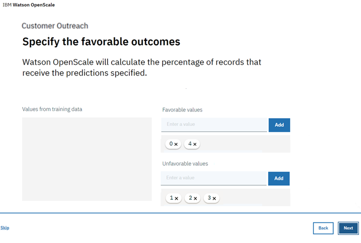
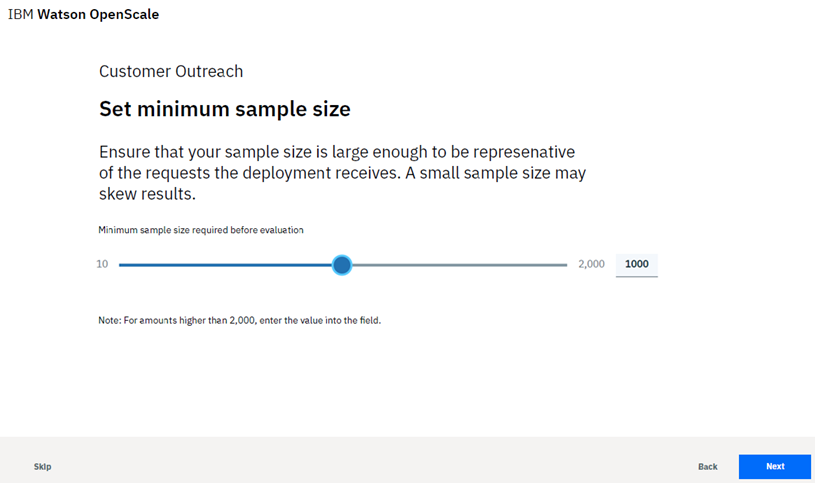
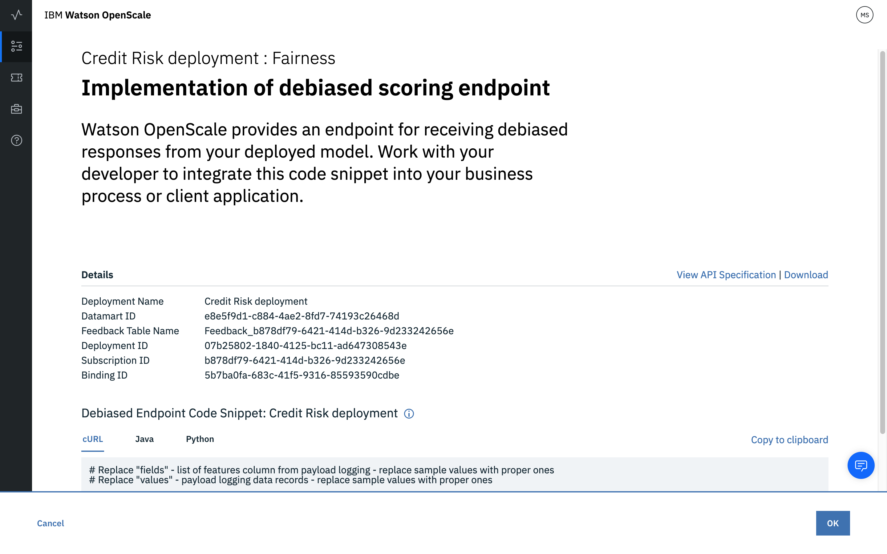

---

copyright:
  years: 2018, 2019
lastupdated: "2019-03-28"

keywords: fairness, fairness monitor

subcollection: ai-openscale

---

{:shortdesc: .shortdesc}
{:new_window: target="_blank"}
{:tip: .tip}
{:important: .important}
{:note: .note}
{:pre: .pre}
{:codeblock: .codeblock}
{:screen: .screen}

# 公平性
{: #mf-monitor}

公平性监视部署是否存在偏差，以帮助确保不同群体的结果公平。
{: shortdesc}

## 了解公平性
{: #mf-understand}

{{site.data.keyword.aios_short}} 在运行时检查已部署的模型是否存在偏差。要检测已部署的模型的偏差，必须定义 Age 或 Gender 之类的公平性属性，如下面的[配置公平性监视器](#mf-config)中所详述。

必须在 Watson {{site.data.keyword.pm_short}} 中指定模型或函数的输出模式，以在 {{site.data.keyword.aios_short}} 中启用偏差检查。可以使用 `store_model` API 的元数据部分中的 `client.repository.ModelMetaNames.OUTPUT_DATA_SCHEMA` 属性来指定输出模式。有关更多信息，请参阅 [WML 客户机文档 ](http://wml-api-pyclient-dev.mybluemix.net/#repository){: new_window}。

### 工作方式
{: #mf-works}

在配置公平性监视器之前，有几个要了解的至关重要的关键概念：

- *公平性属性*：这些是模型可能展现偏差的模型属性。例如，对于公平性属性 **`Gender`**，模型可能针对特定性别值（`Female` 或`Transgender` 等）存在偏差。公平性属性的另一个示例是 **`Age`**，其中模型可能会针对年龄组（例如 `18 to 25`）中的人员展现偏差。

- *参考/受监视值*：公平性属性的值分为两个不同类别：“参考”和“受监视”。受监视值是指可能会区分对待的值。对于诸如 **`Gender`** 之类的公平性属性，受监视值可能为 `Female` 和 `Transgender`。对于数字公平性属性（例如 **`Age`**），受监视值可能为 `[18-25]`。然后，给定公平性属性的所有其他值会被视为参考值，例如 `Gender=Male` 或 `Age=[26,100]`。

- *有利/不利结果*：模型的输出分类为“有利”或“不利”。例如，如果模型预测的是某个人是否应获得贷款，那么有利结果可能为 `Loan Granted` 或 `Loan Partially Granted`，而不利结果可能为 `Loan Denied`。因此，有利结果是被视为肯定结果的结果，而不利结果被视为否定。

{{site.data.keyword.aios_short}} 使用有效内容日志记录表中的最后 `N` 个记录每小时计算偏差；在配置“公平性”时会指定值 `N`。算法会扰动这最后 `N` 个记录以生成其他数据。

通过将公平性属性的值从“参考”更改为“受监视”可执行扰动，反之亦然。然后，会将扰动数据发送到模型以评估其行为。算法会查看有效内容表中的最后 `N` 个记录，以及模型在扰动数据上的行为，以决定模型行为是否有偏差。

如果在此组合数据集中，受监视类的有利结果的百分比小于参考类的有利结果的百分比（差异达到某个阈值），那么会将模型视为有偏差。在配置公平性时将指定此阈值。

公平性值可以大于 100%。这意味着受监视组接收到的有利结果数超过参考组。此外，如果未发送新的评分请求，那么公平性值将保持不变。
{: note}

### 示例
{: #mf-ex1}

假设一个数据点，其中，对于 `Gender=Male`（参考值），模型预测有利结果，但在通过将 `Gender` 更改为 `Female`（受监视值）来扰动记录时，在将所有其他特征值保持相同的情况下，模型预测不利结果。如果有足够的数据点（跨有效内容表中的最后 `N` 个记录，加上扰动数据），其中模型行为有偏差，那么会将模型整体视为展现偏差。

### 支持的模型
{: #mf-supmo}

 {{site.data.keyword.aios_short}} 仅支持对在其特征向量中期望某种类型的结构化数据的模型和 Python 函数进行偏差检测。

## 配置公平性监视器
{: #mf-config}

1.  从*什么是公平性？*页面中，单击**下一步**以启动配置过程。

    

1.  在*选择要监视的特征*页面上，查找并选择要使用的公平性属性，然后单击**下一步**。

    仅支持公平性数据类型为分类、数字（整数）、浮点值或双精度值的特征。不支持具有其他数据类型的特征。
    {: note}

    在此示例中，已选择特征 `Age`、`Gender` 和 `Ethnicity`。

    

    单击**下一步**以继续。

1.  每个特征具有要配置的特定需求。在此示例中，通过直接在每个组中手动输入值来定义“参考组”和“受监视组”的 **`Age`** 范围。

    在此示例中，对于 **`Age`** 公平性属性，如果您认为模型针对年龄在 18 岁到 25 岁之间的人员可能有偏差，那么“受监视组”值将为 `[18-25]`，“参考组”值将为 `[26-100]`。在使用 **`Gender`** 公平性属性的情况下，“参考组”值可能为 `Male`，而“受监视组”值可能为 `Female` 和 `Transgender`。

    

    单击**下一步**以继续

1.  针对 **`Age`** 设置公平性的阈值限制。

    公平性阈值用于指定受监视组的有利结果百分比相比于参考组的有利结果百分比的可接受差值。

    假设一个模型用于预测谁应获得贷款 (`favorable outcome=loan granted`)，谁不应获得贷款 (`unfavorable outcome=loan denied`)。此外，年龄的受监视值为 `[18,25]`，参考值为 `[26,100]`。当偏差检测算法运行时，如果它发现最后 `N` 个记录中年龄组 `[18,25]` 内的人员的有利结果百分比加上扰动数据为 `50%`，而年龄组 `[26,100]` 内的人员的有利结果百分比为 `70%`，那么公平性计算为 50*100/70 = 71.42。

    如果公平性阈值设置为 80%，那么算法会将模型标记为有偏差，因为计算的公平性小于阈值。但是，如果阈值设置为 70%，那么它不会将模型报告为有偏差。

    

    选择公平性阈值后，单击**下一步**。

1.  以相同方式配置特征 `Gender` 和 `Ethnicity`：

     

     

     **注意**：您在这些屏幕中输入的值应是发送到模型评分端点（并因此将添加到有效内容表）的值。如果数据在发送到评分端点之前进行处理，那么输入已处理的值。例如，如果原始数据针对 *Gender* 的值为 `Male` 和 `Female`，并且它已经过处理，以便发送到评分端点的数据为 `M` 和 `F`，那么在此屏幕上输入 `M` 和 `F`。

     完成设置每个特征时，单击**下一步**。

1.  现在，指定表示模型的有利结果的值。如果模型输出模式包含映射列，那么值派生自训练数据中的 `label` 列。在 WML 中，`prediction` 列始终具有双精度值。映射列用于指定此 `prediction` 值到类标签的映射。

    例如，如果 `prediction` 值为 `1.0`，那么映射列的值可能为 `Loan denied`；这暗示模型的预测为 `Loan denied`。因此，如果模型输出模式包含映射列，那么使用映射列中存在的值来指定“有利”和“不利”值。

    但是，如果映射列在模型输出模式中不存在，那么需要使用 `prediction` 列的值（`0.0` 或 `1.0` 等）来指定“有利”和“不利”值。

     

     单击**下一步**。

1.  最后，设置最小样本大小，以防止在评估数据集中提供最小数量的记录之前测量公平性。这确保样本大小不会太小而导致结果偏差。每次在偏差检查运行时，它将使用最小样本大小来决定将对其执行偏差计算的记录数。

     

1.  单击**下一步**按钮。

    系统会呈现您的选择摘要以供复审。如果要更改任何内容，请单击该部分的**编辑**链接。

    您还可以选择**添加其他特征**链接以返回到特征选择屏幕，并向公平性监视器中添加更多特征，例如：`City`、`ZipCode` 或 `Account Balance`。

1.  单击**保存**以完成配置。

### 了解除偏的工作方式
{: #mf-debias}

系统随后会向您呈现一个屏幕，其中提供已除偏评分端点。

  

已除偏评分端点完全可用作已部署的模型的正常评分端点。除返回已部署的模型的响应以外，它还返回额外两列，称为 `debiased_prediction` 和 `debiased_probability`。

- `debiased_prediction` 列包含已除偏预测值。在使用 Watson Machine Learning (WML) 的情况下，这是预测的编码表示。例如，如果模型预测为“Loan Granted”或“Loan Denied”，那么 WML 可以将这两个值分别编码为“0.0”和“1.0”。`debiased_prediction` 列包含已除偏预测的此类编码表示。

- 另一方面，`debiased_probability` 列表示已除偏预测的概率。这是双精度值的数组，其中每个值表示属于其中一个预测类的已除偏预测的概率。

此外，还会返回另一列 `debiased_decoded_target`，以防您在输出模式中有一个列包含以 `modeling-role` 作为 `decoded-target` 的列。

- `debiased_decoded_target` 列包含已除偏预测的字符串表示。在以上示例中，如果预测值为“0.0”或“1.0”，那么 `debiased_decoded_target` 将包含“Loan Granted”或“Loan Denied”。

理想情况下，将会直接从生产应用程序调用此端点，而不是直接调用模型服务引擎（Watson Machine Learning、Amazon Sagemaker、Microsoft Azure ML Studio 等）中部署的模型的评分端点。通过此方式，{{site.data.keyword.aios_short}} 也会将 `debiased` 值存储在模型部署的有效内容日志记录表中。然后，通过此端点执行的所有评分都将自动除偏。

由于此端点处理运行时偏差，因此它将继续对有效内容日志记录表中的最新评分数据运行背景检查，并保持更新用于对所发送的评分请求进行除偏的偏差缓解模型。通过此方式，{{site.data.keyword.aios_short}} 始终具有最新的入局数据，并且其行为会检测和缓解偏差。

最后，{{site.data.keyword.aios_short}} 使用阈值来决定数据现在是否可接受并被认为无偏差。该阈值被视为公平性监视器中为所配置的所有公平性属性设置的阈值中的最小值。

### 后续步骤
{: #mf-next}

从*配置监视器*页面中，可以选择其他监视类别。
