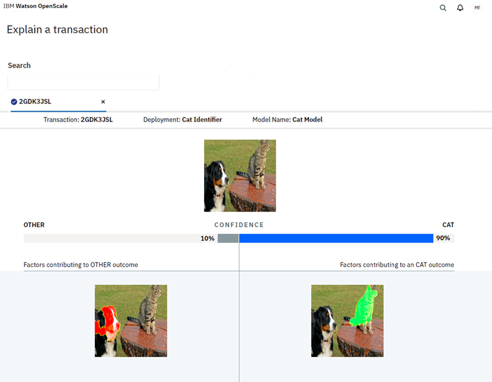
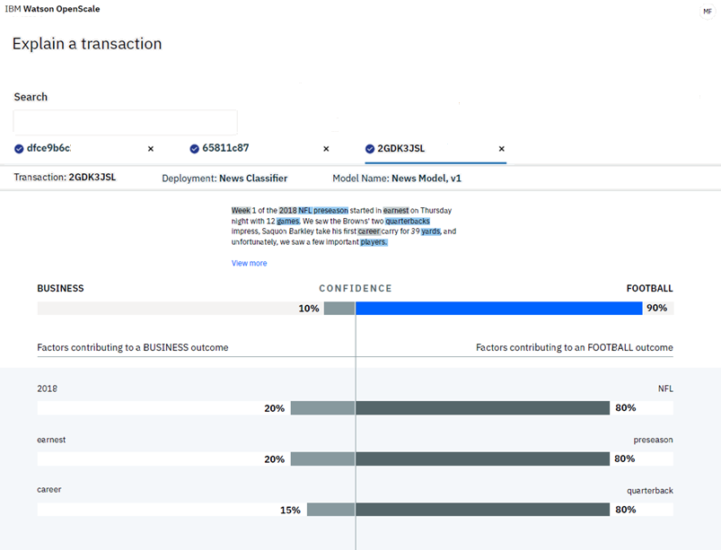

---

copyright:
  years: 2018, 2019
lastupdated: "2019-03-28"

keywords: explainability, monitoring, explain, explaining, transactions, transaction ID

subcollection: ai-openscale

---

{:shortdesc: .shortdesc}
{:new_window: target="_blank"}
{:tip: .tip}
{:important: .important}
{:note: .note}
{:pre: .pre}
{:codeblock: .codeblock}
{:screen: .screen}

# 監視可解釋性
{: #ie-ov}

對於每一項部署，您可以查看特定交易的可解釋性資料。
{: shortdesc}

## 解釋交易
{: #ie-view}

在選取的部署圖磚中，選取導覽器中的**解釋交易**標籤 ()，並輸入交易 ID。

每當將資料傳送給模型進行評分時，它會在 HTTP 標頭中設定 `X-Global-Transaction-Id` 欄位，以設定一個交易 ID。此交易 ID 會儲存在承載內容表格中。如果要尋找模型之特定評分行為的解釋，請指定該評分要求的相關聯交易 ID。請注意，此行為僅適用於 Watson Machine Learning (WML) 交易，而不適用於非 WML 交易。
{: note}

### 在 {{site.data.keyword.aios_short}} 中尋找交易 ID
{: #ie-find}

1.  從部署的時間圖表中，在圖表內滑動標記，並按一下**檢視明細**鏈結，以便[將特定小時的資料視覺化](/docs/services/ai-openscale?topic=ai-openscale-it-ov#it-vdet)。
1.  按一下**檢視交易**按鈕，以[檢視交易 ID 清單](/docs/services/ai-openscale?topic=ai-openscale-it-ov#it-tra)。
1.  從清單中，複製其中一個交易 ID，並貼到**解釋交易**頁面上的搜尋方框，然後按 Enter 鍵。

    交易 ID 清單也會提供選項，您只需在任何交易 ID 的「動作」直欄中，按一下**解釋**鏈結，如此即會在「可解釋性」標籤中開啟該交易。{: note}

  請參閱下列各節，取得各種不同模型類型的解釋範例。

  

## 種類模型範例
{: #ie-class}

這個可解釋性範例指的是一個二進位分類模型，用來核准或拒絕保險理賠。在本例中，您可以看到正面或負面造成 `DENIED` 最終輸出結果的一些因素。

值為 `< 1 year` 的*原則歷時*特性在決定了 DENIED 輸出結果的模型中，所造成的影響最大。造成此輸出結果的其他特性還有*理賠頻率* (`High`) 和*年齡* (`18`)，以及僅帶來些微影響的*汽車價格* (`$50,000`)。

儘管在決定交易的輸出結果時，圖表有助於顯示最重要的因素，分類模型也可以包含進階解釋，且這些解釋詳述於 `Minimum changes for Approved outcome` 和 `Minimum changes for this outcome` 區段中。

進階解釋不適用於迴歸、影像和非結構化文字模型。
{: note}

`Minimum changes for Approved outcome` 指出，如果特性的值已變更為此區段所列出的值，則模型的預測將會變更。

同樣地，`Minimum changes for this outcome` 指出，即使特性的值已變更為此區段所列出值，模型的預測並未變更。

因此由這兩個值可看出，模型在要產生解釋之資料點附近的行為。

## 影像模型範例
{: #ie-image}

對於可解釋性的影像分類模型範例，您可以看到影像中，哪些部分會正面造成所預測的輸出結果，哪些部分會負面造成所預測的輸出結果。在以下的範例中，右側影像顯示對預測造成正面影響的部分，左側影像顯示對輸出結果造成負面影響的影像部分。

目前，如果影像大小超過 1 MB，就無法產生其解釋。
{: note}

## 非結構化文字模型範例
{: #ie-unstruct}

最後，這個可解釋性範例顯示用來評估非結構化文字的分類模型。解釋顯示對模型預測造成正面及負面影響的關鍵字。我們也會針對原始文字中被當成輸入輸送給模型的識別關鍵字，顯示其位置。

