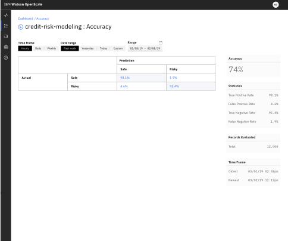
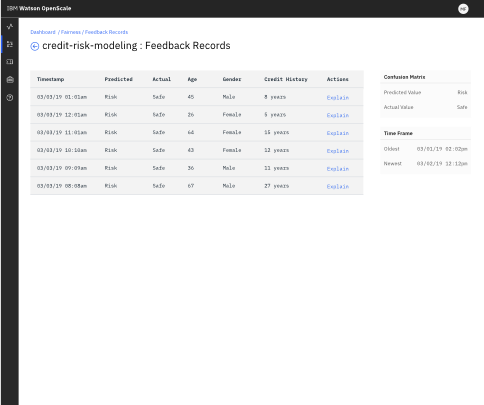

---

copyright:
  years: 2018, 2019
lastupdated: "2019-05-06"

keywords: metrics, monitoring, custom metrics, thresholds

subcollection: ai-openscale

---

{:shortdesc: .shortdesc}
{:new_window: target="_blank"}
{:tip: .tip}
{:important: .important}
{:note: .note}
{:pre: .pre}
{:codeblock: .codeblock}
{:screen: .screen}

# Analyzing metrics and transactions 
{: #anlz_metrics}

You can use {{site.data.keyword.aios_full}} to analyze metrics and transactions through a variety of means.
{: shortdesc}

## Confusion matrix 
{: #it-conf-mtx}

As a detail of the quality metrics, you can view the records that the model analyzed incorrectly. Such anomalies can be false positives or false negatives for binary classification models or can be incorrect class assignments for multi-class models. You can also view a list of feedback records that the model did not analyze correctly.
{: shortdesc}

1. From any of the **Quality** charts, such as **Fairness** click on an hour/day in the chart.
    
    

1. A confusion matrix displays the false positives and false negatives. Click a cell to view the subset of feedback records.

    

1. Review the feedback records and request an explanation of the analysis against the feedback record.

    

1. Transactions appear inline.

    

