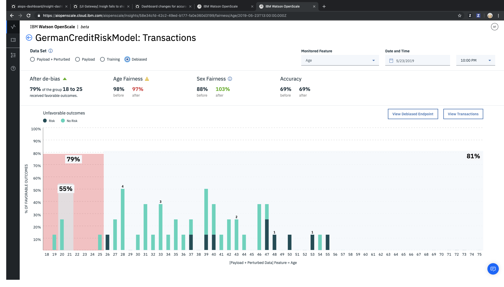

---

copyright:
  years: 2018, 2019
lastupdated: "2019-06-28"

keywords: metrics, monitoring, custom metrics, thresholds

subcollection: ai-openscale

---

{:shortdesc: .shortdesc}
{:external: target="_blank" .external}
{:tip: .tip}
{:important: .important}
{:note: .note}
{:pre: .pre}
{:codeblock: .codeblock}
{:download: .download}
{:screen: .screen}
{:javascript: .ph data-hd-programlang='javascript'}
{:java: .ph data-hd-programlang='java'}
{:python: .ph data-hd-programlang='python'}
{:swift: .ph data-hd-programlang='swift'}
{:faq: data-hd-content-type='faq'}

# Accuracy
{: #accuracy-opener}

Accuracy is a measure of the proportion of correct predictions contained within your model.
{: shortdesc}

## Accuracy at a glance
{: #anlz_metrics_supqualdets_acc}

- **Description**: The proportion of correct predictions
- **Default thresholds**: Lower limit = 80%
- **Default recommendation**:
   - **Upward trend**: An upward trend indicates that the metric is improving. This means that model retraining is effective.
   - **Downward trend**: A downward trend indicates that the metric is deteriorating. Feedback data is becoming significantly different than the training data.
   - **Erratic or irregular variation**: An erratic or irregular variation indicates that the feedback data is not consistent between evaluations. Increase the minimum sample size for the Quality monitor.
- **Problem types**: Binary classification and multiclass classification
- **Chart values**: Last value in the time frame
- **Metrics details available**: Confusion matrix

## Understanding Accuracy
{: #acc-understand}

Accuracy can mean different things depending on the type of the algorithm:

- *Multi-class classification*: Accuracy measures the number of times any class was predicted correctly, normalized by the number of data points. For more details, see [Multi-class classification](https://spark.apache.org/docs/2.1.0/mllib-evaluation-metrics.html#multiclass-classification){: external} in the Apache Spark documentation.

- *Binary classification*: For a binary classification algorithm, accuracy is measured as the area under an ROC curve. See [Binary classification](https://spark.apache.org/docs/2.1.0/mllib-evaluation-metrics.html#binary-classification){: external} in the Apache Spark documentation for more details.

- *Regression*: Regression algorithms are measured using the Coefficient of Determination, or R2. For more details, see [Regression model evaluation](https://spark.apache.org/docs/2.1.0/mllib-evaluation-metrics.html#regression-model-evaluation){: external} in the Apache Spark documentation.

### How it works
{: #acc-works}

You need to add manually-labelled feedback data through the {{site.data.keyword.aios_short}} UI as shown in the following examples, using a [Python client](http://ai-openscale-python-client.mybluemix.net/#feedbacklogging){: external} or [Rest API](https://cloud.ibm.com/apidocs/ai-openscale#post-feedback-payload){: external}.

Review [Supported frameworks](/docs/services/ai-openscale?topic=ai-openscale-in-ov#in-fram) for accuracy monitoring limitations.

### De-biased accuracy
{: #acc-debias-view}

When there is data to support it, the accuracy is computed on both the original and de-biased model. {{site.data.keyword.aios_full_notm}} computes the accuracy for the de-biased output and stores it in the payload logging table as an additional column.

