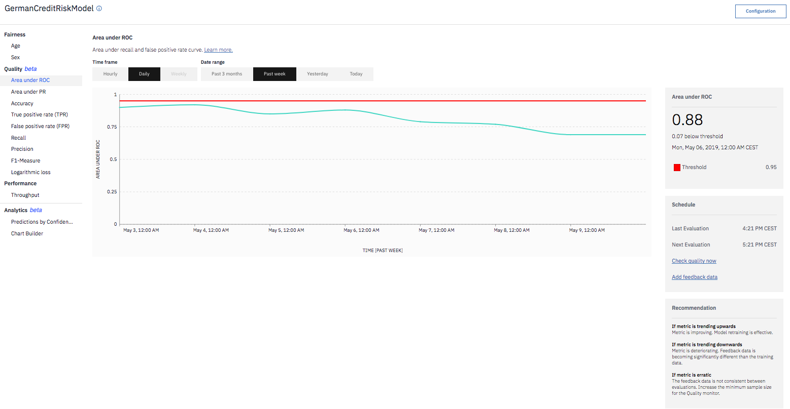
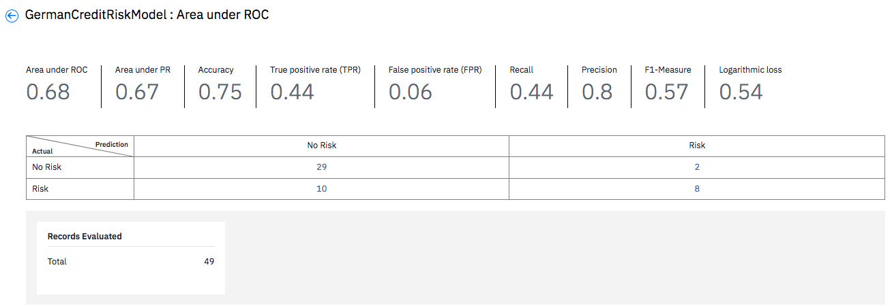

---

copyright:
  years: 2018, 2019
lastupdated: "2019-06-24"

keywords: metrics, monitoring, custom metrics, thresholds

subcollection: ai-openscale

---

{:shortdesc: .shortdesc}
{:external: target="_blank" .external}
{:tip: .tip}
{:important: .important}
{:note: .note}
{:pre: .pre}
{:codeblock: .codeblock}
{:download: .download}
{:screen: .screen}
{:javascript: .ph data-hd-programlang='javascript'}
{:java: .ph data-hd-programlang='java'}
{:python: .ph data-hd-programlang='python'}
{:swift: .ph data-hd-programlang='swift'}
{:faq: data-hd-content-type='faq'}

# Quality metrics overview 
{: #anlz_metrics}

Use quality monitoring to determine how well your model predicts outcomes. When quality monitoring is enabled, it generates a set of metrics every hour by default. You can generate these metrics on demand by clicking the **Check quality now** button or by using the Python client.

Quality metrics are calculated based on the following information:

- manually labeled feedback data,
- monitored deployment responses for these data.

For proper monitoring, feedback data must be logged to {{site.data.keyword.aios_short}} on a regular basis. The feedback data can be provided either by using "Add Feedback data" option or using Python client or REST API.

For machine learning engines other than {{site.data.keyword.aios_short}}, such as Microsoft Azure ML Studio or Amazon Sagemaker ML quality monitoring creates additional scoring requests on the monitored deployment.
{: note}

You can review all metrics values over time on the {{site.data.keyword.aios_short}} dashboard:

To review related details, such as confusion matrix for binary and multi-class classification, which are available for some metrics, click the chart.

## Supported quality metrics
{: #anlz_metrics_supqualdets}

The following quality metrics are supported by {{site.data.keyword.aios_short}}:

- [Area under ROC](/docs/services/ai-openscale?topic=ai-openscale-quality_roc)
- [Area under PR](/docs/services/ai-openscale?topic=ai-openscale-quality-area-pr)
- [Accuracy](/docs/services/ai-openscale?topic=ai-openscale-accuracy-opener)
- [True positive rate (TPR)](/docs/services/ai-openscale?topic=ai-openscale-quality_tpr)
- [False positive rate (FPR)](/docs/services/ai-openscale?topic=ai-openscale-quality_fpr_false)
- [Recall](/docs/services/ai-openscale?topic=ai-openscale-quality_recall)
- [Precision](/docs/services/ai-openscale?topic=ai-openscale-quality_precision)
- [F1-Measure](/docs/services/ai-openscale?topic=ai-openscale-quality_f1-measr)
- [Logarithmic loss](/docs/services/ai-openscale?topic=ai-openscale-quality_log_loss)

## Supported quality details
{: #anlz_metrics_supqualdets_suppr_dets}

The following details for quality metrics are supported by {{site.data.keyword.aios_short}}:

### Confusion matrix
{: #anlz_metrics_supqualdets_confusion-quickovr}

Confusion matrix helps you to understand for which of your feedback data the monitored deployment response is correct and for which it is not.

For more information, see [Confusion matrix](/docs/services/ai-openscale?topic=ai-openscale-it-conf-mtx).