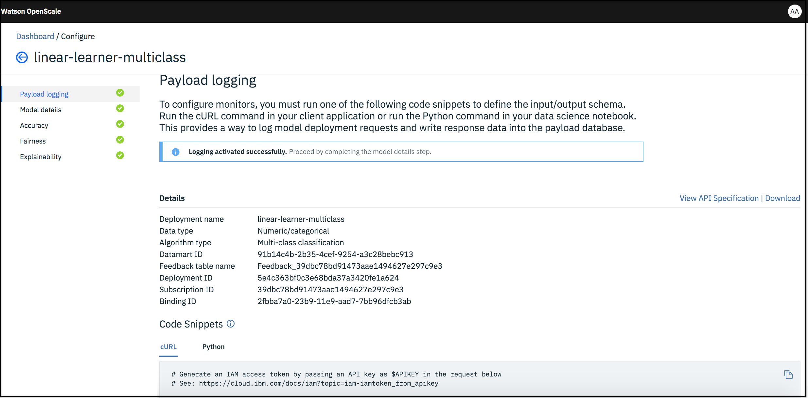

---

copyright:
  years: 2018, 2019
lastupdated: "2019-06-24"

keywords: databases, connections, scoring, requests

subcollection: ai-openscale

---

{:shortdesc: .shortdesc}
{:external: target="_blank" .external}
{:tip: .tip}
{:important: .important}
{:note: .note}
{:pre: .pre}
{:codeblock: .codeblock}
{:download: .download}
{:screen: .screen}
{:javascript: .ph data-hd-programlang='javascript'}
{:java: .ph data-hd-programlang='java'}
{:python: .ph data-hd-programlang='python'}
{:swift: .ph data-hd-programlang='swift'}
{:faq: data-hd-content-type='faq'}

# Sending a scoring request
{: #cdb-score}

To configure monitors, {{site.data.keyword.aios_short}} requires you to send a scoring payload, in order to begin to log the data that will be monitored.

- For models deployed in {{site.data.keyword.pm_full}}, just score your deployment. {{site.data.keyword.pm_short}} automatically sends the scoring payload to {{site.data.keyword.aios_short}}. 
- For other machine learning engines, such as Microsoft Azure, Amazon SageMaker, or a custom machine learning engine the scoring payload must be sent using the Payload Logging API. For more information, see [Payload logging for non-{{site.data.keyword.pm_full}} service instances](/docs/services/ai-openscale?topic=ai-openscale-cml-connect).

Because models deployed in {{site.data.keyword.pm_full}} are automatically scored by {{site.data.keyword.aios_short}}, if you only have models deployed in {{site.data.keyword.pm_short}}, a checkmark appears to indicate that this step is complete in the **Ready to monitor** column.
{: note}

## Steps for payload logging
{: #cdb-score-apisteps}

1. Select a deployment. In the following example **Fraud Detector** is the deployment.
2. Choose whether to use the `cURL` or `Python` code by clicking the `cURL` or `Python` tab.
3. Click **Copy to clipboard** and paste it into to log model deployment request and response data. For more information, see [Payload logging for non-{{site.data.keyword.pm_full}} service instances](/docs/services/ai-openscale?topic=ai-openscale-cml-connect).

The fields and values in the code snippets need to be substituted with your real values, as the ones provided are only examples.
{: important}

After you run your payload logging, a checkmark appears in the "Ready to Monitor" column for the selected deployment. Click **Configure Monitors** to continue.

## Understanding the number of scoring requests
{: #cdb-score-capacity}

Scoring requests are an integral part of {{site.data.keyword.aios_short}} processing. Each transaction record that you send to the model to be scored generates additional processing so that the {{site.data.keyword.aios_short}} service can perform perturbation and create explanations.

- For tabular, text, image models the following baseline request generates data points:

   - 1 scoring request generates 5000 data points.

- For tabular classification models only, there are additional scoring requests that are made for contrastive explanation. The following requests are added to the preceding baseline request:

   - 100 scoring requests generates 51 additional data points per request.
   - 101 scoring requests generates 1 additional data point per request.

## Next steps
{: #cdb-score-next-steps-scoringreq}

[Configure monitors](https://test.cloud.ibm.com/docs/services/ai-openscale?topic=ai-openscale-mo-config).
