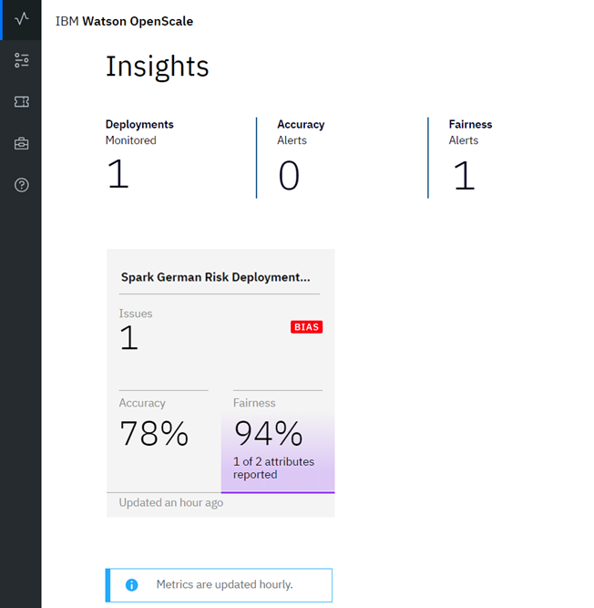
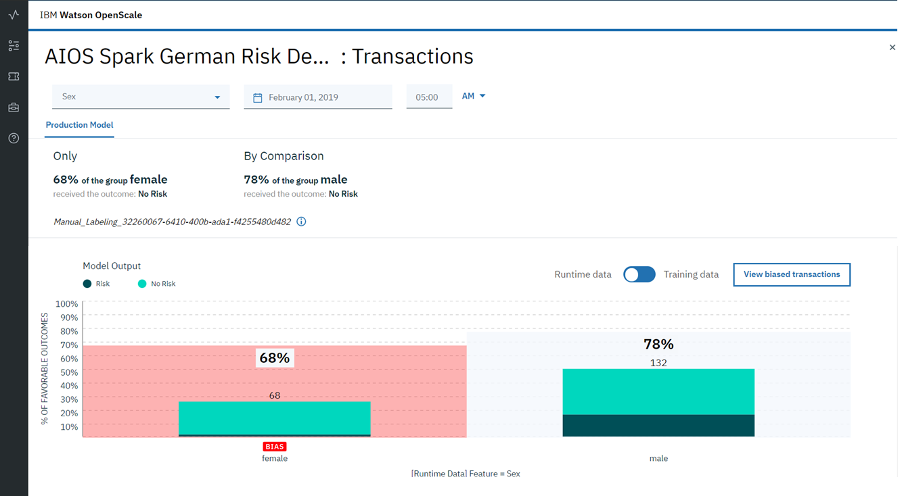
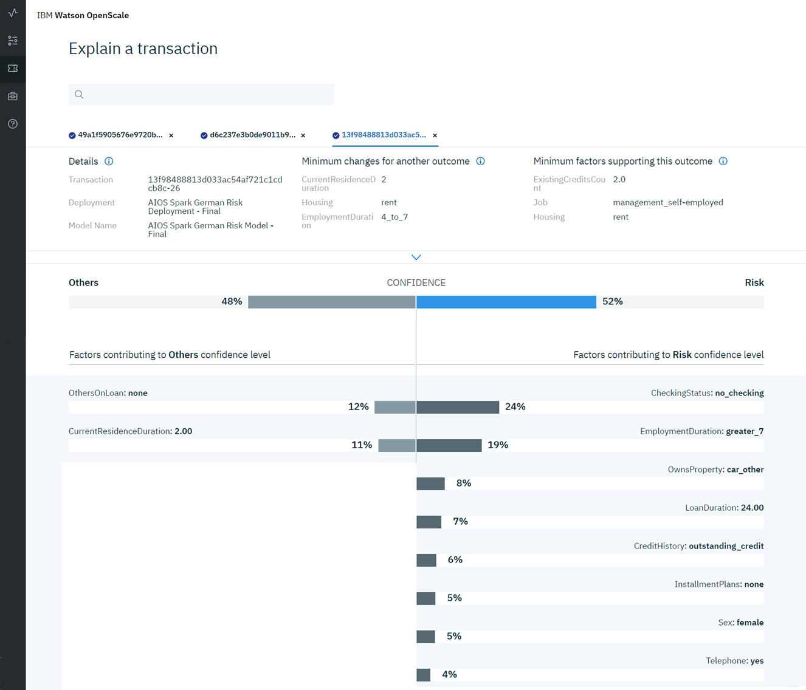

---

copyright:
  years: 2018, 2019
lastupdated: "2019-03-28"

keywords: tutorial, Jupyter notebooks, Watson Studio projects, projects, models, deploy, 

subcollection: ai-openscale

---

{:shortdesc: .shortdesc}
{:new_window: target="_blank"}
{:tip: .tip}
{:important: .important}
{:note: .note}
{:pre: .pre}
{:codeblock: .codeblock}
{:screen: .screen}
{:javascript: .ph data-hd-programlang='javascript'}
{:java: .ph data-hd-programlang='java'}
{:python: .ph data-hd-programlang='python'}
{:swift: .ph data-hd-programlang='swift'}

# Tutorial - (Advanced)
{: #crt-ov}

## Scenario
{: #crt-scenario}

Traditional lenders are under pressure to expand their digital portfolio of financial services to a larger and more diverse audience, which requires a new approach to credit risk modeling. Their data science teams currently rely on standard modeling techniques - like decision trees and logistic regression - which work well for moderate datasets, and make recommendations that can be easily explained. This satisfies regulatory requirements that credit lending decisions must be transparent and explainable.

To provide credit access to a wider and riskier population, applicant credit histories must expand beyond traditional credit, like mortgages and car loans, to alternate credit sources like utility and mobile phone plan payment histories, plus education and job titles. These new data sources offer promise, but also introduce risk by increasing the likelihood of unexpected correlations which introduce bias based on an applicant’s age, gender, or other personal traits.

The data science techniques most suited to these diverse datasets, such as gradient boosted trees and neural networks, can generate highly accurate risk models, but at a cost. Such "black box" models generate opaque predictions that must somehow become transparent, to ensure regulatory approval such as Article 22 of the General Data Protection Regulation (GDPR), or the federal Fair Credit Reporting Act (FCRA) managed by the Consumer Financial Protection Bureau.

The credit risk model provided in this tutorial uses a training dataset that contains 20 attributes about each loan applicant. Two of those attributes - age and sex - can be tested for bias. For this tutorial, the focus will be on bias against sex and age.

{{site.data.keyword.aios_short}} will monitor the deployed model's propensity for a favorable outcome ("No Risk") for one group (the Reference Group) over another (the Monitored Group). In this tutorial, the Monitored Group for sex is `female`, while the Monitored Group for age is `18 to 25`.

## Prerequisites
{: #crt-prereqs}

This tutorial uses a Jupyter notebook that should be run in a Watson Studio project, using a "Python 3.5 with Spark" runtime environment. It requires service credentials for the following {{site.data.keyword.cloud_notm}} services:

- Cloud Object Storage (to store your Watson Studio project)
- {{site.data.keyword.aios_short}}
- Watson Machine Learning
- Db2 Warehouse

The Jupyter notebook will train, create and deploy a German Credit Risk model, configure {{site.data.keyword.aios_short}} to monitor that deployment, and provide seven days' worth of historical records and measurements for viewing in the {{site.data.keyword.aios_short}} Insights dashboard. You can also optionally configure the model for continuous learning with Watson Studio and Spark.

## Introduction
{: #crt-intro}

In this tutorial, you will:

- Provision {{site.data.keyword.cloud_notm}} machine learning and storage services
- Set up a Watson Studio project, and run a Python notebook to create, train and deploy a machine learning model
- Run a Python notebook to create a data mart, configure performance, accuracy, and fairness monitors, and create data to monitor
- View results in the {{site.data.keyword.aios_short}} Insights tab

## Provision {{site.data.keyword.cloud_notm}} Services
{: #crt-services}

Login to your [{{site.data.keyword.cloud_notm}} account ](https://{DomainName}){: new_window} with your IBM ID. When provisioning services, particularly in the case ofDb2 Warehouse, verify that your selected organization and space are the same for all services.

### Create a Watson Studio account
{: #crt-wstudio}

- [Create a Watson Studio instance ](https://{DomainName}/catalog/services/watson-studio){: new_window} if you do not already have one associated with your account:

  

- Give your service a name, choose the Lite (free) plan, and click the **Create** button.

### Provision a Cloud Object Storage service
{: #crt-cos}

- [Provision an Object Storage service ](https://{DomainName}/catalog/services/cloud-object-storage){: new_window} if you do not already one associated with your account:

  

- Give your service a name, choose the Lite (free) plan, and click the **Create** button.

### Provision a Watson Machine Learning service
{: #crt-wml}

- [Provision a Watson Machine Learning instance ](https://{DomainName}/catalog/services/machine-learning){: new_window} if you do not already have one associated with your account:

  

- Give your service a name, choose the Lite (free) plan, and click the **Create** button.

### Provision a Databases for PostgreSQL service
{: #crt-db2}

- [Provision a Databases for PostgreSQL service ](https://{DomainName}/catalog/services/databases-for-postgresql) if you do not already have one associated with your account:

  

- Give your service a name, choose the Entry plan, and click the **Create** button.

## Set up a Watson Studio project
{: #crt-set-wstudio}

- Login to your [Watson Studio account ](https://dataplatform.ibm.com/){: new_window}. Click the account avatar icon in the upper right and verify that the account you are using is the same account you used to create your {{site.data.keyword.cloud_notm}} services:

  

- In Watson Studio, begin by creating a new project. Select "Create a project":

  

- Select the **Standard** tile, to create the project:

  

- Give your project a name and description, make sure the Cloud Object Storage service you created is selected in the **Storage** dropdown, and click **Create**.

## Create and deploy a machine learning model
{: #crt-make-model}

### Add the `IBM Watson OpenScale Lab instructions` notebook to your Watson Studio project
{: #crt-add-notebook}

- Download the following file:

    - [IBM Watson OpenScale Lab instructions ](https://github.com/emartensibm/german-credit/blob/master/german_credit_lab.ipynb){: new_window}

- From the **Assets** tab in your Watson Studio project, click the **Add to project** button and select **Notebook** from the dropdown:

  

- Select **From file**:

  

- Then click the **Choose file** button, and select the "german_credit_lab.ipynb" notebook file that you downloaded:

  

- In the **Select runtime** section, choose a Python 3.5 with Spark option:

- Click **Create Notebook**.

### Edit and run the `IBM Watson OpenScale Lab instructions` notebook
{: #crt-edit-notebook}

The `IBM Watson OpenScale Lab instructions` notebook contains detailed instructions for each step in the Python code you will run. As you work through the notebook, take some time to understand what each command is doing.
{: tip}

- From the **Assets** tab in your Watson Studio project, click the **Edit** icon next to the `IBM Watson OpenScale Lab instructions` notebook to edit it.

- In the "Provision services and configure credentials" section, make the following changes:

    - Follow the instructions to create, copy, and paste an {{site.data.keyword.cloud_notm}} API key.

    - Replace the Watson Machine Learning (WML) service credentials with the ones you created previously.

    - Replace the DB credentials with the ones you created for Databases for PostgreSQL.

    - If you previously configured {{site.data.keyword.aios_short}} to use a free internal PostgreSQL database as your data mart, you can switch to a new data mart that uses your Databases for PostgreSQL service. To delete your old PostgreSQL configuration and create a new one, set the KEEP_MY_INTERNAL_POSTGRES variable to `False`.

        The notebook will remove your existing internal PostgreSQL data mart and create a new data mart with the supplied DB credentials. **No data migration will occur**.
        {: important}

- Once you have provisioned your services and entered your credentials, your notebook is ready to run. Click the **Kernel** menu item, and select **Restart & Clear Output** from the menu:

  

- Now, run each step of the notebook in sequence. Notice what is happening at each step, as described. Complete all the steps, up through and including the steps in the "Additional data to help debugging" section.

The net result is that you will have created, trained, and deployed the **Spark German Risk Deployment** model to your {{site.data.keyword.aios_short}} service instance. {{site.data.keyword.aios_short}} will be configured to check the model for bias against sex (in this case, Female) or age (in this case, 18-25 years old).

## Viewing results
{: #crt-view-results}

### View insights for your deployment
{: #crt-view-insights}

Using the [{{site.data.keyword.aios_short}} dashboard ](https://aiopenscale.cloud.ibm.com/aiopenscale/){: new_window}, click on the **Insights** tab:

  

The Insights page provides an overview of metrics for your deployed models. You can easily see alerts for Fairness or Accuracy metrics that have fallen below the threshold set when running the notebook. The data and settings used in this tutorial will have created Accuracy and Fairness metrics similar to the ones shown here.

  

### View monitoring data for your deployment
{: #crt-view-mon-data}

1. To view monitoring details, from the **Insights** page, click the tile that corresponds to the deployment. The monitoring data for that deployment appears. 
2. Slide the marker across the chart to select data for a specific one-hour window. 
3. Click the **View details** link.

  

Now, you can review the charts for the data you monitored. For this example, you can see that for the "Sex" feature, the group `female` received the favorable outcome "No Risk" less (68%) than the group `male` (78%).

  

### View explainability for a model transaction
{: #crt-view-explain}

For each deployment, you can see explainability data for specific transactions.

If you already know which transaction you want to view, there's a quick way to look it up with the transaction ID. After you click the deployment tile, from the navigator, click the **Explain a transaction**  icon, type the transaction ID, and press **Enter**.
{: tip}

If you use the internal lite version of PostgreSQL, you might not be able to retrieve your database credentials. This might prevent you from seeing transactions.
{: note}

1. From the charts for the latest biased data, click the **View transactions** button.

  

  A list of transactions where the deployment has acted in a biased manner appears. 
  
2. Select one of the transactions and, from the **ACTION** column, click the **Explain** link.

  

You will now see an explanation of how the model arrived at its conclusion, including how confident the model was, the factors that contributed to the confidence level, and the attributes fed to the model.

  
  
## Next steps
{: #crt-next-steps}

- Learn more about [viewing and interpreting the data](/docs/services/ai-openscale?topic=ai-openscale-it-ov) and [monitoring explainability](/docs/services/ai-openscale?topic=ai-openscale-ie-ov).
