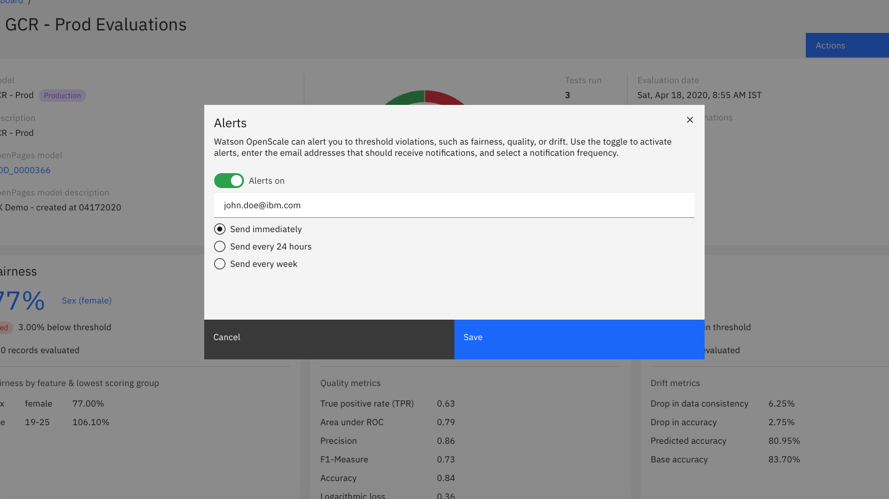
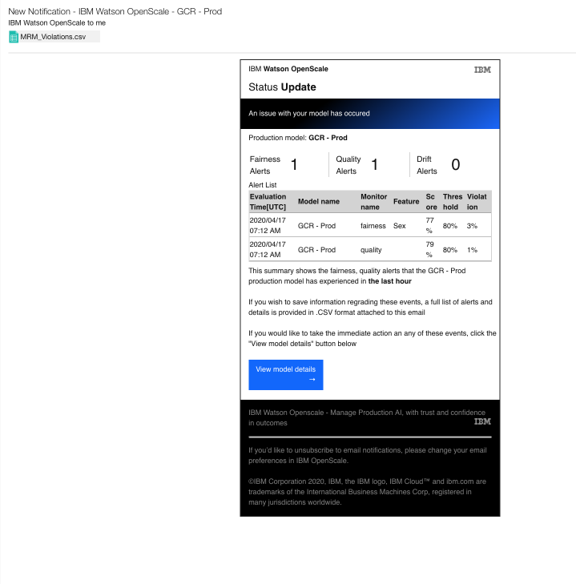

---

copyright:
  years: 2018, 2020
lastupdated: "2020-05-05"

keywords: alerts, threshold violations, email

subcollection: ai-openscale

---

{:shortdesc: .shortdesc}
{:external: target="_blank" .external}
{:tip: .tip}
{:important: .important}
{:note: .note}
{:pre: .pre}
{:codeblock: .codeblock}
{:help: data-hd-content-type='help'}
{:support: data-reuse='support'}
{:screen: .screen}
{:faq: data-hd-content-type='faq'}

# Setting up alerts
{: #alerts}

You can configure {{site.data.keyword.aios_short}} to alert you to threshold violations.
{: shortdesc}

You can enable alerts from the **Actions** menu. After you enable alerts, you can enter the email address to use for alerts and the frequency of the alerts:

{{site.data.keyword.aios_short}} uses the time that the alert is set to determine the time of day of the alert itself. When you choose either the daily or weekly option, you should make sure that you are setting the alert at the same time that you wish to receive the email message in your inbox.
{: note}

The alert comes in the form of an email message that displays the monitors and details about any of the threshold violations:

