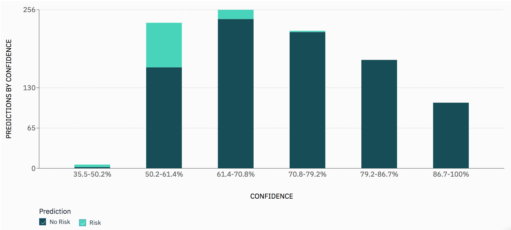

---

copyright:
  years: 2018, 2020
lastupdated: "2020-05-18"

keywords: fairness, fairness monitor, payload, perturbation, training data, debiased

subcollection: ai-openscale

---

{:shortdesc: .shortdesc}
{:external: target="_blank" .external}
{:tip: .tip}
{:important: .important}
{:note: .note}
{:pre: .pre}
{:codeblock: .codeblock}
{:screen: .screen}
{:faq: data-hd-content-type='faq'}

# Predictions by confidence
{: #anlz_metrics_payload-confidence}

You can analyze the scoring payload that is sent to your deployment in the selected data range by reviewing prediction classes and confidence distribution in each class
{: shortdesc}

   
