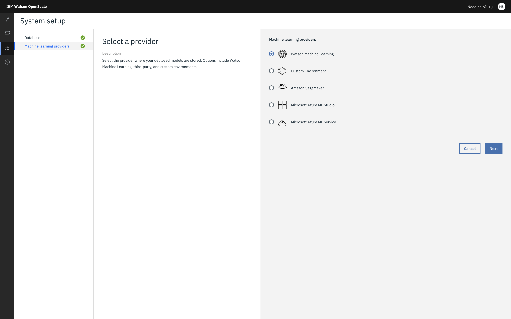

---

copyright:
  years: 2018, 2020
lastupdated: "2020-01-28"

keywords: machine learning, services, ml, custom 

subcollection: ai-openscale

---

{:shortdesc: .shortdesc}
{:external: target="_blank" .external}
{:tip: .tip}
{:important: .important}
{:note: .note}
{:pre: .pre}
{:codeblock: .codeblock}
{:screen: .screen}

# Specifying a Custom ML service instance
{: #co-connect}

Your first step in the {{site.data.keyword.aios_short}} tool is to specify a service instance. Your service instance is where you store your AI models and deployments.
{: shortdesc}

## Connect your Custom service instance
{: #co-config}

{{site.data.keyword.aios_short}} connects to AI models and deployments in a service instance. You can connect a custom service

1. From the **Configure** tab, click **Machine learning provider**.

   

2. Select the **Custom environment** tile.

   

3. Enter a name and description for your custom machine learning provider and click **Next**. 

4. Choose whether to connect to your deployments [by requesting a list](/docs/services/ai-openscale?topic=ai-openscale-co-connect#co-config-request-list) or [by entering individual scoring endpoints](/docs/services/ai-openscale?topic=ai-openscale-co-connect#co-config-scoring-endpoints).

   
    
5. Click **Next**.

### Requesting the list of deployments
{: #co-config-request-list}

1. If you selected the **Request the list of deployments** tile, enter your credentials and API Endpoint, then click **Save**.

   

2. After you save your machine learning setup, return to the **Dashboard**, click the **Insights** tab, and then click the **Add to dashboard** button.

3. Select a deployment from the list and click **Configure**.

You are now ready to configure monitors.

### Providing individual scoring endpoints
{: #co-config-scoring-endpoints}

1. If you selected the **Enter individual scoring endpoints** tile, enter your credentials for the API Endpoint, then click **Save**.

2. After you save your machine learning setup, return to the **Dashboard**, click the **Insights** tab, and then click the **Add to dashboard** button.

3. Click the **Add Endpoint** button.

4. From the drop-down menu, select the custom environment, type the deployment name and API endpoint, then click **Save**.

### Next steps
{: #co-next}

{{site.data.keyword.aios_short}} is now ready for you to [configure monitors](/docs/services/ai-openscale?topic=ai-openscale-mo-config).
