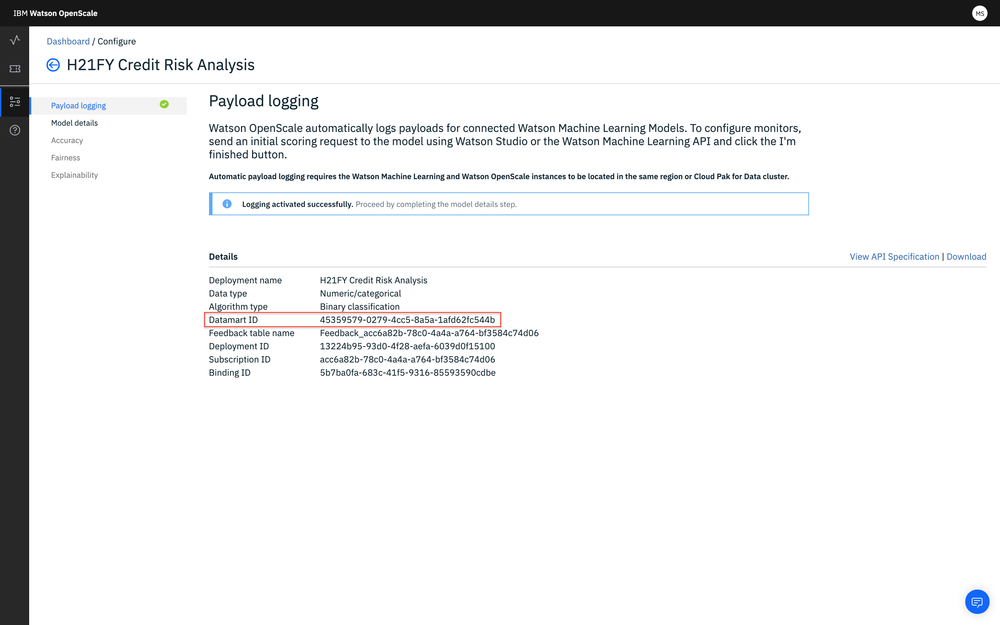
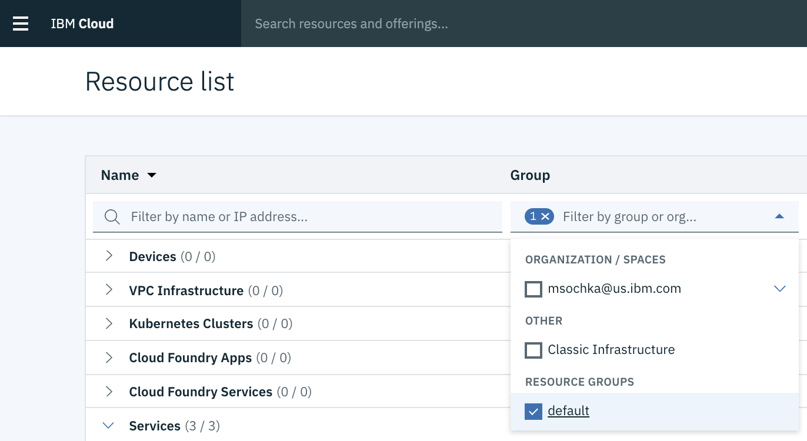

---

copyright:
  years: 2018, 2019
lastupdated: "2019-09-09"

keywords: credentials, REST API, datamart ID, IDs, binding ID,  deployment ID, subscription ID

subcollection: ai-openscale

---

{:shortdesc: .shortdesc}
{:external: target="_blank" .external}
{:tip: .tip}
{:important: .important}
{:note: .note}
{:pre: .pre}
{:codeblock: .codeblock}
{:download: .download}
{:screen: .screen}
{:javascript: .ph data-hd-programlang='javascript'}
{:java: .ph data-hd-programlang='java'}
{:python: .ph data-hd-programlang='python'}
{:swift: .ph data-hd-programlang='swift'}
{:faq: data-hd-content-type='faq'}

# Creating credentials for {{site.data.keyword.aios_short}}
{: #cred-create}

To access the {{site.data.keyword.aios_full}} REST APIs, a platform API key and a data mart, also known as a service instance, ID are required. The Platform API key gives an individual user the ability to access resources in the {{site.data.keyword.cloud_notm}}.
{: shortdesc}

For enterprise accounts, an administrator can create the data mart, invite users into the account, and give those users access to a specific {{site.data.keyword.aios_short}} data mart. A user can then create their own platform API key, and can access the same {{site.data.keyword.aios_short}} data mart. There is no conflict or security risk.

## Creating the platform API key
{: #cred-create-apikey}

To create an IBM Cloud API key, complete the following steps:

- Log into [{{site.data.keyword.cloud_notm}}](https://{DomainName}){: external}.
- Select **Manage** --> **Access (IAM)** --> **{{site.data.keyword.cloud_notm}} API Keys**
- Click the **Create an IBM Cloud API key** button.
- Give your key a name and description and click **Create**.

## Finding service IDs:
{: #cred-find-datamart-id}

Find your datamart, deployment, subscription, or binding IDs, on the {{site.data.keyword.aios_short}} **Payload logging** page, which is shown when selecting **Configure monitors** for a deployment.

1. Click the model deployment tile. 
2. Click **Configure monitors** .
3. Click **Payload logging**.
4. On the {{site.data.keyword.aios_short}} **Payload logging** page, in the **Details** pane, find the ID for which you are looking. For example, the **Datamart ID** field:

    

## Creating service instance credentials by using the command console
{: #cred-creds}

To create credentials for {{site.data.keyword.aios_short}}, complete the following steps by using the {{site.data.keyword.cloud_notm}} [command console](/docs/cli?){: external}:

1. Retrieve your API key by running the following command:

    ```curl
    ibmcloud login --sso
    ibmcloud iam api-key-create 'my_key'
    ```
    {: codeblock}
    {: curl}

    The following information displays:

    ```bash
    Name         my_key
    Created At   2018-10-09T14:04+0000
    API Key      Tg4Gxxxxxxxxxxxxxxxxx_xxxxxxxxxxxxxxxxxQU-nE
    Locked       false
    UUID         ApiKey-xxxxxxxxx-afd7-xxxxx-b0e1-xxxxxxxxxxx
    ```
    {: codeblock}

2. Verify the Resource Group you are using in your {{site.data.keyword.cloud_notm}} account.

   1. Go to the Dashboard.
   2. From the **Navigation Menu** click **Resource list**.
   3. From the **Group** column, click the **Filter by group or organization** drop-down selection and set the **Default** check box.

  

  If you are not using the `Default` resource group, then run the following command to get your credential for {{site.data.keyword.aios_short}}:

   ```bash
   ibmcloud target -g myResourceGroup
   ```

  where `myResourceGroup` is the name of the resource group associated with your {{site.data.keyword.aios_short}} instance.

3. Retrieve your {{site.data.keyword.aios_short}} instance ID by running the following command:

    ```bash
    ibmcloud resource service-instance '<Your_Watson_OpenScale_instance_name>'
    ```

    **Note**: If you are using the {{site.data.keyword.cloud_notm}} command console on Windows, replace the single quotes (') in the preceding commands with double quotes (").

    The following information displays:

    ```bash
    Name:                  AI OpenScale-my_instance
    ID:                    crn:v1:ibmcloud:public:aiopenscale:us-south:a/c2f2xxxxxxxxxxxx867::
    GUID:                  03daxxxx-xxxx-xxxx-xxxx-xxxxxxxx38a7
    Location:              us-south
    Service Name:          aiopenscale
    Service Plan Name:     lite
    Resource Group Name:   Default
    State:                 active
    Type:                  service_instance
    Sub Type:
    Tags:
    Created at:            2018-09-17T13:58:43Z
    Updated at:
    ```

    The `GUID` value is your {{site.data.keyword.aios_short}} instance ID.
        
## Next steps
{: #cred-create-next-steps}

Specify your machine learning provider:

- [Specifying an IBM Watson Machine Learning service instance](/docs/services/ai-openscale?topic=ai-openscale-wml-connect)
- [Specifying a Microsoft Azure ML Studio instance](/docs/services/ai-openscale?topic=ai-openscale-connect-azure)
- [Specifying a Microsoft Azure ML Service instance](/docs/services/ai-openscale?topic=ai-openscale-connect-azureservice)
- [Specifying an Amazon SageMaker ML service instance](/docs/services/ai-openscale?topic=ai-openscale-csm-connect)
- [Specifying a Custom ML service instance](/docs/services/ai-openscale?topic=ai-openscale-co-connect)
