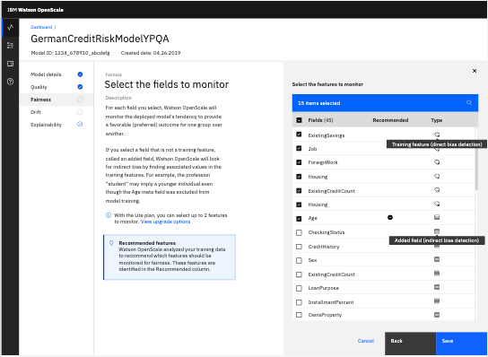

---

copyright:
  years: 2018, 2020
lastupdated: "2020-05-18"

keywords: fairness, monitoring, charts, de-biasing, bias, accuracy

subcollection: ai-openscale

---

{:shortdesc: .shortdesc}
{:external: target="_blank" .external}
{:tip: .tip}
{:important: .important}
{:note: .note}
{:pre: .pre}
{:codeblock: .codeblock}
{:help: data-hd-content-type='help'}
{:support: data-reuse='support'}
{:screen: .screen}
{:faq: data-hd-content-type='faq'}

# Understanding how de-biasing works
{: #mf-debias}

{{site.data.keyword.aios_short}} corrects for both direct and indirect bias by using a scoring endpoint.
{: shortdesc}

The de-biased scoring endpoint can be used exactly as the normal scoring endpoint of your deployed model. In addition to returning the response of your deployed model, it also returns the `debiased_prediction` and `debiased_probability` columns.

- The `debiased_prediction` column contains the debiased prediction value. In {{site.data.keyword.pm_full}}, this column is an encoded representation of the prediction. For example, if the model prediction is either "Loan Granted" or "Loan Denied", {{site.data.keyword.pm_full}} can encode these two values to "0.0" and "1.0". The `debiased_prediction` column contains such an encoded representation of the debiased prediction. If you specify a string column as prediction column, `debiased_prediction` column can also contain a string value.

- The `debiased_probability` column represents the probability of the debiased prediction. This is an array of double value, where each value represents the probability of the de-biased prediction that belongs to one of the prediction classes.

- The `debiased_decoded_target` column still exists in the response, but it contains the same value as the one in the `debiased_prediction` column. Because there is no mapping set in the **Model details** wizard, you can now directly specify the string column as a prediction column.

- The `debiased_decoded_target` column contains the string representation of the debiased prediction. In the previous example, where the prediction value was either "0.0" or "1.0", the `debiased_decoded_target` contains either "Loan Granted" or "Loan Denied".

## Steps to check the debias endpoint
{: #mf-debias-steps}

To check the debias endpoint, from the **Endpoint** box, select **Debiased transactions**. You can then view and copy the endpoint in different formats, such as cURL, Java, or Python. 

Ideally, you would directly call this endpoint from your production application, instead of directly calling the scoring endpoint of your model that is deployed in your machine learning provider ({{site.data.keyword.pm_full}}, Amazon Sagemaker, Microsoft Azure ML Studio, etc.) This way, {{site.data.keyword.aios_short}} also stores the `debiased` values in the payload logging table of your model deployment. Then, all scoring done via this endpoint would be automatically de-biased.

Because this endpoint deals with runtime bias, it continues to run background checks for the scoring data from the payload logging table. It keeps updating the bias mitigation model, which is used to debias the scoring requests sent. In this way, {{site.data.keyword.aios_short}} is always up to date with the incoming data, and with its behavior to detect and mitigate bias.

Finally, {{site.data.keyword.aios_short}} uses a threshold to decide that data is now acceptable and is deemed to be unbiased. That threshold is taken as the least value from the thresholds set in the Fairness monitor for all the fairness attributes configured.

## Indirect bias
{: #mf-debias-indirect}

Indirect bias occurs when one feature substitutes for another. For example, one feature in a model might approximate another feature that is a protected attribute. It would be illegal to descriminate on the basis of race, however because race can sometimes track closely with zip code this might be the cause of indirect bias. In like manner, if you had access to a person's music tastes you might be able to determine a person's age. Or, if you had access to purchase history, you could determine a person's sex. Even if your predictive model had none of the protected attributes, such as race, age, or sex by using proxies your model might produce biased results.

{{site.data.keyword.aios_short}} analyzes indirect bias when the following conditions are met:

- To find correlations, the dataset must be sufficiently large (more than 4000 records).
- The training data must include the meta fields. This means that you must train the model on a subset of data fields. These additional fields, the meta fields, will be used for determining indirect bias. (Include the meta fields, but don't use them in model training.)
- Payload logging must contain meta fields and be run before configuring the fairness monitor. You must use this method to upload the meta fields to the {{site.data.keyword.aios_short}} service. This requires two types of input: 1) training features with values and 2) meta fields with values.
- While configuring fairness, the additional fields are selected as fields to monitor.

### Sample JSON payload file with meta fields
{: #mf-debias-indirect-sample-json}

The following sample file shows a JSON payload with the fields and values that are used to train the model and the meta fields and values that are used for the indirect bias analysis. The meta fields are not used to train the model, instead they are reserved for a different kind of analysis that attempts to correlate them to bias in the model. Although the meta fields can be any type of data, they are usually protected attributes, such as sex, race, or age.

```
[{
	"request": {
		"fields": ["AGE", "BP", "CHOLESTEROL", "NA", "K"],
		"values": [
			[28, "LOW", "HIGH", 0.61, 0.026]
		],
		"meta": {
			"fields": ["SEX"],
			"values": [
				["F"]
			]
		}
	},
	"response": {
		"fields": ["AGE", "BP", "CHOLESTEROL", "NA", "K", "probability", "prediction", "DRUG"],
		"values": [
			[28, "LOW", "HIGH", 0.61, 0.026, [0.82, 0.07, 0.0, 0.05, 0.03], 0.0, "drugY"]
		]
	},
	"binding_id": "3cbede08-0626-4035-8a00-9546081a0a65",
	"subscription_id": "8be283de-cbce-40d6-888b-706f85795866",
	"deployment_id": "b799de0c-da58-4145-8532-97d04778ad33"
}]
```

Meta values must be in the format of an array of arrays:

```
"meta": {
"fields": ["age", "race", "sex"],
"values": [
[32, "Black", "Male"]
]
}

```

### Configuring the {{site.data.keyword.aios_short}} service for indirect bias
{: #mf-debias-indirect-steps}

When you set up the fairness monitor, select the fields to monitor. This can include both training features and fields excluded from model training. If you select a field excluded from model training, {{site.data.keyword.aios_short}} finds correlations between values in that field and values in the training features. The correlated features will be used as proxies for the fields that were excluded from model training.



Some fields are training features. Others fields that are not training features are identified as meta fields. For the selected meta fields, {{site.data.keyword.aios_short}} checks for indirect bias.

## Debias endpoint
{: #mf-debias-endpoint}


The following Java code snippet is provided for debiasing. The debiasing endpoint is available from the UI for you to use as part of your application code or Notebook:


```java
/**
At runtime you need to replace values for the following variables:

$HOSTNAME - Host Name, for example "aiopenscale.test.cloud.ibm.com"
$SERVICE_INSTANCE_ID - Service instance ID
$SUBSCRIPTION_ID - Subscription ID

*/

import org.apache.http.HttpVersion;
import org.apache.http.client.fluent.Request;
import org.apache.http.entity.ContentType;

String bearerToken = "Bearer <TOKEN>";
String URL = "https://$HOSTNAME/openscale/$SERVICE_INSTANCE_ID/v2/subscriptions/$SUBSCRIPTION_ID/predictions";

String payload = "{ \"fields\": [ \"field1\", \"field2\", \"field3\" ], \"values\": [ [ \"field1Value1\", \"field2Value1\",\"field3Value1\" ], [ \"field1Value2\", \"field2Value2\", \"field3Value2\" ]] }";

byte[] res = Request.Post(URL).addHeader("Authorization", bearerToken).useExpectContinue().version(HttpVersion.HTTP_1_1)
          .bodyString(payload, ContentType.APPLICATION_JSON).execute().returnContent().asBytes();
```
{: codeblock}

## Next steps
{: #wos-debias-next-steps}

- For more information, see [Debiasing options](/docs/ai-openscale?topic=ai-openscale-it-dbo).
- For a sample notebook that tests for indirect bias, see [Mitigating Indirect Bias with Watson Openscale](https://github.com/pmservice/ai-openscale-tutorials/blob/master/notebooks/Watson%20OpenScale%20indirect%20bias.ipynb){: external}.