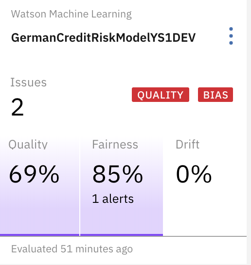
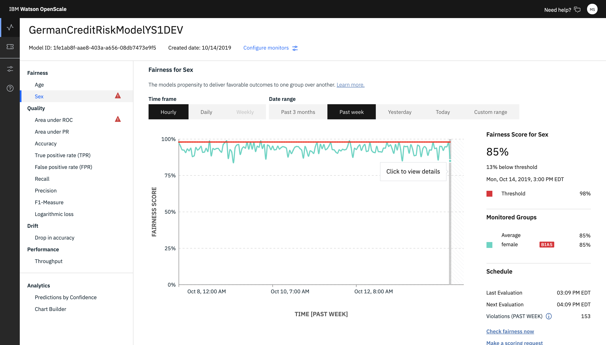
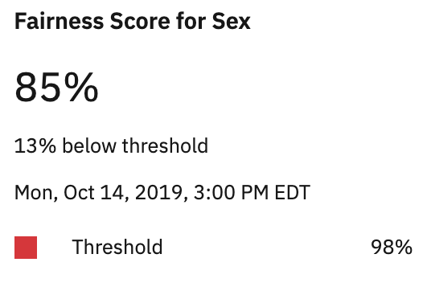
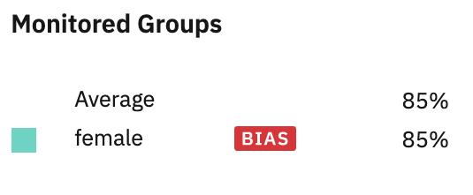
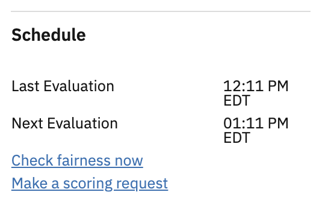

---

copyright:
  years: 2018, 2020
lastupdated: "2020-04-08"

keywords: metrics, monitoring, custom metrics, thresholds, Fairness for a group, sex, age, race

subcollection: ai-openscale

---

{:shortdesc: .shortdesc}
{:external: target="_blank" .external}
{:tip: .tip}
{:important: .important}
{:note: .note}
{:pre: .pre}
{:codeblock: .codeblock}
{:screen: .screen}
{:javascript: .ph data-hd-programlang='javascript'}
{:java: .ph data-hd-programlang='java'}
{:python: .ph data-hd-programlang='python'}
{:swift: .ph data-hd-programlang='swift'}
{:faq: data-hd-content-type='faq'}

# Fairness for a group
{: #quality_group}

The Fairness for a group metric gives the model's propensity to deliver favourable outcomes to one group over another. A group can be any group, such as age, sex, or race.
{: shortdesc}


## Fairness for a group at a glance
{: #quality_group-glance}

- **Description**: The models propensity to deliver favourable outcomes to one group over another.
- **Default thresholds**: Lower limit = 80%
- **Default recommendation**: Debiased scoring endpoint you can use in your business application for receiving debiased responses from your deployed model.
- **Problem type**: All
- **Data type**: Structured
- **Chart values**: Last value in the time frame
- **Metrics details available**: Yes

## Protected attributes
{: #quality_group-atts}

{{site.data.keyword.aios_short}} automatically identifies whether any known protected attributes are present in a model. When {{site.data.keyword.aios_short}} detects these attributes, it automatically recommends configuring bias monitors for each attribute present to ensure that bias against these potentially sensitive attributes is tracked in production. 

### sex
{: #quality_group-sex}

{{site.data.keyword.aios_short}} recommends that within the **Sex** attribute, the bias monitor be configured such that `Female` and `Non-Binary` are the monitored values, and `Male` is the reference value. 

### ethnicity
{: #quality_group-ethnicity}

{{site.data.keyword.aios_short}} recommends that within the **ethnicity** attribute, the bias monitor be configured such that `White-caucasian` is the reference value while other ethnicities are monitored values.

### marital status
{: #quality_group-marital}

{{site.data.keyword.aios_short}} recommends that within the **marital status** attribute, the bias monitor be configured such that `married` be the reference value and `single` be the monitored value.

### age
{: #quality_group-age}

{{site.data.keyword.aios_short}} recommends that within the **age** attribute, the bias monitor be configured such that the range of ages produces actionable de-biasing, for example `18-25` and `26-75`.

### zip code
{: #quality_group-zip}

{{site.data.keyword.aios_short}} recommends that within the **zip code** attribute, the bias monitor be configured such that individual zip codes are scored.

## Interpreting the display
{: #quality_group-display}

Fairness alerts display on the dashboard in tiles.



You can review all metrics values over time on the {{site.data.keyword.aios_short}} dashboard:



### Fairness Score for a group
{: #quality_group-display-fairnessscore}




### Monitored Groups
{: #quality_group-display-monitoredgroups}




### Schedule
{: #quality_group-display-schedule}

The **Schedule** pane shows the **Last evaluation** and **Next evaluation** times. Quality metrics are evaluated every hour. You can force evaluation by clicking **Check fairness now**. You can also add feedback by clicking **Make a scoring request**.




### Do the math
{: #quality_group-display-disparate-imp-rat}


```
                          (% of favorable outcome in monitored group)
Disparate Impact Ratio =  ____________________________________________
                          (% of favorable outcome in reference group)
```


