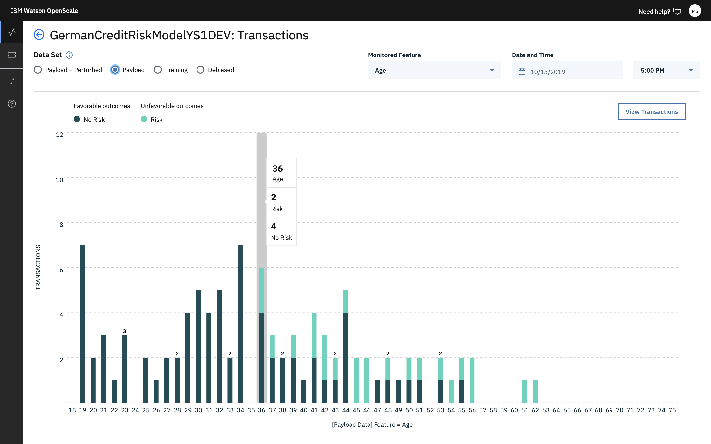
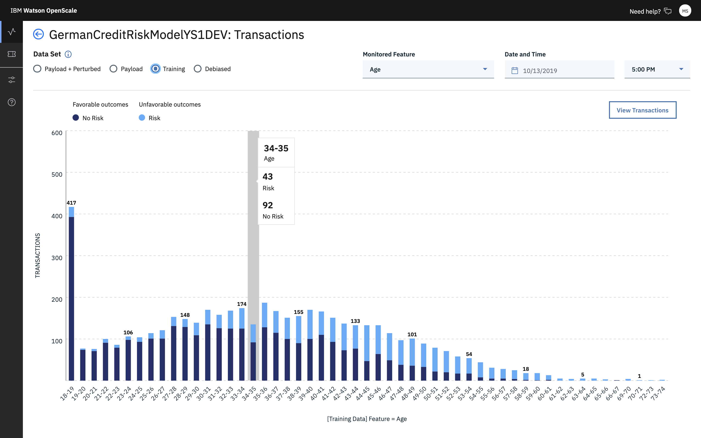
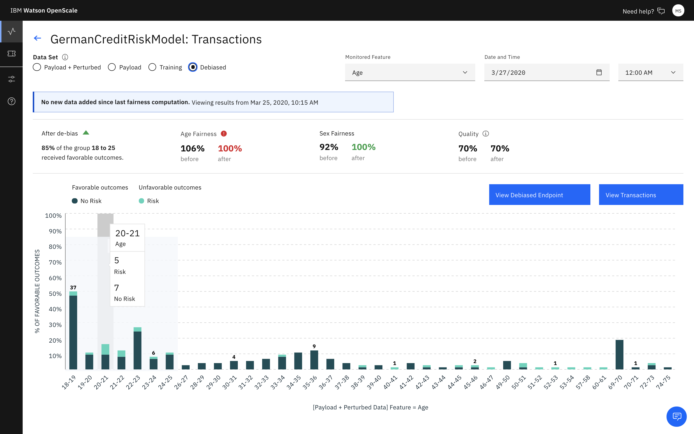

---

copyright:
  years: 2018, 2020
lastupdated: "2020-04-08"

keywords: metrics, monitoring, custom metrics, thresholds

subcollection: ai-openscale

---

{:shortdesc: .shortdesc}
{:external: target="_blank" .external}
{:tip: .tip}
{:important: .important}
{:note: .note}
{:pre: .pre}
{:codeblock: .codeblock}
{:screen: .screen}
{:note: .note}
{:note: .note}
{:note: .note}
{:note: .note}
{:faq: data-hd-content-type='faq'}

# Fairness metrics overview
{: #anlz_metrics_fairness}

Use {{site.data.keyword.aios_full}} fairness monitoring to determine whether outcomes that are produced by your model are fair or not for monitored group. When fairness monitoring is enabled, it generates a set of metrics every hour by default. You can generate these metrics on demand by clicking the **Check fairness now** button or by using the Python client.
{: shortdesc}

{{site.data.keyword.aios_short}} automatically identifies whether any known protected attributes are present in a model. When {{site.data.keyword.aios_short}} detects these attributes, it automatically recommends configuring bias monitors for each attribute present, to ensure that bias against these potentially sensitive attributes is tracked in production. 

Currently, {{site.data.keyword.aios_short}} detects and recommends monitors for the following protected attributes: 

- sex
- ethnicity
- marital status
- age
- zip code

In addition to detecting protected attributes, {{site.data.keyword.aios_short}} recommends which values within each attribute should be set as the monitored and the reference values. For example, {{site.data.keyword.aios_short}} recommends that within the `Sex` attribute, the bias monitor be configured such that `Female` and `Non-Binary` are the monitored values, and `Male` is the reference value. If you want to change any of the recommendations, you can edit them via the bias configuration panel. 

Recommended bias monitors help to speed up configuration and ensure that you are checking your AI models for fairness against sensitive attributes. As regulators begin to turn a sharper eye on algorithmic bias, it is becoming more critical that organizations have a clear understanding of how their models are performing, and whether they are producing unfair outcomes for certain groups.

## Understanding Fairness
{: #mf-understand}

{{site.data.keyword.aios_short}} checks your deployed model for bias at runtime. To detect bias for a deployed model, you must define fairness attributes, such as `Age` or `Sex`, as detailed in the [Configuring the Fairness monitor](/docs/services/ai-openscale?topic=ai-openscale-mf-monitor#mf-config) section.

It is mandatory to specify the output schema for a model or function in {{site.data.keyword.pm_short}}, for bias checking to be enabled in {{site.data.keyword.aios_short}}. The output schema can be specified using the `client.repository.ModelMetaNames.OUTPUT_DATA_SCHEMA` property in the metadata part of the `store_model` API. For more information, see the [{{site.data.keyword.pm_full}} client documentation](http://wml-api-pyclient-dev.mybluemix.net/#repository){: external}.

### How it works
{: #mf-works}

Before configuring the Fairness monitor, there a few key concepts that are critical to understand:

- Fairness attributes are the model attributes for which the model is likely to exhibit bias. As an example, for the fairness attribute **`Sex`**, the model could be biased against specific values, such as `Female` or `Non-binary`. Another example of a fairness attribute is **`Age`**, where the model could exhibit bias against people in an age group, such as `18 to 25`.

- Reference and monitored values: The values of fairness attributes are split into two distinct categories: Reference and Monitored. The Monitored values are those which are likely to be discriminated against. In the case of a fairness attribute like **`Sex`**, the Monitored values could be `Female` and `Non-binary`. For a numeric fairness attribute, such as **`Age`**, the Monitored values could be `[18-25]`. All other values for a given fairness attribute are then considered as Reference values, for example `Sex=Male` or `Age=[26,100]`.

- Favorable and unfavorable outcomes: The output of the model is categorized as either Favorable or Unfavorable. As an example, if the model is predicting whether a person should get a loan or not, then the Favorable outcome could be `Loan Granted` or `Loan Partially Granted`, whereas the Unfavorable outcome might be `Loan Denied`. Thus, the Favorable outcome is one that is deemed as a positive outcome, while the Unfavorable outcome is deemed as being negative.

The {{site.data.keyword.aios_short}} algorithm computes bias on an hourly basis, using the last `N` records present in the payload logging table; the value of `N` is specified when configuring Fairness. The algorithm perturbs these last `N` records to generate additional data.

The perturbation is done by changing the value of the fairness attribute from Reference to Monitored, or vice-versa. The perturbed data is then sent to the model to evaluate its behavior. The algorithm looks at the last `N` records in the payload table, and the behavior of the model on the perturbed data, to decide if the model is acting in a biased manner.

A model is deemed to be biased if, across this combined dataset, the percentage of Favorable outcomes for the Monitored class is less than the percentage of Favorable outcomes for the Reference class, by some threshold value. This threshold value is to be specified when configuring Fairness.

Fairness values can be more than 100%. This means that the Monitored group received more favorable outcomes than the Reference group. In addition, if no new scoring requests are sent, then the Fairness value will remain constant.
{: note}

### Do the math
{: #mf-bias-math}

The fairness metric used in {{site.data.keyword.aios_short}} is disparate impact, which is a measure of how the rate at which an unprivileged group receives a certain outcome or result compares with the rate at which a privileged group receives that same outcome or result.

The following mathematical formula is used for calculating disparate impact:

```
                     (num_positives(privileged=False) / num_instances(privileged=False))
Disparate impact =   ______________________________________________________________________

                     (num_positives(privileged=True) / num_instances(privileged=True))
```

where `num_positives` is the number of individuals in the group (either privileged=False, i.e. unprivileged, or privileged=True, i.e. privileged) who received a positive outcome, and num_instances is the total number of individuals in the group.

The resulting number will be a percentage, which is the percentage that the rate at which unprivileged group receives the positive outcome is of the rate at which the privileged group receives the positive outcome. For instance, if a credit risk model assigns the “no risk” prediction to 80% of unprivileged applicants and to 100% of privileged applicants, that model would have a disparate impact (presented as the fairness score in {{site.data.keyword.aios_short}}) of 80%.

In {{site.data.keyword.aios_short}}, the positive outcomes are designated as the favorable outcomes, and the negative outcomes are designated as the unfavorable outcomes. The privileged group is designated as the reference group, and the unprivileged group is designated as the monitored group.


### Bias visualization
{: #mf-monitor-bias-viz}

When potential bias is detected, {{site.data.keyword.aios_short}} performs several functions to confirm whether the bias is real. {{site.data.keyword.aios_short}} perturbs the data by flipping the monitored value to the reference value and then running this new record through the model. It then surfaces the resulting output as the de-biased output. {{site.data.keyword.aios_short}} also trains a shadow de-biased model that it then uses to detect when a model is going to make a biased prediction. 

Two different datasets are used for computing fairness and accuracy. Fairness is computed by using the payload + perturbed data. Accuracy is computed by using the feedback data. To compute accuracy, {{site.data.keyword.aios_short}} needs manually labelled data, which is only present in feedback table.

The results of these determinations are available in the bias visualization, which includes the following views. (You only see the views if there is data to support

- **Payload + Perturbed**: Includes the scoring request received for the selected hour plus additional records from previous hours if the minimum number of records required for evaluation was not met. Includes additional perturbed/synthesized records used to test the model's response when the value of the monitored feature changes.

   Take note of the following payload and perturbed details:

   - Monitored groups with fairness score
   - Reference groups with fairness score
   - Source of bias

  

- **Payload**: The actual scoring requests received by the model for the selected hour.

   Take note of the following payload details:
   
   - Payload data with stacked bar chart
   - Favorable and Unfavorable outcomes that correspond to the model labels
   - The Date and Time that transactions were loaded

  

- **Training**: The training data records used to train the model.

   Take note of the following training details:
   
   - Number of training data records. Training data is read one time, and distribution is stored in the `subscription/fairness_configuration` variable. While computing distribution, the number of training data records is also retrieved and stored in the same distribution. 
   - When training data is changed, meaning if the `POST /data_distribution` command is run again, this value is updated in the `fairness_configuration/training_data_distribution` variable. While sending the metric, this value is sent as well.

  

- **Debiased**: The output of the debiasing algorithm after processing the runtime and perturbed data. Selecting the **De-biased** radio button shows you the changes in the de-biased model, versus the model in production. The chart reflects the improved outcome status for groups.

   Take note of the following debiased details:
   
   - The result of debiasing the model
   - For monitored groups, such as `age` and `sex` the before and after scores

  

### Example
{: #mf-ex1}

Consider a data point where, for `Sex=Male` (Reference value), the model predicts an Favorable outcome, but when the record is perturbed by changing `Sex` to `Female` (Monitored value), while keeping all other feature values the same, the model predicts an Unfavorable outcome. A model overall is said to exhibit bias if there are sufficient data points (across the last `N` records in the payload table, plus the perturbed data) where the model was acting in a biased manner.

### Supported models
{: #mf-supmo}

 {{site.data.keyword.aios_short}} supports bias detection only for those models and Python functions which expect some kind of structured data in its feature vector.

Fairness metrics are calculated based on the following information:

- scoring payload data.

For proper monitoring purpose, every scoring request should be logged in {{site.data.keyword.aios_short}} as well. Payload data logging is automated for {{site.data.keyword.pm_full}} engines.

For other machine learning engines, the payload data can be provided either by using the Python client or the REST API.

For machine learning engines other than {{site.data.keyword.pm_full}}, fairness monitoring creates additional scoring requests on the monitored deployment.
{: note}

You can review all metrics values over time on the {{site.data.keyword.aios_short}} dashboard:


You can review related details, such as favourable and unfavourable outcomes:


You can view detailed transactions:


You can view the recommended debiased scoring endpoint:


### Supported fairness metrics
{: #anlz_metrics_supfairmets}

The following fairness metrics are supported by {{site.data.keyword.aios_short}}:

- [Fairness for a group](/docs/services/ai-openscale?topic=ai-openscale-quality_group)

The following protected attributes are supported by {{site.data.keyword.aios_short}}: 

- [sex](/docs/services/ai-openscale?topic=ai-openscale-quality_group#quality_group-sex)
- [ethnicity](/docs/services/ai-openscale?topic=ai-openscale-quality_group#quality_group-ethnicity)
- [marital status](/docs/services/ai-openscale?topic=ai-openscale-quality_group#quality_group-marital)
- [age](/docs/services/ai-openscale?topic=ai-openscale-quality_group#quality_group-age)
- [zip code](/docs/services/ai-openscale?topic=ai-openscale-quality_group#quality_group-zip)


### Supported fairness details
{: #anlz_metrics_supfairdets}

The following details for fairness metrics are supported by {{site.data.keyword.aios_short}}:

- The favorable percentages for each of groups
- Fairness averages for all the fairness groups
- Distribution of the data for each of the monitored groups
- Distribution of payload data
