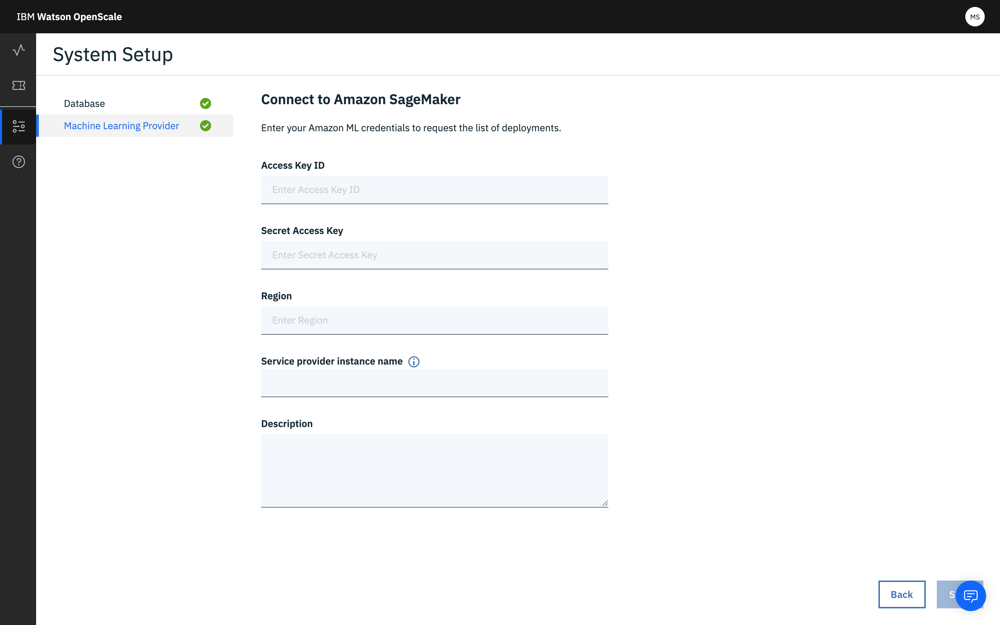

---

copyright:
  years: 2018, 2020
lastupdated: "2020-01-28"

keywords: supported frameworks, models, model types, limitations, limits, AWS, Sagemaker, Amazon

subcollection: ai-openscale

---

{:shortdesc: .shortdesc}
{:external: target="_blank" .external}
{:tip: .tip}
{:important: .important}
{:note: .note}
{:pre: .pre}
{:codeblock: .codeblock}

{:screen: .screen}
{:javascript: .ph data-hd-programlang='javascript'}
{:java: .ph data-hd-programlang='java'}
{:python: .ph data-hd-programlang='python'}
{:swift: .ph data-hd-programlang='swift'}
{:faq: data-hd-content-type='faq'}

# Amazon SageMaker frameworks
{: #frmwrks-aws-sage}

You can use Amazon SageMaker to perform payload logging, feedback logging, and to measure performance accuracy, run-time bias detection, explainability, and auto-debias function in {{site.data.keyword.aios_full}}.
{: shortdesc}

{{site.data.keyword.aios_full}} fully supports the following Amazon SageMaker frameworks:

Table 1. Framework support details

| Framework | Problem type | Data type |
|:---|:---:|:---:|
| Native | Classification | Structured |
| Native | Regression1 | Structured |
{: caption="Framework support details" caption-side="top"}

1Support for regression models does not include drift magnitude.

## Adding Amazon SageMaker to {{site.data.keyword.aios_short}}
{: #frmwrks-aws-sage-add}

You can configure {{site.data.keyword.aios_short}} to work with Amazon SageMaker by using one of the following methods:

- If this is the first time that you are adding a machine learning provider to {{site.data.keyword.aios_short}}, you can use the configuration interface. For more information, see [Specifying an Amazon SageMaker instance](/docs/services/ai-openscale?topic=ai-openscale-csm-connect).
- You can also add your machine learning provider by using the Python SDK. You must use this method if you want to have more than one provider. For more information on performing this programmatically, see [Bind your Amazon SageMaker machine learning engine](/docs/services/ai-openscale?topic=ai-openscale-cml-smbind).

## Sample notebooks
{: #frmwrks-aws-sage-smpl-ntbks}

The following notebooks show how to work with Amazon SageMaker:

- [Creation and deployment of credit risk prediction model](https://github.com/pmservice/ai-openscale-tutorials/blob/master/notebooks/Credit%20%20model%20with%20SageMaker%20linear-learner%20.ipynb){: external}
- [Data mart creation, model deployment monitoring and data analysis](https://github.com/pmservice/ai-openscale-tutorials/blob/master/notebooks/AI%20OpenScale%20and%20SageMaker%20ML%20Engine.ipynb){: external}

## Specifying an Amazon SageMaker ML service instance
{: #csm-connect}

Your first step in the {{site.data.keyword.aios_short}} tool is to specify an Amazon SageMaker service instance. Your Amazon SageMaker service instance is where you store your AI models and deployments.
{: shortdesc}

You can also add your machine learning provider by using the Python SDK. For more information on performing this programmatically, see [Bind your Amazon SageMaker machine learning engine](/docs/services/ai-openscale?topic=ai-openscale-cml-smbind).

### Connect your Amazon SageMaker service instance
{: #csm-config}

{{site.data.keyword.aios_short}} connects to AI models and deployments in an Amazon SageMaker service instance.

1.  From the **Configure** tab, in the navigation pane, click **Machine learning providers**.

    

1.  Click the **Add machine learning provider** button, and then click the **Amazon SageMaker** radio button.

    

1.  Enter and save your credentials:

    - Access Key ID: Your AWS access key ID, `aws_access_key_id`, which verifies who you are and authenticates and authorizes calls that you make to AWS.
    - Secret Access Key: Your AWS secret access key, `aws_secret_access_key`, which is required to verify who you are and to authenticate and authorize calls that you make to AWS.
    - Region: Enter the region where your Access Key ID was created. Keys are stored and used in the region in which they were created and cannot be transferred to another region. 

1.  {{site.data.keyword.aios_short}} lists your deployed models; select the ones you want to monitor.

## Next steps
{: #csm-next}

- {{site.data.keyword.aios_short}} is now ready for you to [configure monitors](/docs/services/ai-openscale?topic=ai-openscale-mo-config).
- [Monitor Sagemaker machine learning with Watson OpenScale](https://developer.ibm.com/patterns/monitor-amazon-sagemaker-machine-learning-models-with-ai-openscale//){: external}