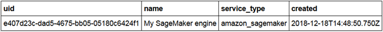

---

copyright:
  years: 2018, 2020
lastupdated: "2020-05-18"

keywords: supported frameworks, models, model types, limitations, limits, AWS, Sagemaker, Amazon

subcollection: ai-openscale

---

{:shortdesc: .shortdesc}
{:external: target="_blank" .external}
{:tip: .tip}
{:important: .important}
{:note: .note}
{:pre: .pre}
{:codeblock: .codeblock}
{:help: data-hd-content-type='help'}
{:support: data-reuse='support'}
{:screen: .screen}
{:note: .note}
{:note: .note}
{:note: .note}
{:note: .note}
{:faq: data-hd-content-type='faq'}

# Amazon SageMaker frameworks
{: #frmwrks-aws-sage}

You can use Amazon SageMaker to perform payload logging, feedback logging, and to measure performance accuracy, run-time bias detection, explainability, and auto-debias function in {{site.data.keyword.aios_full}}.
{: shortdesc}

{{site.data.keyword.aios_full}} fully supports the following Amazon SageMaker frameworks:

Table 1. Framework support details

| Framework | Problem type | Data type |
|:---|:---:|:---:|
| Native | Classification | Structured |
| Native | Regression<sup>1</sup> | Structured |
{: caption="Framework support details" caption-side="top"}

<sup>1</sup>Support for regression models does not include drift magnitude.

## Adding Amazon SageMaker to {{site.data.keyword.aios_short}}
{: #frmwrks-aws-sage-add}

You can configure {{site.data.keyword.aios_short}} to work with Amazon SageMaker by using one of the following methods:

- If this is the first time that you are adding a machine learning provider to {{site.data.keyword.aios_short}}, you can use the configuration interface. For more information, see [Specifying an Amazon SageMaker instance](#csm-connect).
- You can also add your machine learning provider by using the Python SDK. You must use this method if you want to have more than one provider. For more information on performing this programmatically, see [Bind your Amazon SageMaker machine learning engine](#cml-smbind).


## Sample notebooks
{: #frmwrks-aws-sage-smpl-ntbks}

The following notebooks show how to work with Amazon SageMaker:

- [Creation and deployment of credit risk prediction model](https://github.com/pmservice/ai-openscale-tutorials/blob/master/notebooks/Credit%20%20model%20with%20SageMaker%20linear-learner%20.ipynb){: external}
- [Data mart creation, model deployment monitoring and data analysis](https://github.com/pmservice/ai-openscale-tutorials/blob/master/notebooks/AI%20OpenScale%20and%20SageMaker%20ML%20Engine.ipynb){: external}

## Specifying an Amazon SageMaker ML service instance
{: #csm-connect}

Your first step in the {{site.data.keyword.aios_short}} tool is to specify an Amazon SageMaker service instance. Your Amazon SageMaker service instance is where you store your AI models and deployments.

## Connect your Amazon SageMaker service instance
{: #csm-config}

{{site.data.keyword.aios_short}} connects to AI models and deployments in an Amazon SageMaker service instance. To connect your service to {{site.data.keyword.aios_short}}, go to the **Configure**  tab, add a machine learning provider, and click the **Edit**  icon. In addition to a name and description and whether this is a **Pre-production** or **Production** environment type, you must provide the following information that is specific to this type of service instance:

- Access Key ID: Your AWS access key ID, `aws_access_key_id`, which verifies whoyou are and authenticates and authorizes calls that you make to AWS.
- Secret Access Key: Your AWS secret access key, `aws_secret_access_key`, whichis required to verify who you are and to authenticate and authorize calls thatyou make to AWS.
- Region: Enter the region where your Access Key ID was created. Keys are storedand used in the region in which they were created and cannot be transferred toanother region. 


You are now ready to select deployed models and configure your monitors. {{site.data.keyword.aios_short}} lists your deployed models on the **Insights** dashboard where you can click the **Add to dashboard** button. Select the deployments you want to monitor and click **Configure**.

For more information, see [Configure monitors](/docs/ai-openscale?topic=ai-openscale-mo-config).


## Payload logging with the Amazon SageMaker machine learning engine
{: #cml-smconfig}

## Bind your Amazon SageMaker machine learning engine
{: #cml-smbind}
{: help} 
{: support}

- A non-{{site.data.keyword.pm_full}} engine is bound as Custom by using metadata; there is no direct integration with the non-{{site.data.keyword.pm_full}} service.

    ```python
    SAGEMAKER_ENGINE_CREDENTIALS = {
    "access_key_id": "***",
    "secret_access_key": "***",
    "region": "***"
    }

    binding_uid_3 = client.data_mart.bindings.add('My SageMaker engine', SageMakerMachineLearningInstance(SAGEMAKER_ENGINE_CREDENTIALS))

    bindings_details = client.data_mart.bindings.get_details()
    ```
  You can see your service binding with the following command:

    ```python
    client.data_mart.bindings.list()
    ```

    

## Add Amazon SageMaker ML subscription
{: #cml-smsub}

- Add subscription

    ```python
    client.data_mart.subscriptions.add(
        SageMakerMachineLearningAsset(source_uid=source_uid,
                                  binding_uid=binding_uid,
                                  input_data_type=InputDataType.STRUCTURED,
                                  problem_type=ProblemType.MULTICLASS_CLASSIFICATION,
                                  label_column='<my_label_column_name>',
                                  prediction_column='Scored Labels'))
    ```

- Get subscription list

    ```python
    subscriptions = client.data_mart.subscriptions.get_details()

    subscriptions_uids = client.data_mart.subscriptions.get_uids()
    print(subscriptions_uids)
    ```

## Enable payload logging
{: #cml-smenlog}

- Enable payload logging in subscription

    ```python
    subscription.payload_logging.enable()
    ```

- Get logging details

    ```python
    subscription.payload_logging.get_details()
    ```

## Scoring and payload logging
{: #cml-smscore}

- Score your model. For a full example, see the [Working with SageMaker machine learning Engine notebook](https://github.com/pmservice/ai-openscale-tutorials/blob/master/notebooks/AI%20OpenScale%20and%20SageMaker%20ML%20Engine.ipynb){: external}.


- Store the request and response in the payload logging table:

    ```python
    records_list = [PayloadRecord(request=request_data, response=response_data, response_time=response_time),
                    PayloadRecord(request=request_data, response=response_data, response_time=response_time)]

    for i in range(1, 10):
    records_list.append(PayloadRecord(request=request_data, response=response_data, response_time=response_time))

    subscription.payload_logging.store(records=records_list)
    ```
    **Note**: For languages other than Python, you can also log payload by using a REST API.

    ```json
    token_endpoint = "https://iam.cloud.ibm.com/identity/token"
    headers = {
            "Content-Type": "application/x-www-form-urlencoded",
            "Accept": "application/json"
    }

    data = {
            "grant_type":"urn:ibm:params:oauth:grant-type:apikey",
            "apikey":aios_credentials["apikey"]
    }

    req = requests.post(token_endpoint, data=data, headers=headers)
    token = req.json()['access_token']
    ```

    ```json
    import requests, uuid

    PAYLOAD_STORING_HREF_PATTERN = '{}/v1/data_marts/{}/scoring_payloads'
    endpoint = PAYLOAD_STORING_HREF_PATTERN.format(aios_credentials['url'], aios_credentials['data_mart_id'])

    payload = [{
      'binding_id': binding_uid,
      'deployment_id': subscription.get_details()['entity']['deployments'][0]['deployment_id'],
      'subscription_id': subscription.uid,
      'scoring_id': str(uuid.uuid4()),
      'response': response_data,
      'request': request_data
    }]

    headers = {"Authorization": "Bearer " + token}
    req_response = requests.post(endpoint, json=payload, headers = headers)
    print("Request OK: " + str(req_response.ok))
    ```

## Next steps
{: #csm-next-qws}

- {{site.data.keyword.aios_short}} is now ready for you to [configure monitors](/docs/ai-openscale?topic=ai-openscale-mo-config).
- [Monitor SageMaker machine learning with {{site.data.keyword.aios_short}}](https://developer.ibm.com/patterns/monitor-amazon-sagemaker-machine-learning-models-with-ai-openscale//){: external}