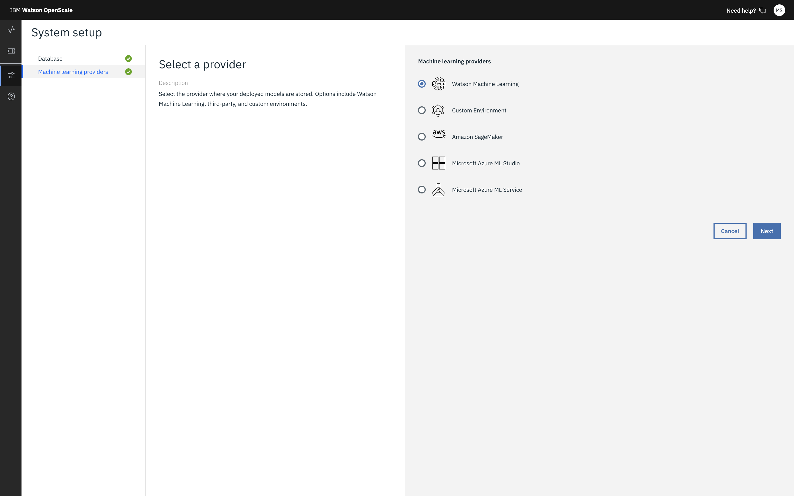
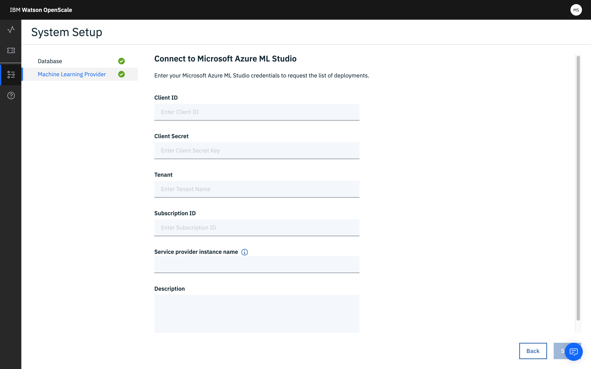

---

copyright:
  years: 2018, 2020
lastupdated: "2020-01-28"

keywords: supported frameworks, models, model types, limitations, limits, azure, studio

subcollection: ai-openscale

---

{:shortdesc: .shortdesc}
{:external: target="_blank" .external}
{:tip: .tip}
{:important: .important}
{:note: .note}
{:pre: .pre}
{:codeblock: .codeblock}

{:screen: .screen}
{:javascript: .ph data-hd-programlang='javascript'}
{:java: .ph data-hd-programlang='java'}
{:python: .ph data-hd-programlang='python'}
{:swift: .ph data-hd-programlang='swift'}
{:faq: data-hd-content-type='faq'}

# Microsoft Azure ML Studio frameworks
{: #frmwrks-azure}

You can use Microsoft Azure ML Studio to perform payload logging, feedback logging, and to measure performance accuracy, run-time bias detection, explainability, and auto-debias function in {{site.data.keyword.aios_full}}.
{: shortdesc}

{{site.data.keyword.aios_full}} fully supports the following Microsoft Azure Machine Learning Studio frameworks:

Table 1. Framework support details

| Framework | Problem type | Data type |
|:---|:---:|:---:|
| Native | Classification | Structured |
| Native | Regression | Structured |
{: caption="Framework support details" caption-side="top"}

## Adding Microsoft Azure ML Studio to {{site.data.keyword.aios_short}}
{: #frmwrks-azure-add}

You can configure {{site.data.keyword.aios_short}} to work with Microsoft Azure ML Studio by using one of the following methods:

- If this is the first time that you are adding a machine learning provider to {{site.data.keyword.aios_short}}, you can use the configuration interface. For more information, see [Specifying a Microsoft Azure ML Studio instance](/docs/services/ai-openscale?topic=ai-openscale-connect-azure).
- You can also add your machine learning provider by using the Python SDK. You must use this method if you want to have more than one provider. For more information on performing this programmatically, see [Bind your Microsoft Azure machine learning engine](/docs/services/ai-openscale?topic=ai-openscale-cml-azbind).

## Sample notebooks
{: #frmwrks-azure-smpl-ntbks}

The following notebooks show how to work with Microsoft Azure ML Studio:

- [Data mart creation, model deployment monitoring and data analysis](https://github.com/pmservice/ai-openscale-tutorials/blob/master/notebooks/AI%20OpenScale%20and%20Azure%20ML%20Studio%20Engine.ipynb){: external}
- [MS Azure Service model scoring examples](https://dataplatform.cloud.ibm.com/analytics/notebooks/v2/0d4ebd8d-87cb-4c38-8ba8-37f5623df131/view?access_token=fcb2c411aed913bf94f86f434184db67aef1a6b304824b86b4ad63686e4890be){: external}

## Explore further
{: #frmwrks-azure-mediumblogs}

-[Monitor Azure machine learning with Watson OpenScale](https://developer.ibm.com/patterns/monitor-azure-machine-learning-studio-models-with-ai-openscale/){: external}
- [How does Azure Machine Learning service differ from Studio?](https://docs.microsoft.com/en-us/azure/machine-learning/service/overview-what-is-azure-ml#how-does-azure-machine-learning-service-differ-from-studio){: external}
- [Consume an Azure Machine Learning model deployed as a web service](https://docs.microsoft.com/en-us/azure/machine-learning/service/how-to-consume-web-service){: external}

## Specifying a Microsoft Azure ML Studio instance
{: #connect-azure}

Your first step in the {{site.data.keyword.aios_short}} tool is to specify a Microsoft Azure ML Studio instance. Your Azure ML Studio instance is where you store your AI models and deployments.

You can also add your machine learning provider by using the Python SDK. For more information on performing this programmatically, see [Bind your Microsoft Azure machine learning engine](/docs/services/ai-openscale?topic=ai-openscale-cml-azbind).

### Connect your Azure ML Studio instance
{: #ca-connect}

{{site.data.keyword.aios_short}} connects to AI models and deployments in a Azure ML Studio instance.

1.  From the **Configure** tab, in the navigation pane, click **Machine learning providers**.

    

1.  Click the **Add machine learning provider** button, and then click the **Microsoft Azure ML Studio** tile.

    

1.  Enter and save your credentials:

    - Client ID: The actual string value of your client ID, which verifies who you are and authenticates and authorizes calls that you make to Azure Studio.
    - Client Secret: The actual string value of the secret, which verifies who you are and authenticates and authorizes calls that you make to Azure Studio.
    - Tenant: Your tenant ID corresponds to your organization and is a dedicated instance of Azure AD. To find the tenant ID, hover over your account name to get the directory / tenant ID, or select Azure Active Directory > Properties > Directory ID in the Azure portal.
    - Subscription ID: Subscription credentials which uniquely identify your Microsoft Azure subscription. The subscription ID forms part of the URI for every service call.

    See [How to: Use the portal to create an Azure AD application and service principal that can access resources](https://docs.microsoft.com/en-us/azure/active-directory/develop/howto-create-service-principal-portal){: external} for instructions about how to get your Microsoft Azure credentials.
    {: note}

1.  {{site.data.keyword.aios_short}} lists your deployed models; select the ones you want to monitor and click **Configure**.

You have successfully selected deployments.

## Next steps
{: #ca-next-frmwrks-azure}

{{site.data.keyword.aios_short}} is now ready for you to [configure monitors](/docs/services/ai-openscale?topic=ai-openscale-mo-config).
