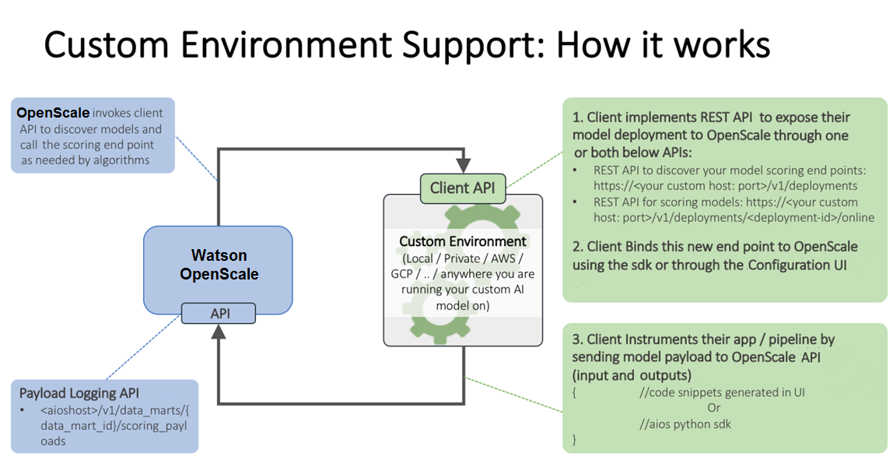
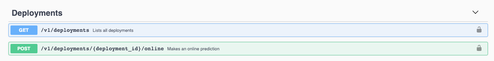
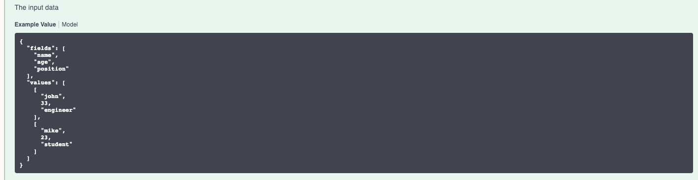
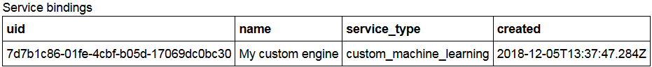

---

copyright:
  years: 2018, 2020
lastupdated: "2020-04-18"

keywords: supported frameworks, models, model types, limitations, limits, custom machine learning engine, custom wrapper, Watson Assistant, chatbot

subcollection: ai-openscale

---

{:shortdesc: .shortdesc}
{:external: target="_blank" .external}
{:tip: .tip}
{:important: .important}
{:note: .note}
{:pre: .pre}
{:codeblock: .codeblock}
{:help: data-hd-content-type='help'}
{:support: data-reuse='support'}
{:screen: .screen}
{:faq: data-hd-content-type='faq'}

# Custom ML frameworks
{: #frmwrks-custom}

You can use your custom machine learning framework to perform payload logging, feedback logging, and to measure performance accuracy, run-time bias detection, explainability, and auto-debias function in {{site.data.keyword.aios_full}}. The custom machine learning framework must have equivalency to {{site.data.keyword.pm_full}}.
{: shortdesc}

{{site.data.keyword.aios_full}} fully supports the following custom machine learning frameworks:

Table 1. Framework support details

| Framework | Problem type | Data type |
|:---|:---:|:---:|
| Equivalent to {{site.data.keyword.pm_full}} | Classification | Structured |
| Equivalent to {{site.data.keyword.pm_full}} | Regression | Structured |
{: caption="Framework support details" caption-side="top"}

For a model that is not equivalent to {{site.data.keyword.pm_full}}, you must create a wrapper for the custom model that exposes the required REST API endpoints and bridge the input/output between {{site.data.keyword.aios_short}} and the actual custom machine learning engine.

## When is a custom machine learning engine the best choice for me?
{: #fmrk-workaround-enging-choice}

A custom machine learning engine is the best choice when the following situations are true:

- You are not using any available out-of-the-box products to serve your machine learning models. You have just developed your own system to do that. There is no, and will be no, direct support in {{site.data.keyword.aios_short}} for that.
- The serving engine you are using from a 3rd-party supplier is not supported by {{site.data.keyword.aios_short}} yet. In this case, consider developing a custom machine learning engine as a wrapper to your original or native deployments.

## How it works
{: #co-works}

The following image shows the custom environment support:



You can also reference the following links:

[{{site.data.keyword.aios_short}} payload logging API](https://cloud.ibm.com/apidocs/ai-openscale#publish-scoring-payload){: external}

[Custom deployment API](https://aiopenscale-custom-deployement-spec.mybluemix.net/){: external}

[Python client binding SDK](http://ai-openscale-python-client.mybluemix.net/#bindings){: external}

[Working with Custom machine Learning engine](https://github.com/pmservice/ai-openscale-tutorials/blob/master/notebooks/AI%20OpenScale%20and%20Custom%20ML%20Engine.ipynb){: external}

[Python SDK for {{site.data.keyword.aios_full}}](https://pypi.org/project/ibm-ai-openscale/){: external}

- **Input criteria for model to support monitors**

  Your model should take as input a feature vector, which is essentially a collection of named fields and their values (the fields being monitored for bias being one of those fields):

  ```bash
  {
    "fields": [
        "name",
        "age",
        "position"
    ],
    "values": [
        [
            "john",
            33,
            "engineer"
        ],
        [
            "mike",
            23,
            "student"
        ]
    ]
  }
  ```

  In this example, `“age”` could be a field someone is evaluating for fairness.

  If the input is a tensor/matrix, which is transformed from the input feature space (which is often the case in deep learning from text or images), that model cannot be handled by the {{site.data.keyword.aios_short}} platform in the current release. By extension, deep learning models with text or image inputs cannot be handled for bias detection and mitigation.

  Additionally, training data should be loaded to support Explainability.

  For explainability on text, the full text should be one of the features. Explainability on images for a Custom model is not supported in the current release.
  {: note}

- **Output criteria for model to support monitors**

  Your model should output the input feature vector alongside the prediction probabilities of various classes in that model.

  ```bash
  {
    "fields": [
        "name",
        "age",
        "position",
        "prediction",
        "probability"
    ],
    "labels": [
        "personal",
        "camping"
    ],
    "values": [
        [
            "john",
            33,
            "engineer",
            "personal",
            [
                0.6744664422398081,
                0.3255335577601919
            ]
        ],
        [
            "mike",
            23,
            "student"
            "camping",
            [
                0.2794765664946941,
                0.7205234335053059
            ]
        ]
    ]
  }
  ```

  In this example, `"personal”` and `“camping”` are the possible classes, and the scores in each scoring output are assigned to both classes. If the prediction probabilities are missing, bias detection will work, but auto-debias will not.

  The preceding scoring output should be accessible from a live scoring endpoint which {{site.data.keyword.aios_short}} could call over REST. For AzureML, SageMaker, and {{site.data.keyword.pm_full}}, {{site.data.keyword.aios_short}} directly connects to the native scoring endpoints, (so you don’t have to worry about implementing the scoring spec).

## Custom machine learning engine
{: #fmrk-workaround-customengine}

A custom machine learning engine provides the infrastructure and hosting capabilities for machine learning models and web applications. Custom machine learning engines that are supported by {{site.data.keyword.aios_short}} must conform to the following requirements:

- Expose two types of REST API endpoints:

   * discovery endpoint (GET list of deployments and details)
   * scoring endpoints (online and real-time scoring)

- All endpoints need to be compatible with the swagger specification to be supported.

- Input payload and output to or from the deployment must be compliant with the JSON file format that is described in the specification.

At this stage only the `BasicAuth` or `none` formats are supported.
{: Note}

The following example shows the REST API endpoints specification:




The following example shows the format for an input payload:




## Adding a custom machine learning engine to {{site.data.keyword.aios_short}}
{: #frmwrks-custom-add}

You can configure {{site.data.keyword.aios_short}} to work with a custom machine learning provider by using one of the following methods:

- If this is the first time that you are adding a custom machine learning provider to {{site.data.keyword.aios_short}}, you can use the configuration interface. For more information, see [Specifying a custom machine learning instance](#co-connect).
- You can also add your machine learning provider by using the Python SDK. You must use this method if you want to have more than one provider. For more information on performing this programmatically, see [Bind your custom machine learning engine](#cml-cusbind).


## Sample notebooks
{: #frmwrks-custom-smpl-ntbks}

- [Creation of Custom Machine Learning engine using Kubernetes cluster](https://github.com/pmservice/ai-openscale-tutorials/tree/master/applications/custom-ml-engine-ibmcloud){: external}
- [Data mart creation, model deployment monitoring and data analysis](https://github.com/pmservice/ai-openscale-tutorials/blob/master/notebooks/AI%20OpenScale%20and%20Custom%20ML%20Engine.ipynb){: external}

## Explore further
{: #frmwrks-custom-mediumblogs}

Use a custom machine learning monitor to create a way to interact with other services, such as {{site.data.keyword.conversationfull}}.

- [Monitor custom machine learning engine with {{site.data.keyword.aios_short}}](https://developer.ibm.com/patterns/monitor-custom-machine-learning-engine-with-ai-openscale/){: external}
- [Explaining your {{site.data.keyword.conversationshort}} chatbot using {{site.data.keyword.aios_short}} ](https://medium.com/@prempiyush/explaining-your-watson-assistant-chatbot-using-watson-openscale-9515e90cbdab){: external}
- For a working example of a custom wrapper, see [Custom Wrapper to {{site.data.keyword.conversationshort}} to interact with {{site.data.keyword.aios_short}}](https://github.com/prempiyush/custom-wa-wrapper){: external}


## Specifying a Custom ML service instance
{: #co-connect}

Your first step in the {{site.data.keyword.aios_short}} tool is to specify a service instance. Your service instance is where you store your AI models and deployments.

## Connect your Custom service instance
{: #co-config}

{{site.data.keyword.aios_short}} connects to AI models and deployments in a service instance. You can connect a custom service. To connect your service to {{site.data.keyword.aios_short}}, go to the **Configure**  tab, add a machine learning provider, and click the **Edit**  icon. In addition to a name and description and whether this is a **Pre-production** or **Production** environment type, you must provide the following information that is specific to this type of service instance:

- Username
- Password
- API endpoint, that uses the format `https://host:port`, such as https://custom-serve-engine.mybluemix.net:8443

Choose whether to connect to your deployments [by requesting a list](/docs/ai-openscale?topic=ai-openscale-co-connect#co-config-request-list) or [by entering individual scoring endpoints](/docs/ai-openscale?topic=ai-openscale-co-connect#co-config-scoring-endpoints).


### Requesting the list of deployments
{: #co-config-request-list}

If you selected the **Request the list of deployments** tile, enter your credentials and API Endpoint, then save your configuration.

### Providing individual scoring endpoints
{: #co-config-scoring-endpoints}

If you selected the **Enter individual scoring endpoints** tile, enter your credentials for the API Endpoint, then save your configuration.


You are now ready to select deployed models and configure your monitors. {{site.data.keyword.aios_short}} lists your deployed models on the **Insights** dashboard where you can click the **Add to dashboard** button. Select the deployments you want to monitor and click **Configure**.

For more information, see [Configure monitors](/docs/ai-openscale?topic=ai-openscale-mo-config).

## Custom machine learning engine examples
{: #fmrk-workaround-cstmmlsengex}

Use the following examples to set up your own custom machine learning engine.
{: shortdesc}

## Python and flask
{: #fmrk-workaround-pandflask}

The [Custom ML Engine example published on git](https://github.com/pmservice/ai-openscale-tutorials/tree/master/applications/custom-ml-engine-ibmcloud) is using python and flask to serve scikit-learn model.

To generate the drift detection model, you must use scikit-learn version 0.20.2 in the notebook. 
{: note}

The [README file](https://github.com/pmservice/ai-openscale-tutorials/tree/master/applications/custom-ml-engine-ibmcloud) describes how the app can be deployed locally for testing purposes as well as cf application on {{site.data.keyword.Bluemix_notm}}. The implementation of REST API endpoints can be found in [app.py file](https://github.com/pmservice/ai-openscale-tutorials/blob/master/applications/custom-ml-engine-ibmcloud/app.py).

## Node.js
{: #fmrk-workaround-nodejs}

You can also find example of custom machine learning engine written in [Node.js here](https://github.com/pmservice/ai-openscale-tutorials/tree/master/applications/custom-ml-engine-nodejs).

## End2end code pattern
{: #fmrk-workaround-e2ecode}

[Code pattern](https://developer.ibm.com/patterns/monitor-custom-machine-learning-engine-with-ai-openscale) showing end2end example of custom engine deployment and integration with {{site.data.keyword.aios_short}}.


## Payload logging with the Custom machine learning engine
{: #cml-cusconfig}

To configure payload logging for a non-{{site.data.keyword.pm_full}} or custom machine learning engine, you must bind the ML engine as custom.

### Bind your Custom machine learning engine
{: #cml-cusbind}
{: help} 
{: support}

- A non-{{site.data.keyword.pm_full}} engine is bound as Custom by using metadata; there is no direct integration with the non-{{site.data.keyword.pm_full}} service. You can bind more than one machine learning engine to {{site.data.keyword.aios_short}} by using the `client.data_mart.bindings.add` method.

    ```python
    custom_engine_credentials = {
    "url": "***",
    "username": "***",
    "password": "***"
    }

    binding_uid = client.data_mart.bindings.add('My custom engine', CustomMachineLearningInstance(custom_engine_credentials))

    bindings_details = client.data_mart.bindings.get_details()
    ```
  You can see your service binding with the following command:

    ```python
    client.data_mart.bindings.list()
    ```

    

### Add Custom subscription
{: #cml-cussub}

- Add subscription

    ```python
    client.data_mart.subscriptions.add(CustomMachineLearningAsset(source_uid='action', binding_uid=binding_uid, prediction_column='predictedActionLabel'))
    ```

- Get subscription list

    ```python
    subscriptions = client.data_mart.subscriptions.get_details()

    subscriptions_uids = client.data_mart.subscriptions.get_uids()
    print(subscriptions_uids)
    ```

### Enable payload logging
{: #cml-cusenlog}

- Enable payload logging in subscription

    ```python
    subscription.payload_logging.enable()
    ```

- Get logging details

    ```python
    subscription.payload_logging.get_details()
    ```

For more information, see [Payload logging]().

### Scoring and payload logging
{: #cml-cusscore}

- Score your model. For a full example, see the [IBM {{site.data.keyword.aios_full}} & Custom ML engine notebook](https://github.com/pmservice/ai-openscale-tutorials/blob/master/notebooks/AI%20OpenScale%20and%20Custom%20ML%20Engine.ipynb){: external}.

- Store the request and response in the payload logging table

    ```python
    records_list = [PayloadRecord(request=request_data, response=response_data, response_time=response_time), PayloadRecord(request=request_data, response=response_data, response_time=response_time)]

    subscription.payload_logging.store(records=records_list)
    ```
    **Note**: For languages other than Python, you can also log payloads directly, by using a REST API.

    ```json
    token_endpoint = "https://iam.cloud.ibm.com/identity/token"
    headers = {
            "Content-Type": "application/x-www-form-urlencoded",
            "Accept": "application/json"
    }

    data = {
            "grant_type":"urn:ibm:params:oauth:grant-type:apikey",
            "apikey":aios_credentials["apikey"]
    }

    req = requests.post(token_endpoint, data=data, headers=headers)
    token = req.json()['access_token']
    ```

    ```json
    import requests, uuid

    PAYLOAD_STORING_HREF_PATTERN = '{}/v1/data_marts/{}/scoring_payloads'
    endpoint = PAYLOAD_STORING_HREF_PATTERN.format(aios_credentials['url'], aios_credentials['data_mart_id'])

    payload = [{
      'binding_id': binding_uid,
      'deployment_id': subscription.get_details()['entity']['deployments'][0]['deployment_id'],
      'subscription_id': subscription.uid,
      'scoring_id': str(uuid.uuid4()),
      'response': response_data,
      'request': request_data
    }]

    headers = {"Authorization": "Bearer " + token}
    req_response = requests.post(endpoint, json=payload, headers = headers)
    print("Request OK: " + str(req_response.ok))
    ```

## Next steps
{: #fmrk-workaround-nxt-steps-over}

{{site.data.keyword.aios_short}} is now ready for you to [configure monitors](/docs/ai-openscale?topic=ai-openscale-mo-config).

