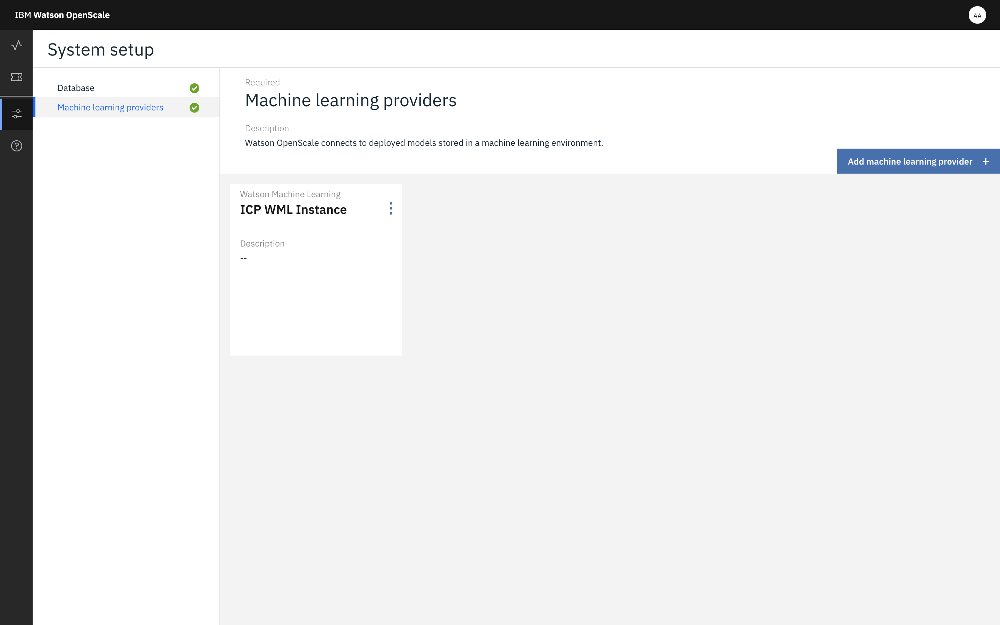
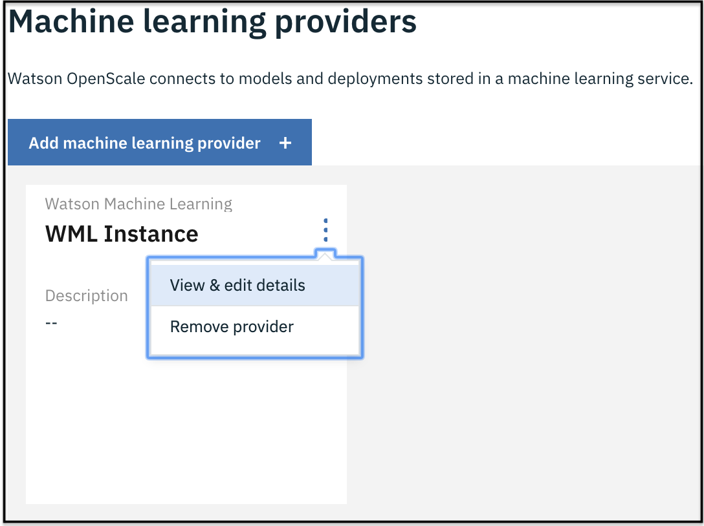

---

copyright:
  years: 2018, 2020
lastupdated: "2020-05-18"

keywords: supported frameworks, models, model types, limitations, limits

subcollection: ai-openscale

---

{:shortdesc: .shortdesc}
{:external: target="_blank" .external}
{:tip: .tip}
{:important: .important}
{:note: .note}
{:pre: .pre}
{:codeblock: .codeblock}
{:help: data-hd-content-type='help'}
{:support: data-reuse='support'}
{:screen: .screen}
{:note: .note}
{:note: .note}
{:note: .note}
{:note: .note}
{:faq: data-hd-content-type='faq'}

# Supported machine learning engines, frameworks, and models
{: #in-ov}

The {{site.data.keyword.aios_short}} service supports the following machine learning engines. Each runtime supports models that are created in the following frameworks:

- [{{site.data.keyword.pm_full}}](/docs/ai-openscale?topic=ai-openscale-frmwrks-wml#frmwrks-wml)

   You can use {{site.data.keyword.pm_full}} to perform payload logging, feedback logging, and to measure performance accuracy, run-time bias detection, explainability, and auto-debias function in {{site.data.keyword.aios_full}}.

- [Azure ML Studio](/docs/ai-openscale?topic=ai-openscale-frmwrks-azure#frmwrks-azure)

   You can use Microsoft Azure ML Studio to perform payload logging, feedback logging, and to measure performance accuracy, run-time bias detection, explainability, and auto-debias function in {{site.data.keyword.aios_full}}.

- [Azure ML Service](/docs/ai-openscale?topic=ai-openscale-frmwrks-azureservice#frmwrks-azureservice)

   You can use Microsoft Azure ML Service to perform payload logging, feedback logging, and to measure performance accuracy, run-time bias detection, explainability, and auto-debias function in {{site.data.keyword.aios_full}}.

- [AWS SageMaker](/docs/ai-openscale?topic=ai-openscale-frmwrks-aws-sage#frmwrks-aws-sage)

   You can use Amazon SageMaker to perform payload logging, feedback logging, and to measure performance accuracy, run-time bias detection, explainability, and auto-debias function in {{site.data.keyword.aios_full}}.

- [Custom](/docs/ai-openscale?topic=ai-openscale-frmwrks-custom#frmwrks-custom)

   You can use your custom machine learning framework to perform payload logging, feedback logging, and to measure performance accuracy, run-time bias detection, explainability, and auto-debias function in {{site.data.keyword.aios_full}}. The custom machine learning framework must have equivalency to {{site.data.keyword.pm_full}}.

- [SPSS C&DS](/docs/ai-openscale-icp?topic=ai-openscale-icp-frmwrks-spss#frmwrks-spss) (only available in {{site.data.keyword.wos4d_full}})

   You can use IBM SPSS C&DS to perform payload logging, feedback logging, and to measure performance accuracy, run-time bias detection, explainability, and auto-debias function in {{site.data.keyword.wos4d_full}}.

&nbsp;

## Support for multiple machine learning engines
{: #fmrk-workaround-multmleng}

{{site.data.keyword.aios_short}} supports multiple machine learning engines within a single instance. You can provision them through the {{site.data.keyword.aios_short}} dashboard configuration or the [Python SDK](http://ai-openscale-python-client.mybluemix.net/?cm_mc_uid=70732728440115575086192&cm_mc_sid_50200000=62539451560175957820){: external}.

When you first set up {{site.data.keyword.aios_short}}, you may have used the user interface or the automated setup option to provision your first machine learning engine. Adding machine learning engines requires that you either use the configuration tab on the {{site.data.keyword.aios_short}} dashboard or the Python SDK.

## Using the dashboard to add providers
{: #fmrk-workaround-multmleng-dashboard}

1. After you open {{site.data.keyword.aios_short}}, from the **Configure**  tab, click the **Add machine learning provider** button.

   

2. Select the provider you want to add.
3. Enter the required information, such as credentials and click **Save**.

After you save your configuration, you are ready to go to the dashboard to choose deployments and configure monitors.

## Editing machine learning providers
{: #fmrk-workaround-editingproviders-dashboard}

Do you need to make an edit to a machine learning provider? Click the tile menu  icon and then click **View & edit details**.

   

## Adding machine learning providers by using the Python SDK binding method
{: #fmrk-workaround-multmleng-binding}

You can bind more than one machine learning engine to {{site.data.keyword.aios_short}} by using the Python API `client.data_mart.bindings.add` method. 

### {{site.data.keyword.pm_full}}
{: #fmrk-workaround-multmleng-binding-wml}

- To bind the {{site.data.keyword.pm_full}} machine learning engine, run the following command:

   `binding_uid = client.data_mart.bindings.add('WML instance', WatsonMachineLearningInstance(WML_CREDENTIALS))`

### Microsoft Azure ML Studio
{: #fmrk-workaround-multmleng-binding-azurestudio}

- To bind the Azure ML Studio machine learning engine, run the following command:

  `binding_uid_2 = client.data_mart.bindings.add('My Azure ML Studio engine', AzureMachineLearningInstance(AZURE_ENGINE_CREDENTIALS))`

### Amazon Sagemaker
{: #fmrk-workaround-multmleng-binding-aws}

- To bind the AWS Sagemaker machine learning engine, run the following command:

  `binding_uid_3 = client.data_mart.bindings.add('My AWS SageMaker engine', SageMakerMachineLearningInstance(SAGEMAKER_ENGINE_CREDENTIALS)) `

### Microsoft Azure ML Service
{: #fmrk-workaround-multmleng-binding-azureservice}

- To bind the Azure ML Service machine learning engine, run the following command:

  `binding_uid_4 = client.data_mart.bindings.add('My Azure ML Service engine', AzureServiceMachineLearningInstance(AZURE_SRVR_ENGINE_CREDENTIALS))`

### Producing a list of machine learning providers
{: #fmrk-workaround-multmleng-binding-list}

To view a list of all the bindings, run the `list` method:

`client.data_mart.bindings.list()`

| uid | name | service_type | created |
|:---|:---:|:---:|:---:
| e88ms###-####-####-############ | My Azure ML Service engine | azure_machine_learning | 2019-04-04T09:50:33.189Z |
| e88sl###-####-####-############ | My Azure ML Studio engine | azure_machine_learning | 2019-04-04T09:50:33.186Z |
| e00sjl###-####-####-############ | WML instance | watson_machine_learning | 2019-03-04T09:50:33.338Z |
| e43kl###-####-####-############ | My AWS SageMaker engine | sagemaker_machine_learning | 2019-04-04T09:50:33.186Z |
{: caption="Table 1. Service bindings" caption-side="top"}

For information about specific machine learning engines, see the following topics:

- [Bind your Custom machine learning engine](/docs/ai-openscale?topic=ai-openscale-cml-cusconfig#cml-cusbind).
- [Bind your Microsoft Azure machine learning studio engine](/docs/ai-openscale?topic=ai-openscale-cml-azbind)
- [Bind your Microsoft Azure machine learning service engine](/docs/ai-openscale?topic=ai-openscale-cml-azsrvconfig#cml-azsrvbind)
- [Bind your Amazon SageMaker machine learning engine](/docs/ai-openscale?topic=ai-openscale-cml-smbind)

For a working example of an actual notebook, see [the {{site.data.keyword.aios_short}} sample notebooks](https://github.com/pmservice/ai-openscale-tutorials/tree/master/notebooks){: external}.

## Next steps
{: #fmrk-workaround-multmleng-next-steps}

- {{site.data.keyword.aios_short}} is now ready for you to [add deployments to your dashboard](/docs/ai-openscale?topic=ai-openscale-mo-config#mo-select-deploy) and [configure monitors](/docs/ai-openscale?topic=ai-openscale-mo-config).
- View the [API Reference material](https://cloud.ibm.com/apidocs/ai-openscale){: external}.

Still have questions? 

- [FAQs](/docs/ai-openscale?topic=ai-openscale-wos-faqs)
- [Contact IBM](https://www.ibm.com/account/reg/us-en/signup?formid=MAIL-watson){: external}.
