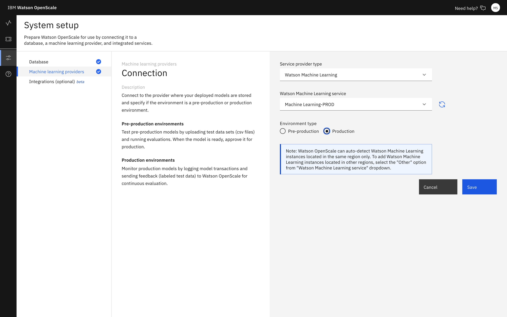
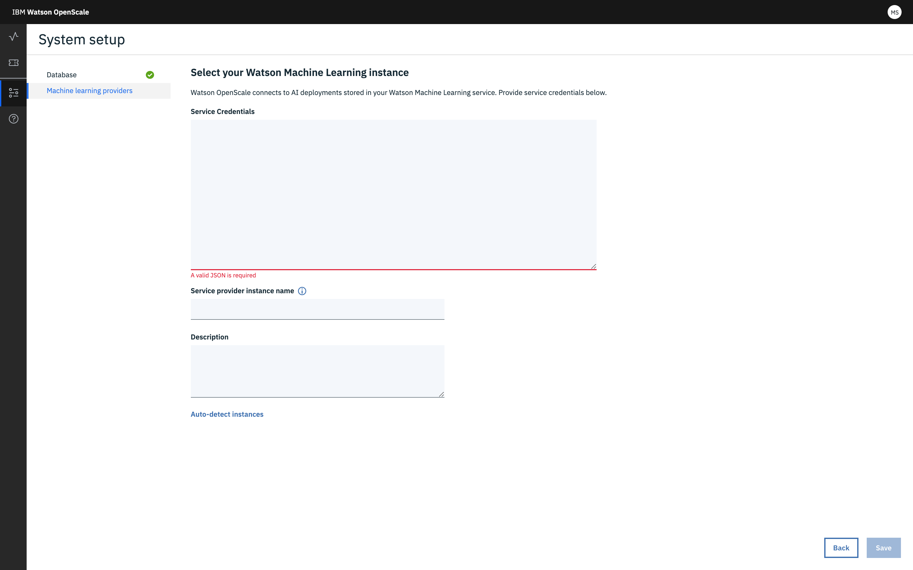

---

copyright:
  years: 2018, 2019
lastupdated: "2019-09-09"

keywords: supported frameworks, models, model types, limitations, limits

subcollection: ai-openscale

---

{:shortdesc: .shortdesc}
{:external: target="_blank" .external}
{:tip: .tip}
{:important: .important}
{:note: .note}
{:pre: .pre}
{:codeblock: .codeblock}

{:screen: .screen}
{:javascript: .ph data-hd-programlang='javascript'}
{:java: .ph data-hd-programlang='java'}
{:python: .ph data-hd-programlang='python'}
{:swift: .ph data-hd-programlang='swift'}
{:faq: data-hd-content-type='faq'}

# {{site.data.keyword.ibmwatson_notm}} {{site.data.keyword.pm_short}}
{: #frmwrks-wml}

You can use {{site.data.keyword.pm_full}} to perform payload logging, feedback logging, and to measure performance accuracy, run-time bias detection, explainability, and auto-debias function in {{site.data.keyword.aios_full}}.
{: shortdesc}

{{site.data.keyword.aios_full}} fully supports the following {{site.data.keyword.pm_full}} frameworks: 
{: shortdesc}

Table 1. Framework support details

| Framework | Problem type | Data type |
|:---|:---:|:---:|
| AutoAI1 | Classification (binary and multi classes) | Structured |
| AutoAI | Regression | Structured or Unstructured (text only) |
| Apache Spark MLlib | Classification | Structured |
| Apache Spark MLLib | Regression | Structured |
| Keras with TensorFlow2&3 | Classification | Unstructured (image, text) |
| Keras with TensorFlow2&3 | Regression | Unstructured (image, text) |
| Python function | Classification | Structured |
| Python function | Regression | Structured |
| scikit-learn | Classification | Structured |
| scikit-learn | Regression | Structured |
| XGBoost4 | Classification | Structured |
| XGBoost | Regression | Structured |
{: caption="Framework support details" caption-side="top"}

1To learn more about AutoAI features, see [AutoAI implementation details](https://dataplatform.cloud.ibm.com/docs/content/wsj/analyze-data/autoai-details.html?audience=wdp&context=analytics){: external}. For models that have where the training data is in Cloud Object Storage, there is no support for fairness attributes of type boolean. However, if the training data is in Db2, Watson OpenScale supports fairness attributes that are boolean type. When using the AutoAI option, {{site.data.keyword.aios_short}} does not support models where the data type of the model prediction is binary. You must change such models so that the data type of their prediction is a string data type.

{: note}

2Keras support does not include support for fairness.
{: note}

3Explainability is supported if your model / framework outputs prediction probabilities.
{: note}

4For XGBoost binary and multiple class models, you must update the model to return prediction probability in the form of numerical values for binary models and a list of probabilities per class for multi-class models.
{: note}

## Specifying an {{site.data.keyword.ibmwatson_notm}} {{site.data.keyword.pm_short}} service instance
{: #wml-connect}

Your first step in the {{site.data.keyword.aios_short}} tool is to specify an {{site.data.keyword.pm_full}} instance. Your {{site.data.keyword.pm_short}} instance is where you store your AI models and deployments.
{: shortdesc}

### Prerequisites
{: #wml-prereq}

You should have provisioned an {{site.data.keyword.pm_full}} instance in the same {{site.data.keyword.Bluemix_notm}} account where the {{site.data.keyword.aios_short}} service instance is present. If you have provisioned a {{site.data.keyword.pm_full}} instance in some other account, then you will not be able to configure that instance with automatic payload logging with {{site.data.keyword.aios_short}}.

### Connect your {{site.data.keyword.pm_short}} service instance
{: #wml-config}

{{site.data.keyword.aios_short}} connects to AI models and deployments in an {{site.data.keyword.pm_full}} instance.

1.  From the **Configure** tab, in the navigation pane, click **Machine learning providers**.

    

2.  Click the **Add machine learning provider** button, and then click the {{site.data.keyword.pm_full}} tile. {{site.data.keyword.aios_short}} checks your {{site.data.keyword.Bluemix_notm}} account to locate any existing {{site.data.keyword.pm_full}} instances. 
3. Select an instance from the **Watson Machine Learning service** drop-down menu.

    

4.  (Optional) You also have the option to **Select a different location**, to specify a machine learning location outside of your {{site.data.keyword.Bluemix_notm}} account. Provide credentials for your location as valid JSON:

    

    Click **Save**.

1.  {{site.data.keyword.aios_short}} lists your deployed models; select the ones you want to monitor and click **Configure**.

## AutoAI models and training data
{: #wml-framework-autoai}

AutoAI automatically prepares data, applies algorithms, or estimators, and builds model pipelines best suited for your data and use case. Because of the way that {{site.data.keyword.aios_short}} works with models to analyze and debias, there needs to be either a copy of or a connection to the underlying training data. For more information, see [Why does Watson OpenScale need access to my training data?](/docs/services/ai-openscale?topic=ai-openscale-wos-faqs#trainingdata). {{site.data.keyword.aios_short}} processes training data at the following locations:

- The UI reads it to find the training data schema and display it in the GUI.
- Bias/Explain/Drift reads the data to generate statistics and generate drift model, etc.

For more information, see [Provide model details](/docs/services/ai-openscale?topic=ai-openscale-mo-config#mo-work-model-dets).

When working with the AutoAI feature, you can provide access to the training data either by uploading the training data from a CSV format file that you store in a Db2 instance, or by running a notebook that has access to the training data and can provide the necessary training data statistics. For more information, see [Numeric/categorical data](/docs/services/ai-openscale?topic=ai-openscale-mo-config#mo-nuca)

## Next steps
{: #wml-next}

{{site.data.keyword.aios_short}} is now ready for you to [configure monitors](/docs/services/ai-openscale?topic=ai-openscale-mo-config).
