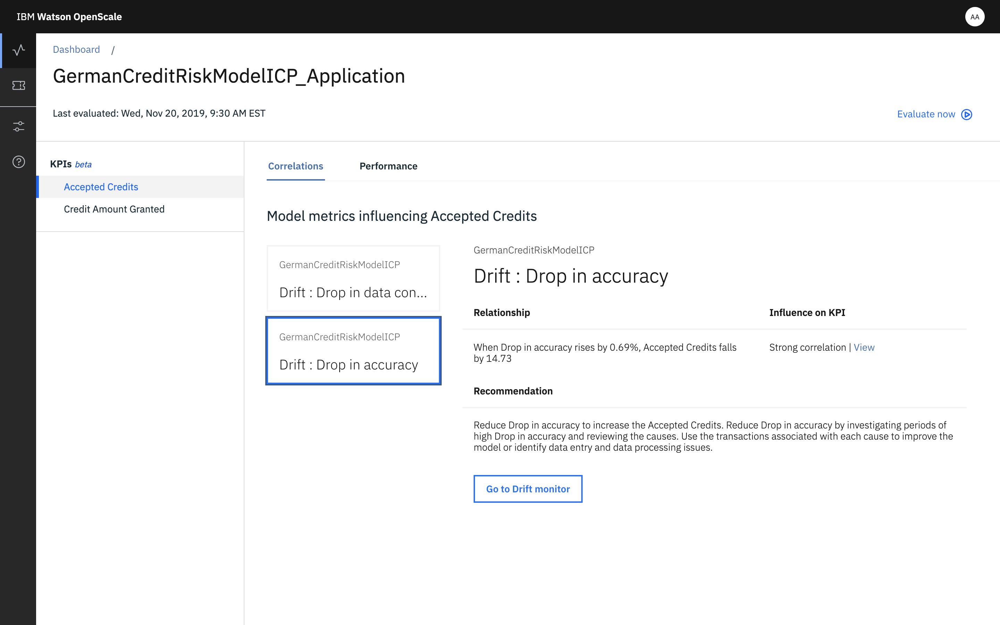
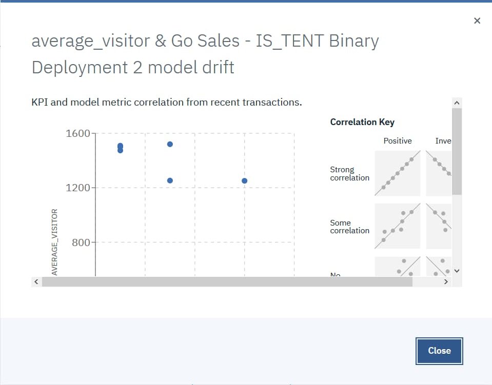

---

copyright:
  years: 2018, 2020
lastupdated: "2020-04-08"

keywords: fairness, monitoring, charts, de-biasing, bias, accuracy

subcollection: ai-openscale

---

{:shortdesc: .shortdesc}
{:external: target="_blank" .external}
{:tip: .tip}
{:important: .important}
{:note: .note}
{:pre: .pre}
{:codeblock: .codeblock}

{:screen: .screen}
{:javascript: .ph data-hd-programlang='javascript'}
{:java: .ph data-hd-programlang='java'}
{:note: .note}
{:swift: .ph data-hd-programlang='swift'}
{:faq: data-hd-content-type='faq'}

# Viewing correlation charts
{: #app-perform-vdet}

Correlations show how business KPIs are influenced by associated models monitors. 
{: shortdesc}

From the Insights dashboard, on the Applications monitor tab, click an application tile to see business KPIs performance and their correlation with that application monitor.

For each Business KPI (on the example below: Number Accepted and Daily Revenue), on the Correlation tab there is a list of model metrics influencing selected KPI.

{{site.data.keyword.aios_short}} discovers if the relationship between selected KPI and associated models metrics exists. Such evaluation happens once a day. It requires minimum 7 Business KPIs measurements (for daily calculated KPIs it means 7 days, for weekly - 7 weeks, etc...) and same number of model metric measurements. Please note that model metrics measurements included in such evaluation are calculated using the only scoring transactions with the same transaction_id as theses included in business events for KPI calculation.

## Step
{: #app-perform-vdet-steps}

- From the **Insights dashboard**, on the **Applications** monitor tab, click an application tile to see this information.

## Do the math
{: #app-perform-vdet-math}

The relationship between KPI and model metric can be one of the following broad categories:

- **Strong correlation**: For every positive or negative change in model accuracy, there is definitely a corresponding positive or negative change in business KPI values. Clearly the two are related. 
- **Some correlation**: For every positive or negative change in model accuracy, there is enough corresponding positive or negative change in business KPI values to state that there is correlation. The two are clearly related, just not very strongly. 
- **No correlation**: For every positive or negative change in model accuracy, there isn’t a corresponding positive or negative change in business KPI values. The two just aren’t related.

The **Strong correlation** and **Some correlation** values are quantified in the following way:

When model metric rises by X%, KPI falls (or rises) by Y.
{: important}

For example, "When Drop in accuracy rises by 5,2%, Daily  Revenue falls by 48000." 

## Interpreting the chart
{: #app-perform-intp-chart}

This information helps to decide if any specific model behaviors required to be reviewed and fixed. To see more details about this model behavior click Go to monitor  button.

In case there is no correlation found between between KPI and model metric, it make sense to revisit business strategy about using the model in the business process.

To visually review correlation strength, from the **Influence on KPI** column, following the **correlation influence** value, click **View**.

## Next steps
{: #app-perform-vdet-ns}

- [View correlation charts](/docs/services/ai-openscale?topic=ai-openscale-app-perform-vdet).
- [View KPI performance](/docs/services/ai-openscale?topic=ai-openscale-it-appkpi-vdet).
