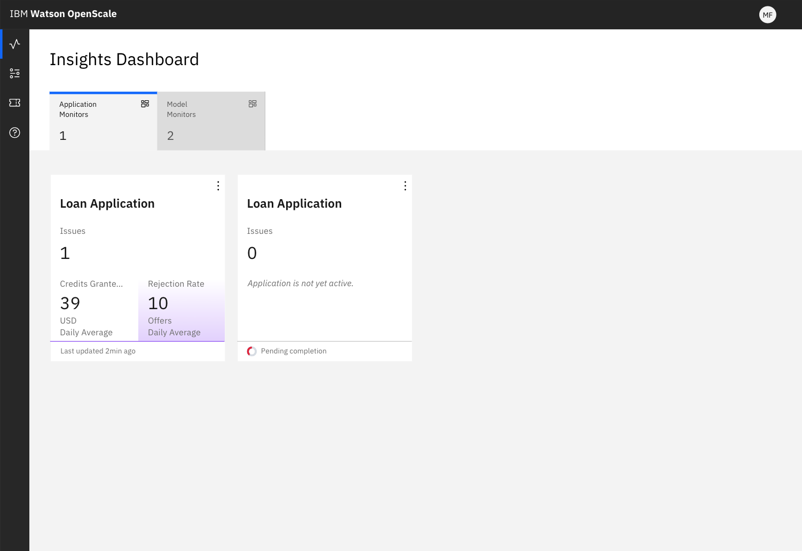

---

copyright:
  years: 2018, 2020
lastupdated: "2020-04-08"

keywords: dashboard, navigating, navigation, insights

subcollection: ai-openscale

---

{:shortdesc: .shortdesc}
{:external: target="_blank" .external}
{:tip: .tip}
{:important: .important}
{:note: .note}
{:pre: .pre}
{:codeblock: .codeblock}

{:screen: .screen}
{:note: .note}
{:note: .note}
{:note: .note}
{:note: .note}
{:faq: data-hd-content-type='faq'}

# Getting application insights with {{site.data.keyword.aios_short}} 
{: #io-app-ov}

You can track all the business processes and applications that you are monitoring through the **Applications monitor** tab of the {{site.data.keyword.aios_full}} dashboard.
{: shortdesc}

There are a few use cases, where having the knowledge how KPIs are correlated with AI measures can be especially beneficial:

- Use the correlation to decide where to invest and which problem, such as drift, fairness, or quality leads to the highest loss from a business perspective. It’s not enough to visualize model issues--{{site.data.keyword.aios_short}} enables you to see the estimate of their importance.
- In cases where there is no correlation between KPIs and AI metrics, this can be cause for further analysis and might lead to questions of how AI is used and whether there is some gap in the process.

The granularity at the transaction level is crucial for linking business events with the scoring payload. Each business event, or transaction, is a result of the business process that can include multiple scorings of different models. Having business events in the {{site.data.keyword.aios_short}} system means that you can slice business data by time or by clustering and link it with the corresponding scoring payload slices. Then measure KPIs on the business payload and AI metrics on the scoring payload. Finally correlate those metrics together.

Your business event (transaction) data is sent independent of any the scoring payload. These two separate data sets are joined by a transaction ID, `transaction_id`, which is present in the business payload and has to be sent (only ID of transaction) in the scoring request as a standard or meta field value.

Business event data is usually sent in batches, such as once per day. For that reason, the data processing time in usually not the event time.

Business event properties are different fields that describe the event (transaction), such as the following items: region, segment, potential profit from the transaction, Numerical fields can be used to calculate KPI values. Other for clustering purposes.

## Insights
{: #io-app-ins}

The **Applications monitor** tab provides a high-level view of your applications monitors and the associated business key performance indicators.

  

Each tile provides a summary of business KPIs for that application. Note that some application tiles show no values yet, perhaps because either configuration is not finalized yet or business KPI evaluation has not been completed.

## Key performance indicators (KPI) insights
{: #it-ap-ov}

To view details about a KPI, click the application tile, which displays the following information:

- Correlation discovered by {{site.data.keyword.aios_short}} between this KPI and the associated model metrics:
   - Drop in accuracy
   - Drop in data consistency
- Performance presented as a time series chart

## Next steps
{: #io-app-next}

Get more insights by performing the following tasks:

- [View correlation charts](/docs/services/ai-openscale?topic=ai-openscale-app-perform-vdet).
- [View KPI performance](/docs/services/ai-openscale?topic=ai-openscale-it-appkpi-vdet).

