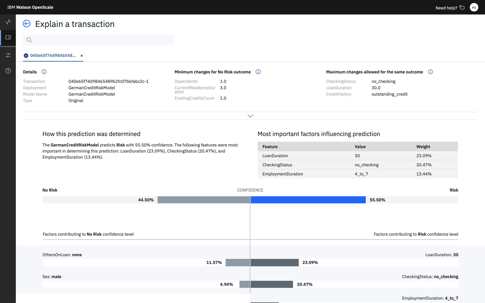
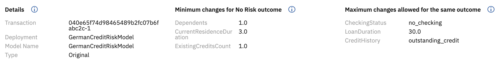

---

copyright:
  years: 2018, 2020
lastupdated: "2020-05-18"

keywords: fairness, monitoring, charts, de-biasing, bias, accuracy

subcollection: ai-openscale

---

{:shortdesc: .shortdesc}
{:external: target="_blank" .external}
{:tip: .tip}
{:important: .important}
{:note: .note}
{:pre: .pre}
{:codeblock: .codeblock}
{:screen: .screen}
{:faq: data-hd-content-type='faq'}

# Explaining a categorical model
{: #ie-class}

This example of explainability is for a binary classification model that approves or denies insurance claims. You can see the factors that contributed positively or negatively to the final outcome of `DENIED` in this case.
{: shortdesc}

The feature *POLICY AGE* having a value of less than one had the maximum impact in the model deciding a DENIED outcome. The other features that contributed to this outcome were *CLAIM FREQUENCY* (`High`) and *AGE* (`18`), with only a minor impact from *CAR VALUE* (`$50,000`).

While the charts are useful in showing the most significant factors in determining the outcome of a transaction, classification models can also include advanced explanations, detailed in the `Minimum changes for Approved outcome` and `Minimum changes for this outcome` sections.

Advanced explanations are not available for regression, image, and unstructured text models.
{: note}

The `Minimum changes for Approved outcome` tells us that, if the values of the features were changed to the values listed in this section, then the prediction of the model will change.

Likewise, the `Maximum changes allowed for the same outcome` tells us that, even if the values of the features were changed to those listed in this section, the prediction of the model would not have changed.

Thus, these two values tell us the behavior of the model in the vicinity of the data point for which the explanation is being generated.

