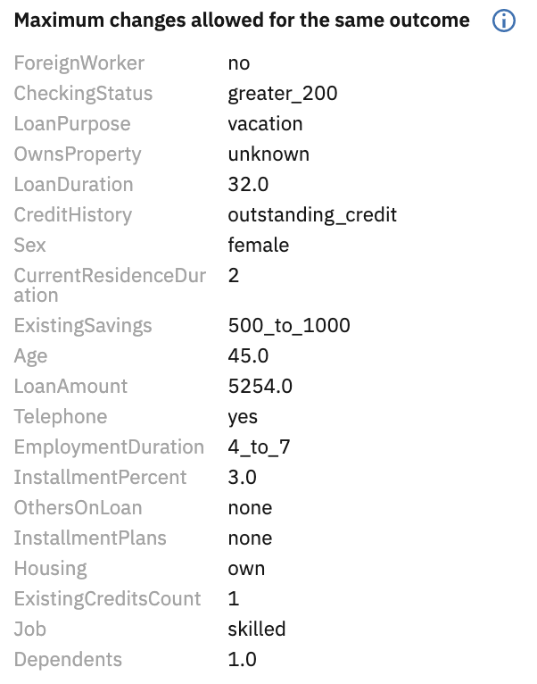
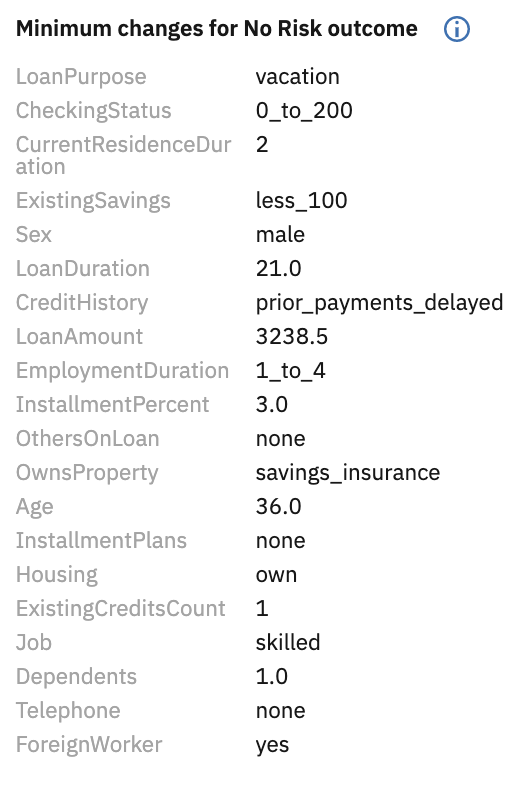
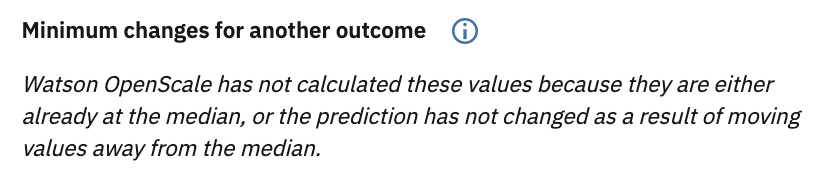

---

copyright:
  years: 2018, 2019
lastupdated: "2019-09-09"

keywords: accuracy, LIME, contrastive, explainability, pertinent positives, pertinent negatives

subcollection: ai-openscale

---

{:shortdesc: .shortdesc}
{:external: target="_blank" .external}
{:tip: .tip}
{:important: .important}
{:note: .note}
{:pre: .pre}
{:codeblock: .codeblock}

{:screen: .screen}
{:javascript: .ph data-hd-programlang='javascript'}
{:java: .ph data-hd-programlang='java'}
{:python: .ph data-hd-programlang='python'}
{:swift: .ph data-hd-programlang='swift'}
{:faq: data-hd-content-type='faq'}

# Contrastive explanations use pertinent positives and pertinent negatives
{: #ie-pp-pn}

For contrastive explanations, {{site.data.keyword.aios_short}} displays pertinent positive and pertinent negative values. These help explain the behavior of the model in the vicinity of the data point for which an explanation is generated.
{: shortdesc}

- Pertinent positives (PP) are feature values obtained by changing the value of each feature towards its median such that the model prediction remains the same.

  

- Pertinent negatives (PN) are feature values obtained by changing the value of each feature away from its median such that the model prediction changes.

  

Consider an example of a model used for loan processing. It can have one of three predictions: Loan Approved, Loan Partially Approved and Loan Denied. For the sake of simplicity, let us assume that the model takes only one feature in input: salary. Let us consider a data point where the salary=150000 and the model predicts Loan Partially Approved. Let the median value of salary be 90000. A pertinent positive could be: Even if the salary of the person was 100000, the model would have still predicted Loan Partially Approved. On the other hand, the pertinent negative will be: If the salary of the person was 200000, the model prediction would have changed to Loan Approved. Thus PP and PN together are explaining the behaviour of the model in the vicinity of the data point for which explanation is to be generated.

{{site.data.keyword.aios_short}} always displays a pertinent positive, however, sometimes there are no pertinent negatives to be displayed. To understand this better, consider that when {{site.data.keyword.aios_short}} calculates the pertinent negative value, it changes the values of all the features away from their median value. If even after changing the value away from median, the prediction does not change, then there are no pertinent negatives to display. In case of pertinent positives, {{site.data.keyword.aios_short}} finds the maximum change in the feature values towards the median such that the prediction does not change. Practically, this means that there is almost always a pertinent positive to explain a transaction (and it could be the feature value of the input data point itself).

