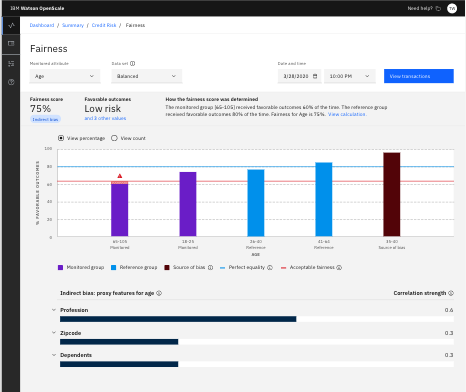

---

copyright:
  years: 2018, 2020
lastupdated: "2020-05-18"

keywords: fairness, monitoring, charts, debiasing, bias, accuracy, indirect bias, manual labelling table, endpoints

subcollection: ai-openscale

---

{:shortdesc: .shortdesc}
{:external: target="_blank" .external}
{:tip: .tip}
{:important: .important}
{:note: .note}
{:pre: .pre}
{:codeblock: .codeblock}
{:screen: .screen}
{:faq: data-hd-content-type='faq'}
{:video: .video}

# Debiasing options
{: #it-dbo}

{{site.data.keyword.aios_short}} uses two types of debiasing: passive and active. Passive debiasing reveals bias, while active debiasing prevents you from carrying that bias forward by changing the model in real time for the current application. In addition to direct bias, {{site.data.keyword.aios_short}} can determine indirect bias.
{: shortdesc}

## Video overview
{: #it-dbo-video}

Get a quick overview of debiasing in {{site.data.keyword.aios_short}} by watching the following video.

{: video output="iframe" data-script="none" id="mediacenterplayer" frameborder="0" width="560" height="395" allowfullscreen webkitallowfullscreen mozAllowFullScreen}

### Video transcript
{: #video-transcript-ui-it-dbo-video}
{: notoc}

Transcript text that will be displayed underneath this video is coming soon.

Thanks for your patience.

&nbsp;

## Passive debiasing
{: #it-dbo-passive}

Passive debiasing is the work that {{site.data.keyword.aios_short}} does by itself, automatically, every hour. It is considered passive because it happens without user intervention. When {{site.data.keyword.aios_short}} checks bias, it also does a debiases the data. It analyzes the behavior of the model, and identifies the data where the model acts in a biased manner.

{{site.data.keyword.aios_short}} then builds a machine learning model to predict whether the model is likely to act in a biased manner on a given, new data point. {{site.data.keyword.aios_short}} then analyzes the data that is received by the model, on an hourly basis, and finds the data points that cause bias. For such data points, the fairness attribute is perturbed from minority to majority, and the perturbed data is sent to the original model for prediction. This prediction of the original model is used as the debiased output.

{{site.data.keyword.aios_short}} debiases all the data that the model receives in the past hour. It also computes the fairness for the debiased output, and displays it in the **Debiased model** tab.

## Active debiasing
{: #it-dbo-active}

Active debiasing is a way for you to request and bring debiased results into your application through the REST API endpoint. You are actively directing {{site.data.keyword.aios_short}} to run debiasing and alter the model so that you can run your application in a non-bias way. In active debiasing, you can use a debiasing REST API endpoint from your application. This REST API endpoint internally calls your model, and checks its behavior.

If {{site.data.keyword.aios_short}} detects that the model is acting in a biased manner, it perturbs the data, and sends it back to the original model. The output of the original model on the perturbed data is returned as the debiased prediction. If {{site.data.keyword.aios_short}} determines that the original model is not acting in a biased manner, then {{site.data.keyword.aios_short}} returns the original model's prediction as the debiased prediction. Thus, by using this REST API endpoint, you can ensure that your application does not base decisions on biased output.

### Steps to select the **Debiased Scoring Endpoint** link
{: #it-dbo-active-steps-endpoint}

1. On the **Evaluations** window, click **Configure monitors**.
2. In the navigation pane, click **Endpoints**.
3. In the **Information** pane, click the **Endpoints** tab.
4. From the **Endpoint** list, click **Debiased transactions**.
5. From the **Code language** list, choose the type of code: **cURL**, **Java**, or **Python**.
6. To copy the code snippet, click the **Copy to clipboard**  icon.

## Viewing fairness results for indirect bias
{: #it-dbo-indirect}

After you ensure that your model is [set up for indirect bias analysis](/docs/ai-openscale?topic=ai-openscale-mf-debias#mf-debias-indirect), you can view results of the analysis: 

The correlated features start out collapsed. The correlation strength is presented following the feature. The tooltip describes the proxy features. The top three features are displayed. Expand each feature to see values for the three lowest monitored groups and three highest reference groups. For each group, the three most-frequent values and the number of favorable outcomes for that class are displayed.

## Next steps
{: #it-dbo-nextsteps}

- To mitigate bias, you must build a new version of the model that fixes the problem. {{site.data.keyword.aios_short}} stores biased records in the manual labeling table. These biased records need to be manually labeled and then the model needs to be retrained by using this additional data to build a new version of the model that is unbiased.
- You can also extract a list of the individual biased records through the manual labeling table. Connect to the manual labeling table and read the records by using standard SQL queries.

