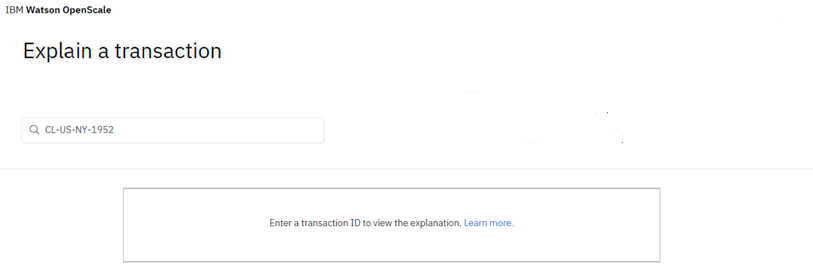

---

copyright:
  years: 2018, 2020
lastupdated: "2020-01-28"

keywords: explainability, monitoring, explain, explaining, transactions, transaction ID

subcollection: ai-openscale

---

{:shortdesc: .shortdesc}
{:external: target="_blank" .external}
{:tip: .tip}
{:important: .important}
{:note: .note}
{:pre: .pre}
{:codeblock: .codeblock}
{:screen: .screen}

# Explaining transactions
{: #ie-ov}

For each deployment, you can see explainability data for specific transactions.
{: shortdesc}

Get a quick overview of explainability in {{site.data.keyword.aios_short}} by watching the following video:

  

     <iframe class="embed-responsive-item" id="WOS-bias-vid" title="Explainable AI Outcomes with {{site.data.keyword.aios_full}}" type="text/html"src="https://cdnapisec.kaltura.com/p/1773841/sp/177384100/embedIframeJs/uiconf_id/39954662/partner_id/1773841?iframeembed=true&playerId=kplayer&entry_id=1_fvsfm0fo&flashvars[streamerType]=auto" width="560" height="395" allowfullscreen webkitallowfullscreen mozAllowFullScreen allow="autoplay *; fullscreen *; encrypted-media *" frameborder="0"></iframe>

  

&nbsp;

## Viewing explanations by transaction ID
{: #ie-view}

2. Click the **Explain a transaction** tab (  ) in the navigator.
3. Type a transaction ID.

Whenever data is sent to the model for scoring, {{site.data.keyword.pm_full}} sets a transaction ID in the HTTP header by setting the `X-Global-Transaction-Id` field. This transaction ID gets stored in the payload table. To find an explanation of the model behavior for a particular scoring, specify the transaction ID associated with that scoring request. Please note that this behavior applies only to {{site.data.keyword.pm_full}} transactions, and is not applicable for non-WML transactions.
{: note}

## Finding a transaction ID in {{site.data.keyword.aios_short}}
{: #ie-find}

1.  From the time chart for your deployment, slide the marker across the chart and click the **View details** link to [visualize data for a specific hour](/docs/services/ai-openscale?topic=ai-openscale-it-vdet).
1.  Click the **View transactions** button to [view the list of transaction IDs](/docs/services/ai-openscale?topic=ai-openscale-it-tra).
1.  Click the **Explain** link in the Action column for any transaction ID, which will open that transaction in the Explainability tab.

  See the following sections for examples of explanations for different types of models.

  

## Finding explanations through chart details
{: #ie-view-ui}

Because explanations exist for fairness, drift, and performance you can click the charts to get a detailed view of the data set and then click the **View transactions** button.

- For one of the fairness attributes, such as sex or age click the attribute, then click the chart, and then click the **View transactions** button.
- For the drift monitor, click **Drift magnitude**, click the chart, and then click a tile to see the transactions associated with that particular drift group.
- For a performance chart, click the chart, and then click **Explain**.

## Understanding the difference between contrastive explanations and LIME
{: #ie-pp-pn}

Local Interpretable Model-Agnostic Explanations (LIME) is a Python library that {{site.data.keyword.aios_short}} uses to analyze the input and ouput values of a model to create human-understandable interpretations of the model. Both LIME and contrastive explanation are valuable tools for making sense of a model, however, they offer very different perspectives. Contrastive explanations reveal how much values need to change to either change the prediction or still have the same prediction. The factors which need the maximum change are considered more important in this type of explanation. In other words the features with highest importance in contrastive explanations are those where the model is least sensitive. On the other hand, LIME reveals which features are most important for a specific data point. The 5000 perturbations that are typically done for analysis are very close to the data point and in an ideal setting the features with high importance in LIME are those which are most important for that specific data point. For these reasons, the features with high importance for LIME and those for contrastive explanations can be very different.

## Next steps
{: #ie-trans-id-next}

- [Explaining categorical models](/docs/services/ai-openscale?topic=ai-openscale-ie-class)
- [Explaining image models](/docs/services/ai-openscale?topic=ai-openscale-ie-image)
- [Explaining unstructured text models](/docs/services/ai-openscale?topic=ai-openscale-ie-unstruct)
- [Contrastive explanations](/docs/services/ai-openscale?topic=ai-openscale-ie-pp-pn)
