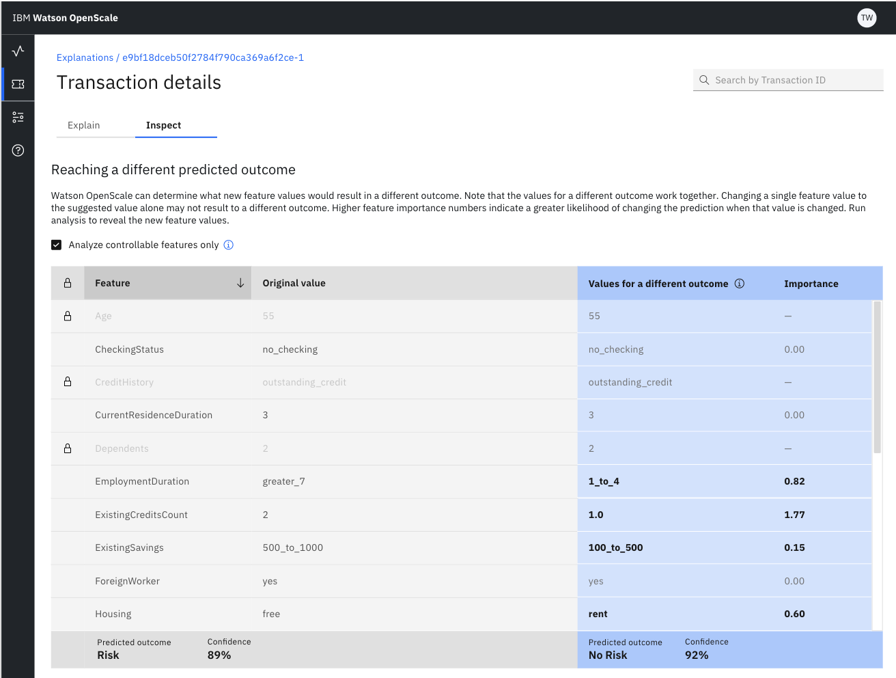
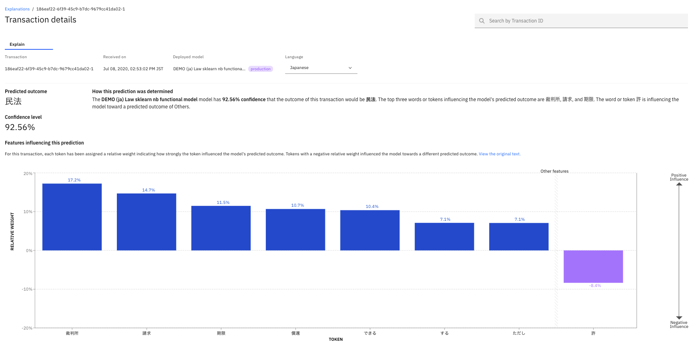
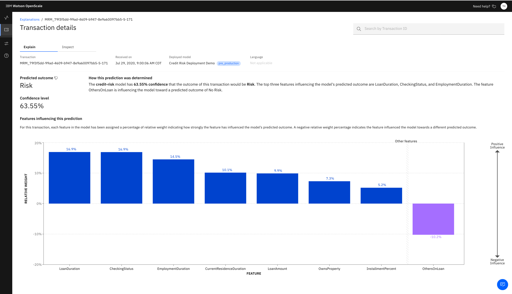

---

copyright:
  years: 2018, 2020
lastupdated: "2020-05-18"

keywords: explainability, monitoring, explain, explaining, transactions, transaction ID, LIME, contrastive, pertinent positives, pertinent negatives

subcollection: ai-openscale

---

{:shortdesc: .shortdesc}
{:external: target="_blank" .external}
{:tip: .tip}
{:important: .important}
{:note: .note}
{:pre: .pre}
{:codeblock: .codeblock}
{:screen: .screen}
{:faq: data-hd-content-type='faq'}

# Explaining transactions
{: #ie-ov}

For each deployment, you can see explainability data for specific transactions. Depending on the type of mode, it can include 
{: shortdesc}

&nbsp;

## Viewing explanations by transaction ID
{: #ie-view}

2. Click the **Explain a transaction** tab (  ) in the navigator.
3. Type a transaction ID.
4. To analyze results further, click the **Inspect** tab, choose whether to analyze controllable feature only, and click the **Run analysis** button.

   The results of this analysis show how different values can change the outcome of this specific transaction. You must designate which features are controllable. For more information, see [Configuring the explainability monitor](/docs/ai-openscale?topic=ai-openscale-explainability-monitor)

   

Whenever data is sent to the model for scoring, {{site.data.keyword.pm_full}} sets a transaction ID in the HTTP header by setting the `X-Global-Transaction-Id` field. This transaction ID gets stored in the payload table. To find an explanation of the model behavior for a particular scoring, specify the transaction ID associated with that scoring request. Please note that this behavior applies only to {{site.data.keyword.pm_full}} transactions, and is not applicable for non-WML transactions.
{: note}

&nbsp;

## Finding a transaction ID in {{site.data.keyword.aios_short}}
{: #ie-find}

1.  From the chart, slide the marker across the chart and click the **View details** link to [visualize data for a specific hour](/docs/ai-openscale?topic=ai-openscale-it-vdet).
1.  Click the **View transactions** button to [view the list of transaction IDs](/docs/ai-openscale?topic=ai-openscale-it-vdep#it-tra).
1.  Click the **Explain** link in the Action column for any transaction ID, which will open that transaction in the Explainability tab.

&nbsp;

## Finding explanations through chart details
{: #ie-view-ui}

Because explanations exist for model risk, fairness, drift, and performance you can click one of the following links to view detailed transactions:

- From the **Evaluations** page, in the **Number of explanations** section, click the number link. In the **Select an explanation** window, click a transaction and then click the **View** button. 
- For one of the fairness attributes, from the **Evaluations** page, click the fairness percentage link. Click the attribute, such as sex or age, click the chart, and then click the **View transactions** button.
- For the drift monitor, from the **Evaluations** page, click the drift percentage link. Click the chart, click the drift type, then click a tile to see the transactions associated with that particular drift group.
- For a performance chart, from the **Evaluations** page, click any of the percentage links. In the **Performance** section, click **Throughput**, click the chart, and then click the **Explain** link that follows the transaction you want to view.

&nbsp;

## Understanding the difference between contrastive explanations and LIME
{: #ie-contrastive.v.lime}

Local Interpretable Model-Agnostic Explanations (LIME) is a Python library that {{site.data.keyword.aios_short}} uses to analyze the input and ouput values of a model to create human-understandable interpretations of the model. Both LIME and contrastive explanation are valuable tools for making sense of a model, however, they offer very different perspectives. Contrastive explanations reveal how much values need to change to either change the prediction or still have the same prediction. The factors which need the maximum change are considered more important in this type of explanation. In other words the features with highest importance in contrastive explanations are those where the model is least sensitive. On the other hand, LIME reveals which features are most important for a specific data point. The 5000 perturbations that are typically done for analysis are very close to the data point and in an ideal setting the features with high importance in LIME are those which are most important for that specific data point. For these reasons, the features with high importance for LIME and those for contrastive explanations can be very different.

For proper processing of LIME explanations, {{site.data.keyword.aios_short}} does not support column names with equals sign (=) in the dataset.
{: important} 

For contrastive explanations, {{site.data.keyword.aios_short}} displays the maximum changes for the same outcome and the minimum changes for a changed outcome. These categories are also known as pertinent positive and pertinent negative values. These values help explain the behavior of the model in the vicinity of the data point for which an explanation is generated. 

Consider an example of a model used for loan processing. It can have the following predictions: **Loan Approved**, **Loan Partially Approved**, and **Loan Denied**. For the sake of simplicity, assume that the model takes only one feature in input: salary. Consider a data point where the salary=150000 and the model predicts Loan Partially Approved. Assume that the median value of salary is 90000. A pertinent positive might be: Even if the salary of the person was 100000, the model still predicts Loan Partially Approved. Alternatively, the pertinent negative is: If the salary of the person was 200000, the model prediction would change to Loan Approved. Thus pertinent positive and pertinent negative together explain the behavior of the model in the vicinity of the data point for which the explanation is generated.
 
{{site.data.keyword.aios_short}} always displays a pertinent positive sometimes there are no pertinent negatives to be displayed. When {{site.data.keyword.aios_short}} calculates the pertinent negative value, it changes the values of all the features away from their median value. If the value changes away from median, the prediction does not change, then there are no pertinent negatives to display. For pertinent positives, {{site.data.keyword.aios_short}} finds the maximum change in the feature values towards the median such that the prediction does not change. Practically, there is almost always a pertinent positive to explain a transaction (and it might be the feature value of the input data point itself).

&nbsp;

## Explaining a categorical model
{: #ie-class}

A categorical model, such as a binary classification model categorizes data into distinct groups. Unlike regression, image, and unstructured text models, {{site.data.keyword.aios_short}} generates advanced explanations for binary classification models. You can use the **Inspect** tab to experiment with features by changing the values to see whether the outcome changes.

While the charts are useful in showing the most significant factors in determining the outcome of a transaction, classification models can also include advanced explanations on the `Explain` and `Inspect` tabs.

- The `Explain` tab, in addition to basic information about the transaction and model, displays the following information:
  
  - Predicted outcome: The outcomes are set in the model.
  - How this prediction was determined: Displays the LIME explanation.
  - Confidence level: How confident, as a percentage, the {{site.data.keyword.aios_short}} service is about the analysis.
  - Features influencing this prediction: For this transaction, each feature in the model has been assigned a percentage of relative weight indicating how strongly the feature has influenced the model’s predicted outcome. A negative relative weight percentage indicates the feature influenced the model towards a different predicted outcome.
  
- The `Inspect` tab displays the following information as part of the contrastive explanation:
  
  - Feature: The feature from the model. If the model was created with additional meta fields that were not used in training, you have the option of viewing only those features by selecting the **Analyze controllable features only** option.
  - Original value: The original value used in training the model.
  - New value: You can enter a new value for one or more features to see how it might change the outcome.
  - Value for a different outcome: After you run an analysis, you can see what are the mostly likely settings to change the outcome.
  - Importance: After you run an analsysis, you can see what the relative importance is for each changed feature value.

&nbsp;

## Explaining image models
{: #ie-image}

{{site.data.keyword.aios_short}} supports explainability for image data. See the image zones that contributed to the model output and the zones that did not contribute. Click an image for a larger view.

### Explaining image model transactions
{: #ie-image-workingviewing}

For an image classification model example of explainability, you can see which parts of an image contributed positively to the predicted outcome and which contributed negatively. In the following example, the image in the positive pane shows the parts which impacted positively to the prediction. The image in the negative pane shows the parts of images that had a negative impact on the outcome.

See the image zones that contributed to the model output and the zones that did not contribute. Click an image for a larger view.

### Image model examples
{: #ie-image-working-ntbks}

Use the following two Notebooks to see detailed code samples and develop your own {{site.data.keyword.aios_short}} deployments:

- [Tutorial on generating an explanation for an image-based model](https://github.com/pmservice/ai-openscale-tutorials/blob/master/notebooks/Watson%20OpenScale%20Explanation%20for%20Image%20Multiclass%20Classification%20Model.ipynb){: external}
- [Tutorial on generating an explanation for an image-based binary classifier model](https://github.com/pmservice/ai-openscale-tutorials/blob/master/notebooks/Watson%20OpenScale%20Explanation%20for%20Image%20Binary%20Classification%20Model.ipynb){: external}

&nbsp;

## Explaining unstructured text models
{: #ie-unstruct}

{{site.data.keyword.aios_short}} supports explainability for unstructured text data.

If you are using a Keras model that takes the input as byte array, you must create a deployable function in {{site.data.keyword.pm_full}} that accepts the entire text as a single feature in input (as opposed to text which is vectorised and represented as a tensor or split across multiple features). Creating a deployable function is part of the functionality that {{site.data.keyword.pm_full}} support. For more information, see [Passing payload data to model deployments](https://dataplatform.cloud.ibm.com/docs/content/wsj/analyze-data/ml-deploy-functions.html?linkInPage=true#models){: external}

For information about setting up your unstructured text models, see [Working with unstructured text models](/docs/ai-openscale?topic=ai-openscale-ie-unstruct-steps).

For information about configuring support for non-space-delimited languages, such as Japanese, Chinese, and Korean, see [Enabling non-space-delimited language support](/docs/ai-openscale?topic=ai-openscale-explainability-monitor#ie-unstruct-xplan-langsupport)

### Explaining unstructured text transactions
{: #ie-unstruct-xplan}

The following example of explainability shows a classification model that evaluates unstructured text. The explanation shows the keywords that had a positive as well as a negative impact on the model prediction. We also show the position of the identified keywords in the original text which was fed as input to the model.  

Unstructured text models present the importance of words or tokens. To change the language, select a different language from the drop-down menu. The explanation runs again by using a different tokenizer.

### Unstructured text model example
{: #ie-unstruct-ntbkssample}

Use the following notebook to see detailed code samples and develop your own {{site.data.keyword.aios_short}} deployments:

- [Tutorial on generating an explanation for a text-based model](https://github.com/pmservice/ai-openscale-tutorials/blob/master/notebooks/Watson%20OpenScale%20Explanation%20for%20Text%20Model.ipynb){: external}

&nbsp;

## Explaining tabular transactions
{: #ie-tabular-xplan}

The following example of explainability shows a classification model that evaluates tabular data.

### Tabular model example
{: #ie-tabular-ntbkssample}

Use the following notebook to see detailed code samples and develop your own {{site.data.keyword.aios_short}} deployments:

- [Tutorial on generating an explanation for a tabular model on {{site.data.keyword.aios_short}}](https://github.com/pmservice/ai-openscale-tutorials/blob/master/notebooks/Watson%20OpenScale%20Explanation%20for%20Tabular%20Model.ipynb){: external}

&nbsp;

## Next steps
{: #ie-trans-id-next}

- [Fairness metrics overview](/docs/ai-openscale?topic=ai-openscale-anlz_metrics_fairness)
- [Quality metrics overview](/docs/ai-openscale?topic=ai-openscale-anlz_metrics)
- [Drift detection overview](/docs/ai-openscale?topic=ai-openscale-behavior-ovr)
- [Performance metrics overview](/docs/ai-openscale?topic=ai-openscale-anlz_metrics_performance)
