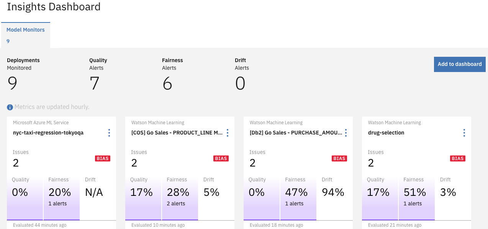

---

copyright:
  years: 2018, 2019
lastupdated: "2019-06-28"

keywords: dashboard, navigating, navigation, insights

subcollection: ai-openscale

---

{:shortdesc: .shortdesc}
{:external: target="_blank" .external}
{:tip: .tip}
{:important: .important}
{:note: .note}
{:pre: .pre}
{:codeblock: .codeblock}
{:download: .download}
{:screen: .screen}
{:javascript: .ph data-hd-programlang='javascript'}
{:java: .ph data-hd-programlang='java'}
{:python: .ph data-hd-programlang='python'}
{:swift: .ph data-hd-programlang='swift'}
{:faq: data-hd-content-type='faq'}

# Getting insights with {{site.data.keyword.aios_short}}
{: #io-ov}

You can track all the deployed models, also known as deployments, that you are monitoring through the {{site.data.keyword.aios_full}} dashboard. The dashboard is your main view into {{site.data.keyword.aios_short}} and provides you with the means of getting insights into how your models are performing.
{: shortdesc}

## Insights
{: #io-ins}

The **Insights**  tab provides a high-level view of your deployment monitoring.

  

- ***Deployments Monitored*** - In this example, a total of 25 deployments are being monitored. The deployments are shown as individual tiles. Ten of the 25 tiles are visible in the sample.

- ***Quality Alerts*** - A total of 7 Quality (previously called Accuracy) alerts are represented in the tiles and show values of various percentages.

- ***Fairness Alerts*** - There are also 7 Fairness alerts, which displays in several of the tiles, represented by a small `BIAS` tag. The deployment shows various Fairness values as a percentage and also displays an indication of how many attributes are being reported.

Each tile provides a summary of monitoring activity for that deployment. Note that some deployment tiles show no bias yet, perhaps because fairness evaluation has not yet completed.

## Fairness, quality, performance, and analytics insights
{: #it-ov}

Select any of the individual deployment tiles to view more details about that deployment. Monitoring data for individual deployments displays in a series of charts. The charts track metrics, such as fairness, average requests per minute, and accuracy over days, weeks, or months.

- [Viewing data for a deployment](/docs/services/ai-openscale?topic=ai-openscale-it-vdep)
- [Visualizing data for a specific hour](/docs/services/ai-openscale?topic=ai-openscale-it-vdet)
- [Fairness](/docs/services/ai-openscale?topic=ai-openscale-anlz_metrics_fairness)
- [Quality](/docs/services/ai-openscale?topic=ai-openscale-anlz_metrics)
- [Drift](/docs/services/ai-openscale?topic=ai-openscale-behavior-drift-ovr)
- [Performance](/docs/services/ai-openscale?topic=ai-openscale-anlz_metrics_performance)
- [Analytics](/docs/services/ai-openscale?topic=ai-openscale-anlz_metrics_payload)
- [De-biasing options](/docs/services/ai-openscale?topic=ai-openscale-it-dbo)

## Explainability
{: #io-tran}

Use the **Explain a transaction**  tab to search a specific transaction ID to explain a particular transaction record.

- [Explaining transactions](/docs/services/ai-openscale?topic=ai-openscale-ie-ov)
- [Explaining categorical models](/docs/services/ai-openscale?topic=ai-openscale-ie-class)
- [Explaining image models](/docs/services/ai-openscale?topic=ai-openscale-ie-image)
- [Explaining unstructured text models](/docs/services/ai-openscale?topic=ai-openscale-ie-unstruct)
- [Contrastive explanations](/docs/services/ai-openscale?topic=ai-openscale-ie-pp-pn)

## Next steps
{: #io-next}

- [Add more deployments to monitor](/docs/services/ai-openscale?topic=ai-openscale-dpl-select).

