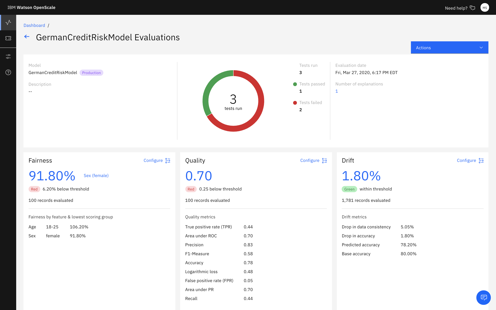
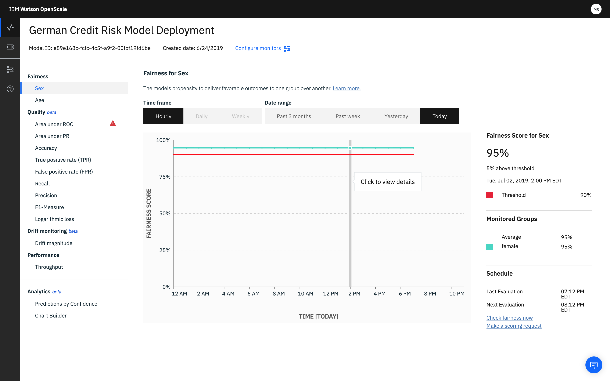
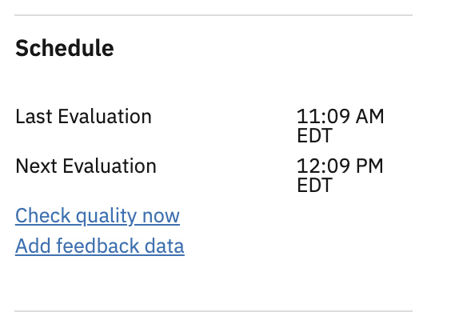
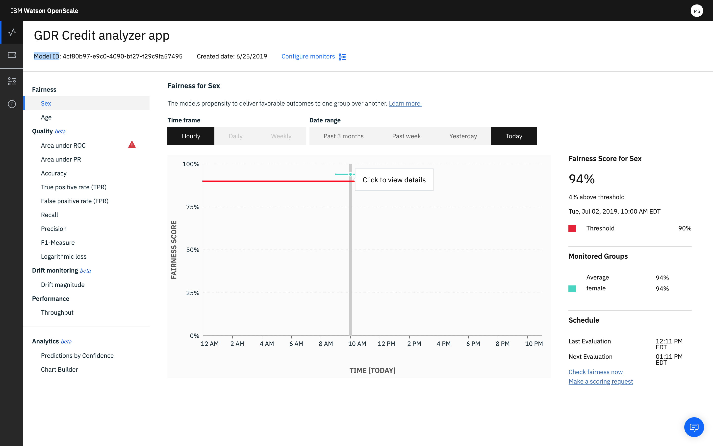
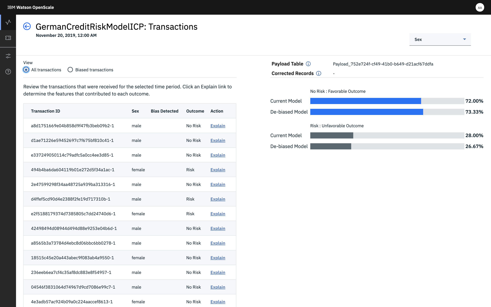
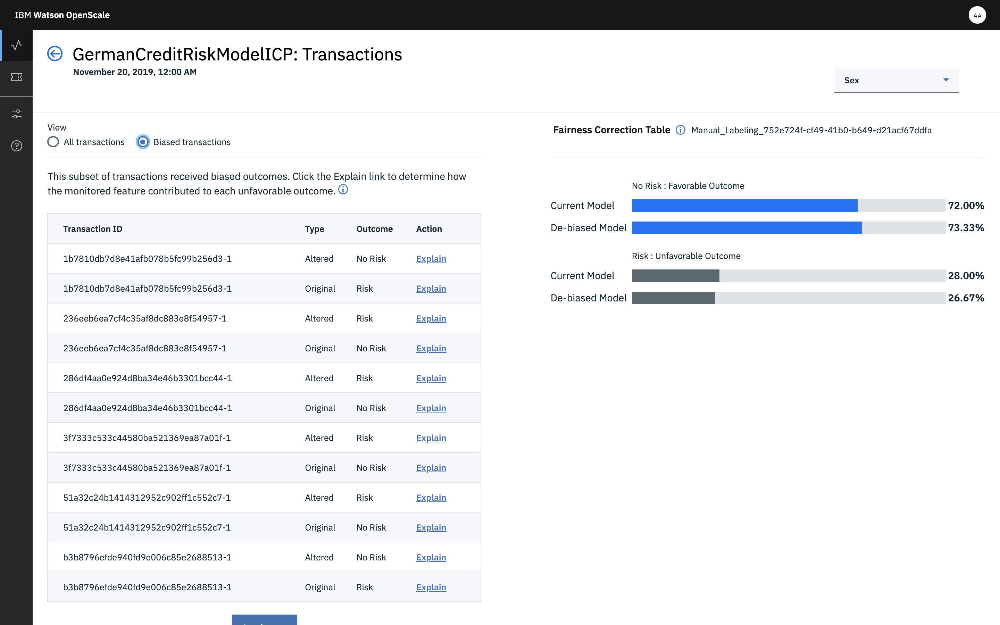

---

copyright:
  years: 2018, 2020
lastupdated: "2020-08-08"

keywords: fairness, monitoring, charts, debiasing, bias, accuracy, tests run, tests failed, tests passed

subcollection: ai-openscale

---

{:shortdesc: .shortdesc}
{:external: target="_blank" .external}
{:tip: .tip}
{:important: .important}
{:note: .note}
{:pre: .pre}
{:codeblock: .codeblock}
{:screen: .screen}
{:faq: data-hd-content-type='faq'}

# Viewing data for a deployment
{: #it-vdep}

Select a deployment from the dashboard to see monitoring data for that deployment. The heading displays information about the deployed model, such as the **Model ID**, **Description**. amd **Evaluation date** fields.
{: shortdesc}

The **Evaluation** window displays details for the fairness, quality, and drift monitors. Depending on the type of model, either pre-production or production, the **Tests run**, **Tests passed**, and **Tests failed** display the following results:

- For a pre-production model deployment, the results of your test run are displayed
- For a production model deployment, the results of the latest regularly scheduled hourly fairness and quality checks and that latest 3-hourly drift check are displayed.

Click one of the tiles, for example the Fairness tile to view the fairness timeline view:

Because the algorithm checks are only run every hour, there are also links provided to check fairness and quality on-demand. From the **Schedule** panel, you can click the following links to make an immediate check of your data:

Next, click the chart and move the marker across the chart to see statistics for an individual hour:

- ***Fairness***: Two Fairness features, Sex and Age, met their set thresholds for approval.
- ***Quality***: The **Area under ROC** metric displays an alert because it was not within the configured treshold.
- ***Avg. Reqs/Min***: Click the **Throughput** metric to see the number of records that were processed per minute between. The throughput is computed every minute, and its average value over the course of the hour is reported in the chart.

## View transactions
{: #it-tra}

Use the **View transactions** option to view the individual transactions that contributed to the model. When you click the **View transactions** button, a list of transactions displays.

Click the **Explain** link for any of the transaction IDs to get details about that transaction in the Explainability tab. For more information, see [Monitoring explainability](/docs/ai-openscale?topic=ai-openscale-ie-ov).

Select the **All transactions** view to see all transactions from the selected feature (in this example "AGE"), and the selected period (in this example "September 15, 2018 1:00 PM"):

Select the **Biased transactions** view to see only the subset of transactions that received biased outcomes. Each biased transaction is compared to a similar-but-slightly-altered (perturbed) transaction that shows how changing the value of the monitored feature (AGE) will result in a favorable outcome for the biased transaction:

## Next steps
{: #it-tra-nextsteps}

View transaction details, where you can see how the prediction was determined and also, how you might change the outcome by adjusting values. For more information, see [Explaining transactions](/docs/ai-openscale?topic=ai-openscale-ie-ov).