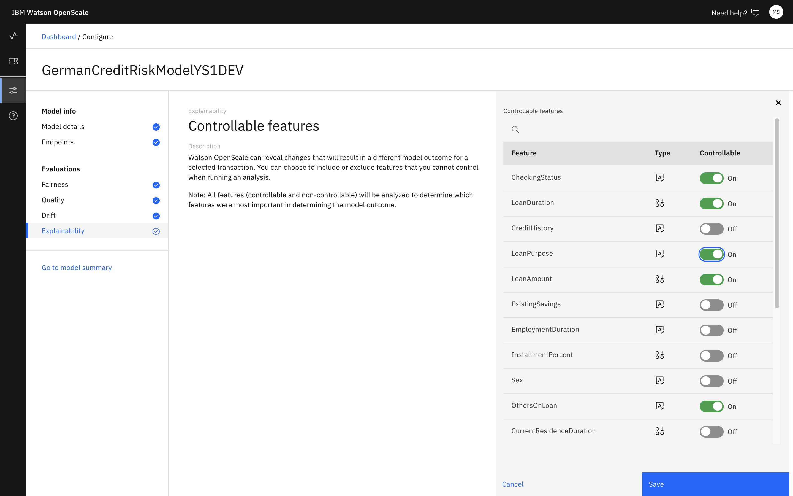

---

copyright:
  years: 2018, 2020
lastupdated: "2020-05-18"

keywords: explainability, configuration, configure, controllable, feature

subcollection: ai-openscale

---

{:shortdesc: .shortdesc}
{:external: target="_blank" .external}
{:tip: .tip}
{:important: .important}
{:note: .note}
{:pre: .pre}
{:codeblock: .codeblock}
{:help: data-hd-content-type='help'}
{:support: data-reuse='support'}
{:screen: .screen}
{:faq: data-hd-content-type='faq'}

# Configuring the explainability monitor
{: #explainability-monitor}

In {{site.data.keyword.aios_full}}, the explainability monitor sets whether a feature is controllable or not. 
{: shortdesc}

## Requirements for controllable features
{: #explainability-reqs}

A controllable feature is one that can be changed and have a meaningful impact on the outcome. For example, a loan amount would be a controllable feature that might affect whether an applicant is approved or not. An example of an uncontrollable feature would be something inherent, such as sex or age, which are characteristic attributes that would be beyond the ability of someone to adjust in a transient manner.

## Steps
{: #explainability-config}
{: help} 
{: support}

To start the configuration process, from the **Explainability** tab, in the **Controllable features** box, click the **Edit**  icon.

For each of the features, select whether it is controllable. 

## Next steps
{: #mf-next}

- To see the results of your controllable features settings, see [Viewing explanations by transaction ID](/docs/ai-openscale?topic=ai-openscale-ie-ov#ie-view).
- To continue configuring monitors, click the **Drift** tab and click the **Edit** icon. For more information, see [Configuring the drift detection monitor](/docs/ai-openscale?topic=ai-openscale-behavior-drift-config).
