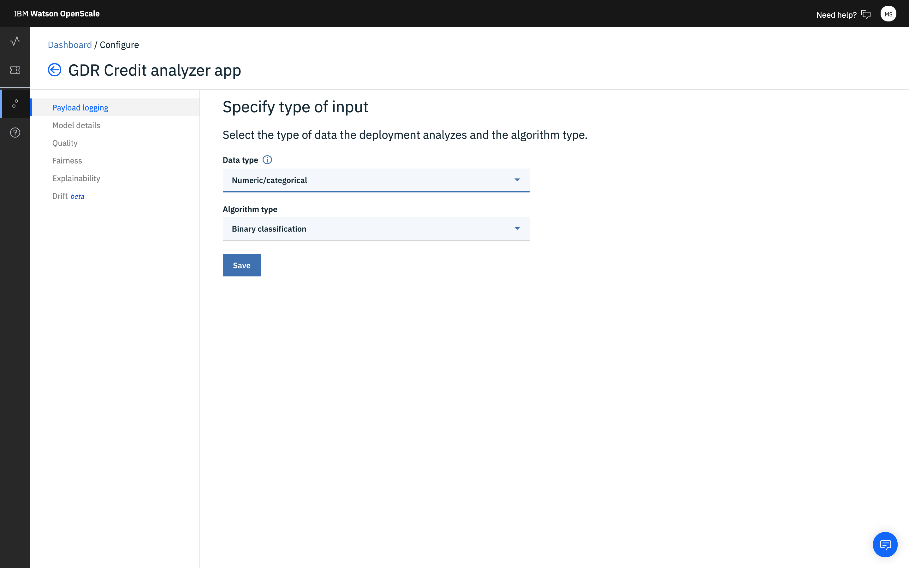
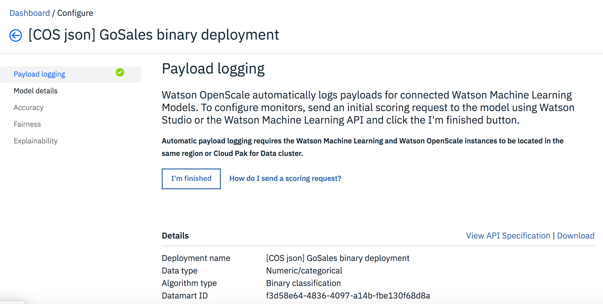
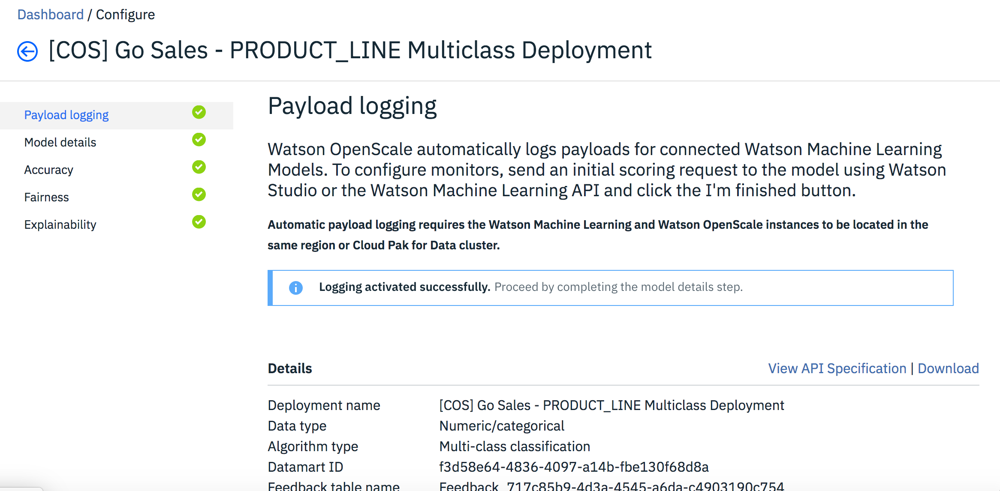

---

copyright:
  years: 2018, 2019
lastupdated: "2019-11-22"

keywords: deployment, monitors, data

subcollection: ai-openscale

---

{:shortdesc: .shortdesc}
{:external: target="_blank" .external}
{:tip: .tip}
{:important: .important}
{:note: .note}
{:pre: .pre}
{:codeblock: .codeblock}
{:screen: .screen}
{:javascript: .ph data-hd-programlang='javascript'}
{:java: .ph data-hd-programlang='java'}
{:python: .ph data-hd-programlang='python'}
{:swift: .ph data-hd-programlang='swift'}
{:faq: data-hd-content-type='faq'}

# Prepare models for monitoring
{: #mo-config}

Set up and enable monitors for each deployment that you are tracking with {{site.data.keyword.aios_short}}.
{: shortdesc}

For example, if you are using the **German Credit Risk** sample model for the interactive tutorial, select the model deployment, set the data type for payload logging, and confirm the settings that are presented as part of the model details section.

## Selecting a deployment
{: #mo-select-deploy}

1. From the **Insights dashboard**, on the **Model monitor** tab, click the **Add to dashboard** button. 

   A list of available model deployments appears. If you don't see any model deployments, you must deploy a model using your machine learning provider. For the tutorial, select the **German Credit Risk model**.

   

2. Click a model deployment and then click **Configure**.

   After your selections are saved, you are ready to configure monitors, which include payload logging, accuracy, and fairness. 

2. To get started, click **Configure monitors**.

## Provide payload logging details
{: #mo-work-data}

You must provide information about your model and training data. For more information about training data, see [Why does {{site.data.keyword.aios_short}} need access to my training data?](/docs/services/ai-openscale?topic=ai-openscale-trainingdata#trainingdata) For the tutorial, in the **Data type** field, select **Numeric/categorical** and for the **Algorithm type**, select **Binary classification**.

- If you use an {{site.data.keyword.pm_full}} instance that is in the same region as your {{site.data.keyword.aios_short}} instance, although you must select Data type and Algorithm type, some payload logging information is configured automatically for you. 
- Otherwise from the **Payload logging** tab and windows, you must enter information about your data and algorithm types and your payload logging. 

- There are specific requirements depending on your selections. For more information, see [Numeric/categorical data](/docs/services/ai-openscale?topic=ai-openscale-mo-config#mo-datan).

- Before you configure your monitors, copy one of the code snippets to run to establish the connection to Watson Machine Learning. Run the cURL command in your client application or the Python command in your data science notebook. This provides a way to log model deployment requests and write response data into the payload database.
   
After you send the payload logging details, either by using the local {{site.data.keyword.pm_full}} method or by using the API, you must return to the **Payload logging** screen and click **I'm finished**.

If the scoring is sent correctly to {{site.data.keyword.aios_short}}, the following screen is shown after you click the **I'm finished** button. The button is hidden and you see the message, **Logging activated successfully**.

## Provide model details
{: #mo-work-model-dets}

Provide information about your model so that {{site.data.keyword.aios_short}} can access the database and understand how the model is set up. 

Specifically to configure monitors, you must provide the following information:

- Specify the Location (either `Db2` or `Cloud Object Storage`), then:
    - For a Db2 database, enter the following information:
        - Host name or IP address
        - Port
        - Database (name)
        - Username
        - Password
    - For Cloud Object Storage, enter the following information:
        - Login URL: The Login URL must match the region setting of the bucket where your training data is located. You will specify the training data bucket in the next step.
        - Resource instance (ID)
        - API key
- To ensure a valid connection, click the **Test** button to connect to the trainingdata.
- Specify the exact location in the Db2 database or Cloud Object Storage wherethetraining data is located.
    - For a Db2 database, select both a schema and a training table that includes columns expected by your model.
    - For Cloud Object Storage, select a Bucket and a Data Set.

## Continuing the interactive tutorial
{: #mo-work-model-dets-int-tut}

If you use the Lite plan option, the Db2 configuration information is provided within the sample model metadata. Optionally, if you want to use your own Db2 or Cloud Object Storage, you can continue with the following section, which shows how to set up the Cloud Object Storage instance that you created previously. 

You must enter the location of the training data. Training data must be stored in a Db2 database or Cloud Object Storage. Enter your connection information, then click **Test** to verify the connection. You do this by entering the location, hostname or IP address, the database name, and the authentication information from IBM Cloud.

### Location of training data (tutorial example)
{: #mo-work-model-dets-int-tut-train}

For the interactive tutorial, use the Cloud Object Storage instance that you created and load the [training data](https://raw.githubusercontent.com/pmservice/ai-openscale-tutorials/master/assets/historical_data/german_credit_risk/wml/german_credit_data_biased_training.csv) into a bucket that you create. 

You'll need the following information, which you can obtain by clicking the Cloud Object Storage instance from the IBM Cloud dashboard:

- **Login URL**: This is the Service Endpoint. From the Navigation pane click **Endpoint**. Copy the `us-geo` public service endpoint and paste it into the Login URL box. Be sure to include the HTTPS:// at the beginning of your URL.  

For the following two items, from the Navigation pane, click **Service credentials** and then click the **New Credential** button. Retrieve the following two values from the JSON service credentails you just created:

- **Resource Instance ID**: From the `resource_instance_id` field.
- **API Key**: From the `apikey` field.

  One of the automatic service credentials does not have enough access to support your training data. You must create your own service credentials to establish access.
  {: note}

### The training bucket and file (tutorial example)
{: #mo-work-model-dets-int-tut-bucket}

- From the drop-down boxes, select the bucket that you created and the `german_credit_data_biased_training.csv` file that you uploaded there.

### Information about the training data and model (tutorial example)
{: #mo-work-model-dets-int-tut-mods}

- The label column from the training table: For example, for the tutorial, click the **Risk** tile.
- The features that were used to train the AI deployment: For example, for the tutorial,select all features.
- The text and categorical features: 
- The deployment prediction column: For example, for the tutorial, click the **predictedLabel** tile.
- The transaction ID column: Not required for the interactive setup tutorial (click Next to bypass this step), but required for the Application monitor tutorial. 
   
   For example, for the Application monitor tutorial, click the **transaction_id** tile. The `transaction_id` value is required to connect a machine learning model with business applications and KPIs. Without a matching `transaction_id` column, it is impossible to track correlation between the two monitors.

When you finish providing all the required information, a summary of your selections is presented for review. If you want to change anything, click the **Edit** link for that section, otherwise, save your work.

To understand the impact of the monitored model along with business applications, business events must be matched with related scoring payload data. For this reason, one column from a scoring payload that is logged to {{site.data.keyword.aios_short}} must contain a unique business transaction ID. The same transaction ID must be available in business events. For more details about applications, see [Configuring applications]().

If there is no transaction ID column on the list, please either score your models or log scoring payload to {{site.data.keyword.aios_short}}, including meta information that contains the `transaction_id` field.
{: note}

The following sections give some specific information that you encounter depending on the type of model, either [Numeric/categorical data](/docs/services/ai-openscale?topic=ai-openscale-mo-config#mo-datan) or [Images and Unstructured text](/docs/services/ai-openscale?topic=ai-openscale-mo-config#mo-datai).

## Numeric/categorical data
{: #mo-nuca}

For numeric or categorical data, you need to provide information about the training data for your model, in order to configure the monitors.

- **Manually configure monitors** - Requires you to provide connection information to your training data. 

  The format of the training data must match the model. For example, if the model expects `M` and `F` for the feature `Gender`, then the training data should have `M` and `F`, not `Male` and `Female`.  The current release of {{site.data.keyword.aios_short}} supports either Db2 or Cloud Object Storage locations.

  - Specify the Location (either `Db2` or `Cloud Object Storage`), then:
      - For a Db2 database, enter the following information:
          - Host name or IP address
          - Port
          - Database (name)
          - Username
          - Password
      - For Cloud Object Storage, enter the following information:
          - Login URL: The Login URL must match the region setting of the bucket where your training data is located. You will specify the training data bucket in the next step.
          - Resource instance (ID)
          - API key
  - To ensure a valid connection, click the **Test** button to connect to the trainingdata.
  - Specify the exact location in the Db2 database or Cloud Object Storage where thetraining data is located.
      - For a Db2 database, select both a schema and a training table that includes columns expected by your model.
      - For Cloud Object Storage, select a Bucket and a Data Set.

- **Upload a training data distribution file** - Choose this option if you prefer to keep your training data private. You can use a custom Python notebook to provide {{site.data.keyword.aios_short}} with information to analyze your training data without providing access to the training data itself.

  Running the Python notebook lets you capture distinct values in the schema columns, as well as the column names. In addition, you can use the notebook to pre-configure the Fairness monitor.

   - Download the [custom notebook](https://github.com/IBM-Watson/aios-data-distribution/blob/master/training_statistics_notebook.ipynb){: external}, and replace any credentials with your own credentials.
   - Review the notebook carefully, specifying data for your model where appropriate. Save the notebook.
   - Run the notebook to generate a JSON-formatted configuration file.
   - Upload the JSON configuration file.

     

- {{site.data.keyword.aios_short}} locates your training data from the metadata stored with the model in {{site.data.keyword.pm_full}}. Choose the label column in the training data that contains your prediction values.
- Select the columns used to train the model - these are the features that your model deployment expects in a request.
- You can choose either a string column or a numeric column as the prediction column.

## Images and Unstructured text
{: #mo-imun}

- **Images**

  For models that accept images as input, the image needs to be represented as a (height) x (width) x (# channels) format, where each point represents either monochrome or RGB values for each pixel.

- **Unstructured text**

   For models that accept text as input, it is expected that the model accepts the entire text, and not a vectorized representation of the text.

Fairness and drift metrics are not supported for unstructured (image or text) data types.
{: note}

## Review and save configuration
{: #mo-save}

Review your selection summary and click **Save** to continue.

  

## Next steps
{: #mo-next}

To continue configuring monitors, click the **Quality** tab and click **Begin**. For more information, see [Configuring the Quality monitor](/docs/services/ai-openscale?topic=ai-openscale-acc-monitor).
