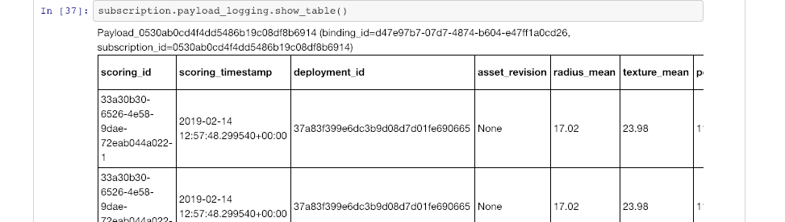

---

copyright:
  years: 2018, 2020
lastupdated: "2020-04-08"

keywords: databases, connections, scoring, requests, schema, REST API, API

subcollection: ai-openscale

---

{:shortdesc: .shortdesc}
{:external: target="_blank" .external}
{:tip: .tip}
{:important: .important}
{:note: .note}
{:pre: .pre}
{:codeblock: .codeblock}
{:help: data-hd-content-type='help'}
{:support: data-reuse='support'}
{:screen: .screen}
{:note: .note}
{:note: .note}
{:note: .note}
{:note: .note}
{:faq: data-hd-content-type='faq'}

# Payload and feedback logging in {{site.data.keyword.aios_short}}
{: #cdb-payload}

For {{site.data.keyword.aios_short}}, all transactions that are sent to the deployed models must be logged as payload records in the {{site.data.keyword.aios_short}} data mart. The input and output payloads (requests and responses) need to be in the format that is required by {{site.data.keyword.aios_short}} as described in the specifications. 
{: shortdesc}

{{site.data.keyword.aios_short}} supports payload and feedback logging through the following methods:

- [Using the Python Client](/docs/services/ai-openscale?topic=ai-openscale-cdb-payload#cdb-payload-log-pythonsdk)
- [Using the REST API](/docs/services/ai-openscale?topic=ai-openscale-cdb-payload#cdb-payload-log-rest-api)
- [Automatically for supported machine learning providers](/docs/services/ai-openscale?topic=ai-openscale-fmrk-workaround-pyld-lg)

## Logging the payload with Python SDK
{: #cdb-payload-log-pythonsdk}
{: help} 
{: support}

For an example of full working code, see the [AI OpenScale and Custom ML Engine](https://github.com/pmservice/ai-openscale-tutorials/blob/master/notebooks/AI%20OpenScale%20and%20Custom%20ML%20Engine.ipynb){: external} sample notebook.

The following code sample shows how to log the payload by using the Python SDK:

```python
records_list = [
   PayloadRecord(request=request_data, 
                 response=response_data,
                 response_time=response_time), 
   PayloadRecord(request=request_data,
                 response=response_data,
                 response_time=response_time)]
subscription.payload_logging.store(records=records_list)
```
{: codeblock}

### Previewing the payload logging table

You can preview the content of your payload logging table either by directly connecting to the database or by using the Python SDK, which is shown in the following sample output. 




## Logging the payload with the REST API
{: #cdb-payload-log-rest-api}
{: help} 
{: support}

The following code sample shows how to log the payload by using the REST API:

```python
PAYLOAD_STORING_HREF_PATTERN ='{}/v1/data_marts/{}/scoring_payloads'
endpoint = PAYLOAD_STORING_HREF_PATTERN.format(
                                AIOS_CREDENTIALS['url'], 
                                AIOS_CREDENTIALS['data_mart_id'])
deployment_uid = subscription.get_details()['entity']['deployments'][0]['deployment_id']
payload = [{'binding_id': binding_uid, 
            'deployment_id': deployment_uid,
            'subscription_id': subscription.uid,
            'scoring_id': scoring_uid,
            'response': response_data,
            'request': request_data}]
headers = {'Authorization': 'Bearer '+ token}
req_response = requests.post(endpoint, 
                             json=payload,
                             headers = headers)
```
{: codeblock}

## Next steps

After you set up payload logging, you can continue configuring monitors by entering model details. For more information, see [Provide model details](/docs/services/ai-openscale?topic=ai-openscale-mo-config#mo-work-model-dets).

[See the sample payload files](https://github.com/pmservice/ai-openscale-tutorials/tree/master/assets/historical_data/german_credit_risk/wos){: external}.

