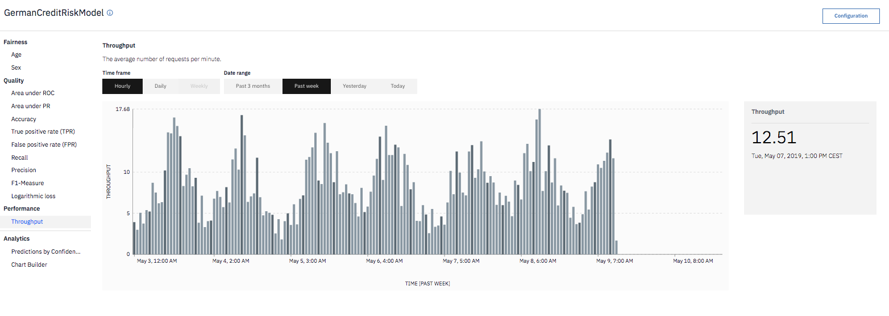

---

copyright:
  years: 2018, 2020
lastupdated: "2020-04-08"

keywords: fairness, fairness monitor, payload, perturbation, training data, performance, throughput

subcollection: ai-openscale

---

{:shortdesc: .shortdesc}
{:external: target="_blank" .external}
{:tip: .tip}
{:important: .important}
{:note: .note}
{:pre: .pre}
{:codeblock: .codeblock}
{:screen: .screen}
{:javascript: .ph data-hd-programlang='javascript'}
{:java: .ph data-hd-programlang='java'}
{:python: .ph data-hd-programlang='python'}
{:swift: .ph data-hd-programlang='swift'}
{:faq: data-hd-content-type='faq'}

# Throughput
{: #performance_mets_through}

Throughput measures the average scoring requests per minute in a specific timeframe.
{: shortdesc}

## Throughput at a glance
{: #performance_mets_through-glance}

- **Description**: Average scoring requests per minute in a specific timeframe
- **Default thresholds**: Not applicable
- **Default recommendation**: Not applicable
- **Problem type**: All
- **Chart values**: Average value in the timeframe
- **Metrics details available**: None

Throughput is not supported for the Watson Machine Learning models with automatic payload logging.
{: note}

## Interpreting the display
{: #performance_mets_through-display}

The throughput chart displays the average number of requests per minute. You can use controls to choose the timeframe, such as daily, weekly, or monthly:

