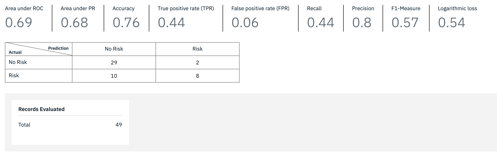
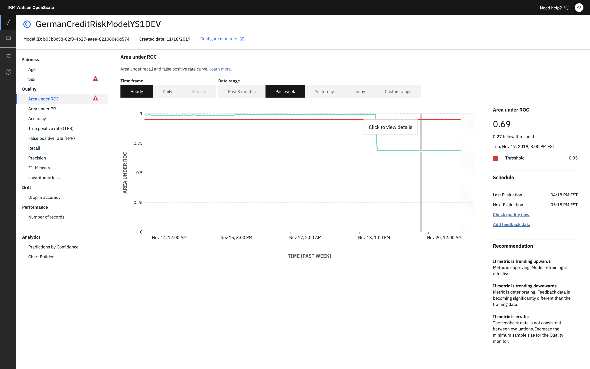

---

copyright:
  years: 2018, 2020
lastupdated: "2020-08-08"

keywords: metrics, monitoring, custom metrics, thresholds, confusion matrix, score

subcollection: ai-openscale

---

{:shortdesc: .shortdesc}
{:external: target="_blank" .external}
{:tip: .tip}
{:important: .important}
{:note: .note}
{:pre: .pre}
{:codeblock: .codeblock}

{:screen: .screen}
{:note: .note}
{:note: .note}
{:note: .note}
{:note: .note}
{:faq: data-hd-content-type='faq'}

# Confusion matrix
{: #it-conf-mtx}

As a detail of the quality metrics, you can view the records that the model analyzed incorrectly. Such anomalies can be false positives or false negatives for binary classification models or can be incorrect class assignments for multi-class models. You can also view a list of feedback records that the model did not analyze correctly.
{: shortdesc}

To review related details, such as confusion matrix for binary and multi-class classification, which are available for some metrics, click the chart.

For binary problems, {{site.data.keyword.aios_full}} assigns the target category to  either the `positive` or `negative` level. For this, the confusion matrix output follows the convention where the label for the positive category is located in the second row or column.

## Steps
{: #it-conf-mtx-steps}

1. From any of the **Quality** charts, such as **Area under ROC** click on an hour/day in the chart.
    
    

1. A confusion matrix displays the false positives and false negatives. Click a cell to view the subset of feedback records.

    

