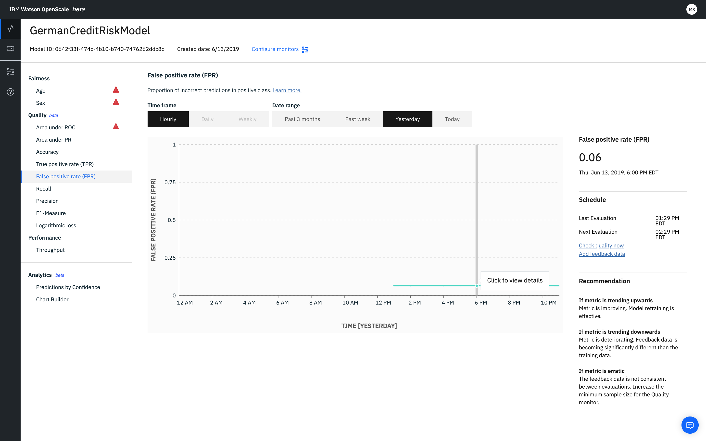

---

copyright:
  years: 2018, 2020
lastupdated: "2020-04-18"

keywords: metrics, monitoring, custom metrics, thresholds, False positive rate, fpr, score, schedule, recommendation

subcollection: ai-openscale

---

{:shortdesc: .shortdesc}
{:external: target="_blank" .external}
{:tip: .tip}
{:important: .important}
{:note: .note}
{:pre: .pre}
{:codeblock: .codeblock}

{:screen: .screen}
{:note: .note}
{:note: .note}
{:note: .note}
{:note: .note}
{:faq: data-hd-content-type='faq'}

# False positive rate (FPR)
{: #quality_fpr_false}

The false positive rate gives the proportion of incorrect predictions in positive class.
{: shortdesc}

## False positive rate (FPR)
{: #quality_fpr_false-glance}

- **Description**: Proportion of incorrect predictions in positive class
- **Default thresholds**: Lower limit = 80%
- **Default recommendation**:
   - **Upward trend**: An upward trend indicates that the metric is deteriorating. Feedback data is becoming significantly different than the training data.
   - **Downward trend**: A downward trend indicates that the metric is improving. This means that model retraining is effective.
   - **Erratic or irregular variation**: An erratic or irregular variation indicates that the feedback data is not consistent between evaluations. Increase the minimum sample size for the Quality monitor.
- **Problem type**: Binary classification
- **Chart values**: Last value in the time frame
- **Metrics details available**: Confusion matrix

## Interpreting the display
{: #quality_fpr_false-display}



## Do the math
{: #quality_fpr_false-math}

The The false positive rate is calculated as the total number of false positives divided by the number of false positives and the number of true negatives.

```
                        number of false positives
False positive rate =  ______________________________________________________

                       (number of false positives + number of true negatives)
```