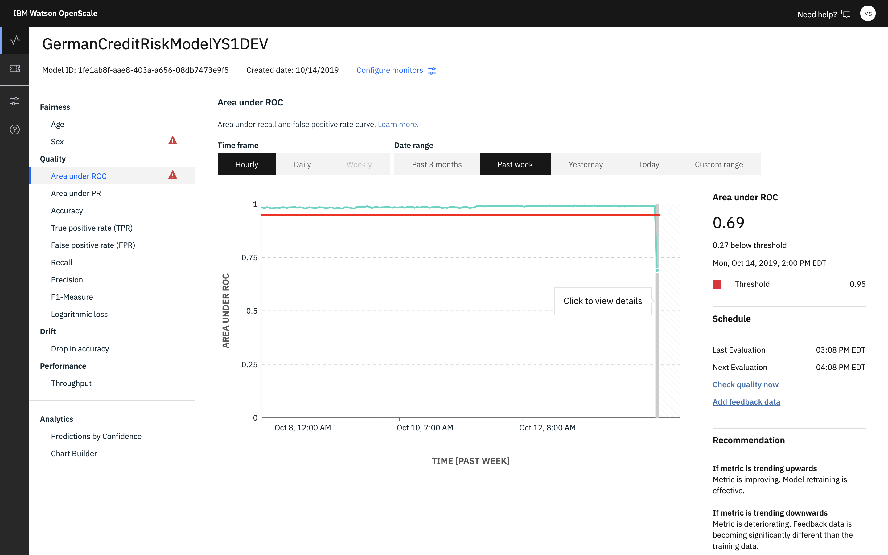
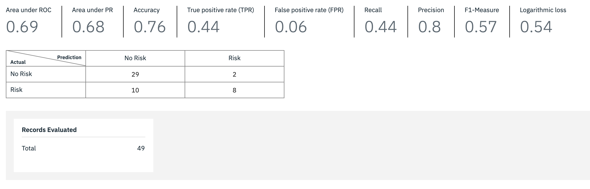

---

copyright:
  years: 2018, 2020
lastupdated: "2020-04-08"

keywords: metrics, monitoring, custom metrics, thresholds, score, schedule, recommendation

subcollection: ai-openscale

---

{:shortdesc: .shortdesc}
{:external: target="_blank" .external}
{:tip: .tip}
{:important: .important}
{:note: .note}
{:pre: .pre}
{:codeblock: .codeblock}
{:screen: .screen}
{:javascript: .ph data-hd-programlang='javascript'}
{:java: .ph data-hd-programlang='java'}
{:note: .note}
{:swift: .ph data-hd-programlang='swift'}
{:faq: data-hd-content-type='faq'}

# Quality metrics overview
{: #anlz_metrics}

Use quality monitoring to determine how well your model predicts outcomes. When quality monitoring is enabled, it generates a set of metrics every hour by default. You can generate these metrics on demand by clicking the **Check quality now** button or by using the Python client.
{: shortdesc}

Quality metrics are calculated based on the following information:

- manually labeled feedback data,
- monitored deployment responses for these data.

For proper monitoring, feedback data must be logged to {{site.data.keyword.aios_short}} on a regular basis. The feedback data can be provided either by using "Add Feedback data" option or using Python client or REST API.

For machine learning engines other than {{site.data.keyword.aios_short}}, such as Microsoft Azure ML Studio, Microsoft Azure ML Service, or Amazon Sagemaker ML quality monitoring creates additional scoring requests on the monitored deployment.
{: note}

You can review all metrics values over time on the {{site.data.keyword.aios_short}} dashboard:

To review related details, such as confusion matrix for binary and multi-class classification, which are available for some metrics, click the chart.

## Supported quality metrics
{: #anlz_metrics_supqualdets}

The following quality metrics are supported by {{site.data.keyword.aios_short}}:

### Binary classification problems
{: #anlz_metrics_supqualdets-binary}

For binary models, {{site.data.keyword.aios_short}} tracks when the quality of the model falls below an acceptable level. For binary classification models, it will check the **Area under ROC** score which measures the model's ability to distinguish two classes. The higher the Area under ROC score, the better the model is at identifying class A as class A and class B as class B.

- [Area under ROC](/docs/services/ai-openscale?topic=ai-openscale-quality_roc)
- [True positive rate (TPR)](/docs/services/ai-openscale?topic=ai-openscale-quality_tpr)
- [Precision](/docs/services/ai-openscale?topic=ai-openscale-quality_precision)
- [F1-Measure](/docs/services/ai-openscale?topic=ai-openscale-quality_f1-measr)
- [Logarithmic loss](/docs/services/ai-openscale?topic=ai-openscale-quality_log_loss)
- [False positive rate (FPR)](/docs/services/ai-openscale?topic=ai-openscale-quality_fpr_false)
- [Area under PR](/docs/services/ai-openscale?topic=ai-openscale-quality-area-pr)
- [Recall](/docs/services/ai-openscale?topic=ai-openscale-quality_recall)

### Regression classification problems
{: #anlz_metrics_supqualdets-regression}

For regression models, {{site.data.keyword.aios_short}} tracks when the quality of the model falls below an acceptable level and checks the **R squared** score. R squared measures correlation between predicted values and actual values. The higher the R squared score, the better the model fits to the actual values.

- [R squared](/docs/services/ai-openscale?topic=ai-openscale-quality_r_squared)
- [Proportion explained variance](/docs/services/ai-openscale?topic=ai-openscale-quality_var)
- [Root of mean squared error](/docs/services/ai-openscale?topic=ai-openscale-supqualdets_squ_errors_mean)
- [Mean absolute error](/docs/services/ai-openscale?topic=ai-openscale-quality_abserror)
- [Mean squared error](/docs/services/ai-openscale?topic=ai-openscale-quality_squerror)

### Mutliclass classification problems
{: #anlz_metrics_supqualdets-multiclass}

For multi-classification models, {{site.data.keyword.aios_short}} tracks when the quality of the model falls below an acceptable level and checks the **Accuracy** score which is the percentage of predictions the model got right.

- [Accuracy](/docs/services/ai-openscale?topic=ai-openscale-accuracy-opener)
- [Weighted True Positive Rate (wTPR)](/docs/services/ai-openscale?topic=ai-openscale-quality-wtpr)
- [Weighted False Positive Rate (wFPR)](/docs/services/ai-openscale?topic=ai-openscale-quality_wfpr_weighted)
- [Weighted recall](/docs/services/ai-openscale?topic=ai-openscale-quality_weighted_recall)
- [Weighted precision](/docs/services/ai-openscale?topic=ai-openscale-quality_wgth_prec)
- [Weighted F1-Measure](/docs/services/ai-openscale?topic=ai-openscale-quality_wght_f1-measure)
- [Logarithmic loss](/docs/services/ai-openscale?topic=ai-openscale-quality_log_loss)

## Supported quality details
{: #anlz_metrics_supqualdets_suppr_dets}

The following details for quality metrics are supported by {{site.data.keyword.aios_short}}:

### Confusion matrix
{: #anlz_metrics_supqualdets_confusion-quickovr}

Confusion matrix helps you to understand for which of your feedback data the monitored deployment response is correct and for which it is not.

For more information, see [Confusion matrix](/docs/services/ai-openscale?topic=ai-openscale-it-conf-mtx).

## Next steps

- After {{site.data.keyword.aios_short}} detects problems with quality, such as accuracy threshold violations, you must build a new version of the model that fixes the problem. Using the manually labelled data in the feedback table, you must retrain the model along with the original training data.

