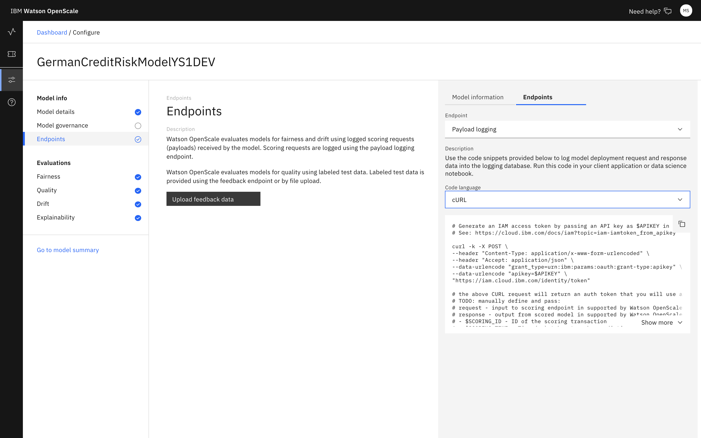

---

copyright:
  years: 2018, 2020
lastupdated: "2020-05-18"

keywords: databases, connections, scoring, requests

subcollection: ai-openscale

---

{:shortdesc: .shortdesc}
{:external: target="_blank" .external}
{:tip: .tip}
{:important: .important}
{:note: .note}
{:pre: .pre}
{:codeblock: .codeblock}
{:help: data-hd-content-type='help'}
{:support: data-reuse='support'}
{:screen: .screen}
{:note: .note}
{:note: .note}
{:note: .note}
{:note: .note}
{:faq: data-hd-content-type='faq'}

# Sending a scoring request
{: #cdb-score}

To configure monitors, you must send a scoring payload to log the data to be monitored.
{: shortdesc}

- For models deployed in {{site.data.keyword.pm_full}}, you must score your model by using {{site.data.keyword.pm_full}} API. The scoring payload is automatically sent to {{site.data.keyword.aios_short}} when you score the model.
- For other machine learning engines, such as Microsoft Azure, Amazon SageMaker, or a custom machine learning engine the scoring payload must be sent by using the Payload Logging API. For more information, see [Payload logging for non-{{site.data.keyword.pm_full}} service instances](/docs/ai-openscale?topic=ai-openscale-cml-connect).

## Steps for payload logging
{: #cdb-score-apisteps}
{: help} 
{: support}

1. From the {{site.data.keyword.aios_short}} dashboard, click a deployment tile.
2. Click **Configure monitors**. 
3. In the navigation pane, click **Payload logging**.
2. Choose whether to use the `cURL` or `Python` code by clicking the `cURL` or `Python` tab.
3. Click **Copy to clipboard** and paste it into to log model deployment request and response data. For more information, see [Payload logging for non-{{site.data.keyword.pm_full}} service instances](/docs/ai-openscale?topic=ai-openscale-cml-connect).

The fields and values in the code snippets need to be substituted with your real values, as the ones provided are only examples.
{: important}

After you run your payload logging, a check mark appears in the **Ready to Monitor** column for the selected deployment. Click **Configure Monitors** to continue.

## Payload logging fields
{: #cdb-score-fields-values}

The following table describes the fields that make up a typical payload logging request.

|:----|:-----|
| Field | Description |
| scoring_id |   |
| response_time |   |
| request | The `request` section specifies fields and values for both the training data and the meta data, which are features that you can use to measure indirect bias |
| ---- fields |   |
| ---- values |   |
| ---- meta |   |
| ------- fields |   |
| ------- values |   |
| response |   |
| ---- fields |   |
| ---- values |   |
| binding_id |   |
| subscription_id |   |
| deployment_id |   |
{: row-headers}
{: class="comparison-table"}
{: caption="Table 1. Payload logging fields" caption-side="top"}
{: summary="The table provides detailed descriptions of the fields that you find in a typical payload logging request."}
{: #payloadloggingfieldstable1}

## Understanding the number of scoring requests
{: #cdb-score-capacity}
{: help} 
{: support}

Scoring requests are a part of {{site.data.keyword.aios_short}} processing. Each transaction record that you send to the model to be scored generates extra processing so that the {{site.data.keyword.aios_short}} service perturbs data and creates explanations.

- For tabular, text, or image models the following baseline request generates data points:

   - 1 scheduling service scoring request generates 5000 data points.

- For tabular classification models only, there are more scoring requests that are made for contrastive explanation. The following requests are added to the preceding baseline request:

   - One hundred (100) scoring requests generate 51 additional data points per request.
   - One hundred one (101) scoring requests generate 1 additional data point per request.

## Next steps
{: #cdb-score-next-steps-scoringreq}

[Configure monitors](/docs/ai-openscale?topic=ai-openscale-mo-config).
